class: center, middle


```{r setup, include=FALSE}
options(htmltools.dir.version = FALSE)
```

```{r xaringan-themer, include=FALSE, warning=FALSE}
library(xaringanthemer)

style_mono_light(header_font_google = google_font("Maitree"),
  text_font_google   = google_font("Maitree"),
  code_font_google   = google_font("Fira Mono"),
  base_color = "#1c5253"
)


```


Statistics is the grammar of science. 

-- [Karl Pearson](https://en.wikipedia.org/wiki/Karl_Pearson) --


---


class: middle


### **รหัสวิชา:** 2758501

**ชื่อรายวิชา:** สถิติและสารสนเทศทางการศึกษา (Statistics and Information in Education)

2 หน่วยกิต (1-2-5)


[**course syllabus**](https://drive.google.com/file/d/1gQIKSVzkZ3MJj-pG7ul_VkKY4uw_-kmA/view?usp=sharing)


---
class: inverse, middle

# แนะนำคณาจารย์

.pull-left[
section 1: รศ.ดร.สุชาดา บวรกิติวงศ์

section 2: อ.ดร.กนิษฐ์ ศรีเคลือบ

section 3: อ.ดร.ประภาศิริ รัชชประภาพรกุล

section 4: อ.ดร.สิวะโชติ ศรีสุทธิยากร

section 5: อ.ดร.สุรศักดิ์ เก้าเอี้ยน]


---

class: center, middle


---

class: center, middle


---

class: center, middle


---
class: center, middle,inverse

# เนื้อหารายวิชา


---
class:  middle

# เนื้อหารายสัปดาห์


สัปดาห์ที่ 1: แนะนำรายวิชา ความรู้เบื้องต้นเกี่ยวกับสถิติ (สิวะโชติ)

--

สัปดาห์ที่ 2-3: สถิติเชิงบรรยาย (สุชาดา และ สุรศักดิ์)

--

สัปดาห์ที่ 4-5: การสุ่มตัวอย่างและการเก็บรวบรวมข้อมูลด้วยวิธีสมัยใหม่ (กนิษฐ์)

--

สัปดาห์ที่ 6: การประมาณค่า และการทดสอบสมมุติฐาน (ประภาศิริ)

--

สัปดาห์ที่ 7: การทดสอบเพื่อเปรียบเทียบค่าเฉลี่ยหนึ่งและสองกลุ่ม (สุชาดา)


--

สัปดาห์ที่ 8: **สอบกลางภาค (9 ต.ค. 2563 เวลา 8:30-11:30 น.)**

---
class:  middle

# เนื้อหารายสัปดาห์

สัปดาห์ที่ 9: การทดสอบเพื่อเปรียบเทียบค่าเฉลี่ยหลายกลุ่ม (สุชาดา)

--

สัปดาห์ที่ 10: การวิเคราะห์สหสัมพันธ์ (ประภาศิริ)

--

สัปดาห์ที่ 11: การวิเคราะห์ความถดถอยอย่างง่าย (สุรศักดิ์)

--

สัปดาห์ที่ 12: การวิเคราะห์ความถดถอยที่มีตัวแปร dummy (สุรศักดิ์)

--

สัปดาห์ที่ 13: การวิเคราะห์ความถดถอยเชิงพหุ (ประภาศิริ)

--
 
สัปดาห์ที่ 14: การวิเคราะห์อิทธิพลปฏิสัมพันธ์ (สิวะโชติ)

--

สัปดาห์ที่ 15: แยกกลุ่มเพื่อนำเสนอผลงาน

--

สัปดาห์ที่ 16: **สอบปลายภาค (4 ธ.ค. 2563 เวลา 8:30-11:30 น.)**


---
class:  middle

# การประเมินผล

- สอบกลางภาค 30%

- สอบปลายภาค 30%

- [โครงงานกลุ่ม 2 ชิ้น](https://drive.google.com/file/d/1iOiFOYVRVykuZvpAr3dNuguMBVddB8W-/view?usp=sharing) 20%

<section style="text-indent:4em;">- ชิ้นงานที่ 1 (ส่งภายในวันศุกร์ที่ 16 ตุลาคม 2563)</section>

<section style="text-indent:4em;">- ชิ้นงานที่ 2 (ส่งภายในวันศุกร์ที่ 11 ธันวาคม 2563)</section>


- งานในชั้นเรียนและแบบฝึกหัด 10%

- การมีส่วนร่วมในชั้นเรียนและการเข้าเรียน 10%

---
class:  middle

# รูปแบบการจัดการเรียนการสอน


1. **บรรยายรวม (Lecture)** ผ่านระบบ facebook live ทุกวันจันทร์ เวลา 13:00 - 15:00 น. ยกเว้นเนื้อหาในสัปดาห์ที่ 4-5 เรื่องการสุ่มตัวอย่างและการเก็บรวบรวมข้อมูลสมัยใหม่จะให้นิสิตเข้าไปเรียนรู้และทำกิจกรรมผ่านระบบ KruRoo 

2. **ฝึกปฏิบัติการทางสถิติ (StatLAB)** ผ่านระบบ Zoom 

- section 4 ทุกวันจันทร์ เวลา 15:00 - 16:00 น.

- section 1, 2, 3 และ 5 ทุกวันอังคาร เวลา 13:00 - 14:00 น.

**หมายเหตุ:** รายวิชานี้ใช้ระบบ [**KruRoo**](www.kruroo.com) เป็นระบบบริหารจัดการเรียนรู้ นิสิตสามารถ login เข้าสู่ระบบได้โดยใช้รหัสนิสิตเป็นทั้ง username และ password สำหรับการเข้าสู่ระบบครั้งแรก จากนั้นนิสิตสามารถเปลี่ยน password ใหม่ให้เป็นของตนเองได้ในภายหลัง


---

class: center, middle


---

class: center, middle


[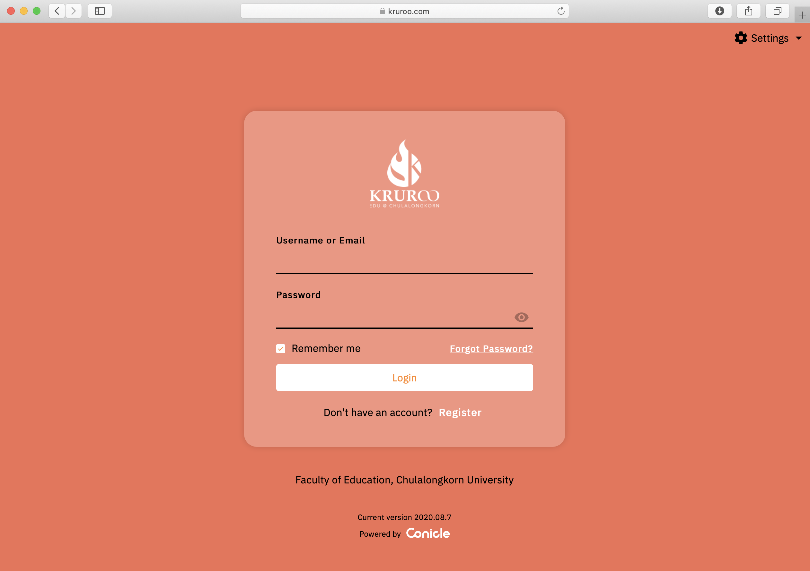](www.kruroo.com)


---

class: center, middle


---


## การดาวน์โหลดและติดตั้งโปรแกรม Jamovi

- ไปที่ [https://www.jamovi.org/download.html](https://www.jamovi.org/download.html)

- ดาวน์โหลด Jamovi Version ล่าสุด

- ติดตั้งโปรแกรมลงในเครื่องคอมพิวเตอร์ของนิสิต

<center><iframe width="426" height="240" src="https://www.youtube.com/embed/4sHLiUVYSN4" frameborder="0" allow="accelerometer; autoplay; encrypted-media; gyroscope; picture-in-picture" allowfullscreen></iframe></center>


---


## ลักษณะเด่นของ Jamovi

<small>

**1. Free!!!**


**2. Easy to use**


**3. Provides various statistical tools for social sciences.**


- Descriptive Statistics

- t-tests

- ANOVAs

- Correlation & Regression


- Non-parametric tests

- reliability and factor analysis

- etc...


<small>


---
class: middle


# Other Features

- R syntax

- Reproducibility

- Community

---
class: middle


---
class: middle


.pull-right[https://forum.jamovi.org/]


---
class: center


---
class: middle, center, inverse
 
# 1. พื้นฐานเกี่ยวกับการวิจัย


---


class: middle

## กระบวนการวิจัย

.pull-left[

- นักวิจัยใช้การวิจัยเป็นเครื่องมือสำคัญในการสร้างองค์ความรู้เพื่ออธิบายสภาพปรากฏการณ์ต่าง ๆ ที่สนใจ

- การดำเนินการวิจัยเป็นการดำเนินการตามกระบวนการที่มีระบบเพื่อรับประกันความถูกต้องของคำตอบที่นักวิจัยได้รับ

]

.pull-right[]

---

## การออกแบบการวิจัย

--

ประกอบด้วยกิจกรรมหลัก 3 อย่าง ได้แก่  

- **การออกแบบวิธีการได้มาซึ่งตัวอย่าง (sampling design)** เพื่อกำหนดวิธีการได้มาซึ่งชุดของหน่วยข้อมูล/ตัวอย่าง ที่มีคุณสมบัติสำหรับคือความเป็นตัวแทน (representative) ของกลุ่มเป้าหมาย/ประชากร

--

- **การออกแบบการวัด (measurement design)** เพื่อกำหนดวิธีการและสร้างเครื่องมือที่สามารถสังเกตหรือวัดค่าของคุณลักษณะหรือสิ่งที่สนใจจะศึกษาจากหน่วยข้อมูลได้อย่างแม่นยำและถูกต้อง 

--

- **การออกแบบการวิเคราะห์ข้อมูล (analysis design)** เพื่อกำหนดวิธีการวิเคราะห์ข้อมูลที่ให้สารสนเทศสอดคล้องกับวัตถุประสงค์ของการวิเคราะห์ มีความถูกต้อง ชัดเจน และเพียงพอต่อการความต้องการของผู้ใช้ข้อมูล/วัตถุประสงค์การวิจัย

---

class: middle, inverse

# 2. ประชากรและตัวอย่าง

---
class: middle

## ประชากร (population)

- โดยปกติการวิจัยเชิงปริมาณจะเรียกกลุ่มเป้าหมายที่เป็นเอกภพหรือขอบเขตของหน่วยข้อมูลทั้งหมดที่ต้องการศึกษาว่า ** ประชากร (population)**


> พฤติกรรมการเตรียมตัวสู่อาชีพของนิสิตนักศึกษาระดับปริญญาตรีในเขตภาคเหนือ (สรียา โชติธรรม และอุษณี ลลิตผสาน, 2561)

--

> ผลของการใช้การเรียนรู้แบบสืบสอบแบบแนะนำเน้นกระบวนการที่มีต่อมโนทัศน์ทางเคมีและความสามารถในการวิเคราะห์ของนักเรียนมัธยมศึกษาตอนปลาย 
> (กัลยา ภูทัตโต, 2558)


---
class: middle

## ตัวอย่าง (sample)

<section style="font-size:14px;">

.pull-left[
- ในทางปฏิบัติหลายครั้งยากที่จะดำเนินการเก็บรวบรวมข้อมูลที่ต้องการจากทุกหน่วยของประชากร เนื่องจากมีข้อจำกัดโดยเฉพาะในด้านทรัพยากรทั้งเงิน บุคคลากร และเวลา


- การเก็บรวบรวมข้อมูลกับหน่วยข้อมูลจำนวนมากโดยที่มีทรัพยากรสนับสนุนไม่เพียงพอ ยังอาจทำให้เกิดความผิดพลาดในการดำเนินการได้ง่าย และส่งผลให้มีโอกาสสูงที่จะเกิดความคลาดเคลื่อนในข้อมูลค่าสังเกตที่เก็บรวบรวมมา

- การใช้เลือกเก็บรวบรวมข้อมูลจาก **ตัวอย่าง (sample)** ที่เป็นส่วนย่อย (subset) ของประชากร และมีคุณสมบัติคือ**เป็นตัวแทนที่ดีของประชากร** จึงเป็นวิธีการที่เหมาะสมมากกว่า

- ตัวอย่างที่เป็นตัวแทนที่ดีของประชากร เมื่อนำมาวิเคราะห์แล้วจะให้ผลการวิเคราะห์ที่สอดคล้องใกล้เคียงกับสภาพจริงของประชากรนั้น แต่ถ้าตัวอย่างมีความลำเอียง 
(bias) ผลการวิเคราะห์ที่ได้ก็จะมีความลำเอียงตามไปด้วย


]


.pull-right[

</br>

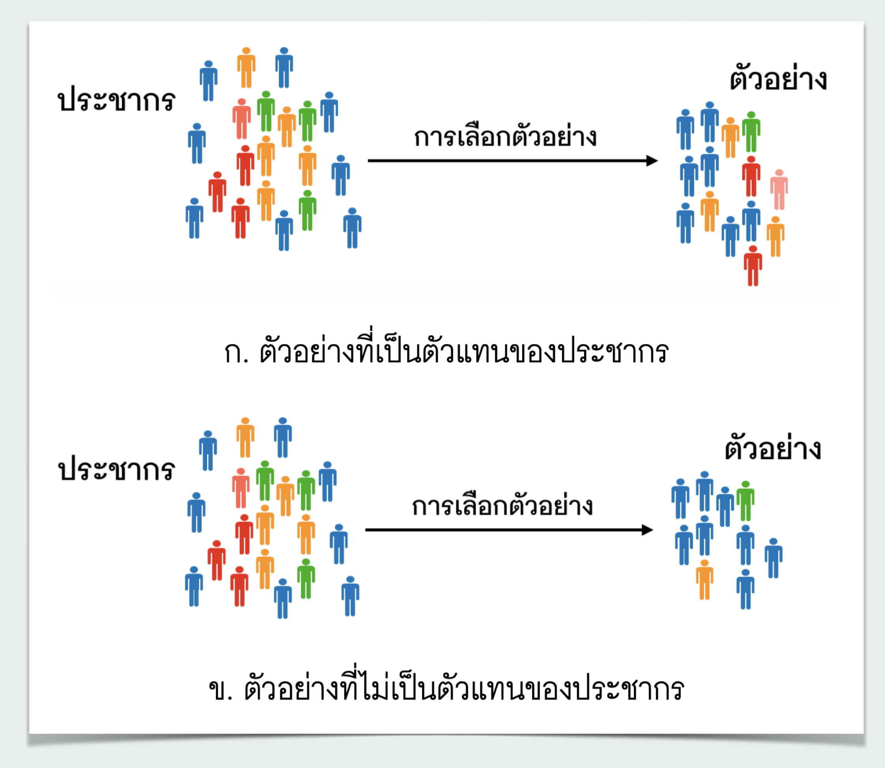

]

</section>

---
class: middle

## การออกแบบการได้มาซึ่งตัวอย่าง (sampling design)


- การกำหนดขนาดตัวอย่าง (sample size)


- การกำหนดวิธีการได้มาซึ่งตัวอย่าง (sampling method)


<section style="text-indent:4em;">- การเลือกตัวอย่างแบบใช้ความน่าจะเป็น</section>
<section style="text-indent:4em;">- การเลือกตัวอย่างแบบไม่ใช้ความน่าจะเป็น</section>


---
class: middle, inverse

# 3. ตัวแปรและข้อมูล

- โดยปกติแล้วสภาพในโลกจริงมักมีความซับซ้อน ไม่แน่นอน และมีการเปลี่ยนไปอย่างรวดเร็ว จึงเป็นไปได้ยากที่จะศึกษาสภาพของปรากฏการณ์ต่าง ๆ จากกลุ่มเป้าหมาย/ประชากรได้อย่างครบถ้วนทุกมิติ สิ่งที่นักวิจัยทำคือการกำหนดตัวแปร (variables) เพื่อสะท้อนสภาพปรากฏการณ์ดังกล่าวในมิติที่นักวิจัยสนใจ 

---
class: middle


## ตัวแปร (variables)

หมายถึงคุณลักษณะของสิ่งต่าง ๆ ที่อาจเป็นได้ทั้ง คน สัตว์ หรือสิ่งของ โดยที่คุณลักษณะดังกล่าวมีการเปลี่ยนแปลงค่าได้ไปตามหน่วยของสิ่ง ๆ นั้น 


<center></center>


---

class: middle

<center></center>


---
class: middle

## ตัวแปร

<small>

เมื่อนักวิจัยกำหนดตัวแปรที่ต้องการแล้วขั้นตอนต่อมาคือการดำเนินการวัดค่าสังเกตของตัวแปรที่สนใจ การวัด (measurement) เป็นกระบวนการที่นักวิจัยใช้เพื่อกำหนดค่าให้กับสิ่งที่ต้องการวัดอย่างเป็นระบบ ซึ่งทำให้ได้ค่าสังเกต (observation) หรือข้อมูล (data) ของตัวแปรดังกล่าว


.pull-left[
การวิจัยหนึ่ง ๆ สามารถมีตัวแปรวิจัยได้หลายตัว การวิจัยที่เกี่ยวข้องกับทางการศึกษา อาจมี**ตัวแปรที่เกี่ยวกับนักเรียน** เช่น

- ฐานะทางเศรษฐกิจและสังคมของนักเรียน

- ทักษะการคิดวิเคราะห์ของนักเรียน

- ผลสัมฤทธิ์ทางการเรียน 

- ระดับการมีปฏิสัมพันธ์ในชั้นเรียน 

- คุณลักษณะอันพึงประสงค์ของนักเรียน
]

.pull-right[

**ตัวแปรที่เกี่ยวกับครู** เช่น


- วิธีการสอนของครู

- ประสบการณ์สอนของครู

- ความเชี่ยวชาญในการใช้เทคโนโลยีของครู


**ตัวแปรที่เกี่ยวกับโรงเรียน** เช่น

- ขนาดโรงเรียน

- งบประมาณสำหรับการพัฒนาการศึกษาของโรงเรียน
]

</small>
---

## Example

<small>

นักวิจัยต้องการศึกษาสภาพการจัดการเรียนรู้ของห้องเรียน โดยที่กำหนดขอบเขตสภาพการจัดการเรียนรู้ในการศึกษาครั้งนี้จะศึกษาเฉพาะด้าน**วิธีการสอนของครู** และ**การมีปฏิสัมพันธ์ของนักเรียนในห้องเรียน**

.pull-left[


ห้องเรียนที่ทำการศึกษามี 3 ห้อง ใช้วิธีการสอน 3 แบบได้แก่ 

- แบบใช้ปัญหาเป็นฐาน (PBL)

- แบบสืบเสาะ (INQ)

- แบบบรรยาย (LEC)


```{r echo=F ,message=F, align="center"}
library(dplyr)
library(kableExtra)
class<-c("A","B","C")
method<-c("PBL","INQ","LEC")
item1<-c(100,50,15)
item2<-c(100,50,25)
item3<-c(100,50,20)
dat<-data.frame(class,method,item1,item2,item3)
#dat<-dat%>%mutate(iteraction=(item1+item2+item3)*5/300)
names(dat)[1:2]<-c("ห้องเรียน","วิธีการสอน")
kable(dat)%>% kable_styling(bootstrap_options = c("hover", "condensed", "responsive"))
```


]


.pull-right[

การวัดระดับปฏิสัมพันธ์ของนักเรียนในชั้นเรียนครั้งนี้ใช้ แบบสังเกตระดับการมีปฏิสัมพันธ์ของนักเรียนในชั้นเรียน โดยประกอบด้วยข้อรายการสังเกต ดังนี้ 

- ร้อยละของกิจกรรมที่นักเรียนในห้องเรียนมีส่วนร่วม (item1)

- ร้อยละของนักเรียนที่มีส่วนร่วมในการทำกิจกรรมในห้องเรียน (item2)

- ร้อยละของนักเรียนที่แสดงหรือแลกเปลี่ยนความคิดเห็นในห้องเรียน (item3)
]

</small>

---
class: middle, center


$interaction_{classA}=(\frac{item1+item2+item3}{3}) \times \frac{5}{100} = 5.0$


$interaction_{classB}=(\frac{item1+item2+item3}{3}) \times \frac{5}{100} = 2.5$


$interaction_{classC}=(\frac{item1+item2+item3}{3}) \times \frac{5}{100} = 1.0$


```{r echo=F ,message=F, fig.align="left"}
library(dplyr)
library(kableExtra)
class<-c("A","B","C")
method<-c("PBL","INQ","LEC")
item1<-c(100,50,15)
item2<-c(100,50,25)
item3<-c(100,50,20)
dat<-data.frame(class,method,item1,item2,item3)
dat<-dat%>%mutate(iteraction=(item1+item2+item3)*5/300)
names(dat)[1:2]<-c("ห้องเรียน","วิธีการสอน")
names(dat)[6]<-c("ปฏิสัมพันธ์")
kable(dat)%>% kable_styling(position="left",bootstrap_options = c("hover", "condensed", "responsive"))
```


---
class: middle

# มาตรวัดของตัวแปร

ตัวแปรสามารถจำแนกได้หลายลักษณะขึ้นอยู่กับเกณฑ์ทีี่ใช้ในการจำแนก ลักษณะหนึ่งคือจำแนกประเภทของตัวแปรด้วยมาตรการวัดของตัวแปร (scale of measurement) ดังนี้

- มาตรวัดแบบนามบัญญัติ (nominal scale)

- มาตรวัดแบบเรียงอันดับ (ordinal scale)

- มาตรวัดแบบอันตรภาค (interval scale)

- มาตรวัดแบบอัตราส่วน (ratio scale)


---
class: middle

# มาตรวัดแบบนามบัญญัติ


<small>
.pull-left[
เป็นมาตรวัดที่อยู่ในระดับต่ำที่สุดเนื่องจากข้อมูลที่มีมาตรวัดแบบนามบัญญัติให้รายละเอียดสำหรับเพียงระบุ (identify) จำแนก (classify) หรือวินิจฉัย (diagnose) หน่วยข้อมูลออกเป็นกลุ่มหรือประเภทตามค่าสังเกตของคุณลักษณะที่กำหนดเท่านั้น นอกจากนี้ยังไม่สามารถเรียงลำดับค่าสังเกตดังกล่าวได้ ข้อมูลของตัวแปรที่มีมาตรวัดแบบนามบัญญัติจำเป็นต้องมีคุณสมบัติที่สำคัญ 2 ประการได้แก่

- คุณสมบัติความไม่ซ้ำซ้อนกัน (mutually exclusive property) กล่าวคือ การกำหนดค่าของตัวแปรให้กับแต่ละหน่วยข้อมูลสามารถทำได้เพียงแบบเดียวเท่านั้น

- คุณสมบัติความถ้วนทั่วโดยรวม (collective exhausive property) กล่าวคือ หน่วยข้อมูลทุกหน่วยจะต้องได้รับการกำหนดค่าของตัวแปรได้


]


.pull-right[

ข้อมูลหรือค่าสังเกตของตัวแปรที่มีมาตรวัดแบบนามบัญญัติจะไม่มีความหมายในเชิงปริมาณ **ทำให้ไม่สามารถนำไปดำเนินการทางคณิตศาสตร์ใด ๆ ได้อย่างมีความหมาย** ถึงแม้ว่าในกระบวนการวิเคราะห์ผู้วิเคราะห์จะมีการแทนค่าคุณลักษณะของตัวแปรด้วยตัวเลขก็ตาม เช่น 1 = ชาย และ 2 = หญิง หรือ 0 = รร.สังกัด สพฐ., 1 = รร.สังกัด สช., 2 = รร.สังกัด อปท. เป็นต้น

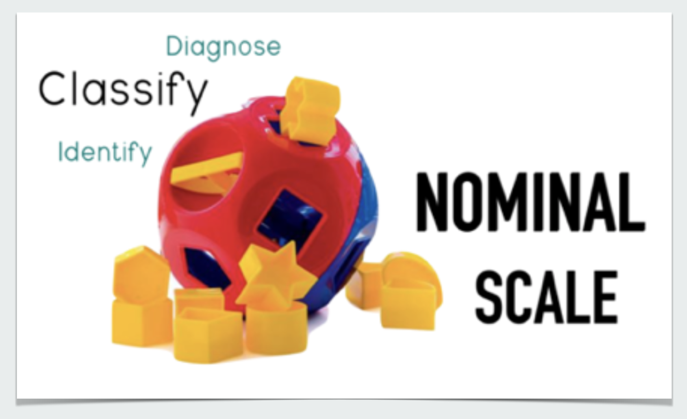


]

</small>

---
class: middle

# มาตรวัดแบบเรียงอันดับ

<small>

.pull-left[
เป็นมาตรวัดของตัวแปรแบบจัดประเภทที่นอกจากจะใช้จำแนกประเภทของหน่วยข้อมูลแล้วยังสามารถจัดเรียงอันดับประเภทของหน่วยข้อมูลดังกล่าวได้ด้วย ยกตัวอย่างเช่น 

- วุฒิการศึกษาของผู้ปกครอง ที่มีค่าสังเกตที่เป็นไปได้ 4 ค่าได้แก่ ประถมศึกษา มัธยมศึกษา ปริญญาตรี หรือ สูงกว่าปริญญาตรี

- ระดับอุณหภูมิของอากาศตามการรับรู้ของนักท่องเที่ยว ที่อาจมี 3 ระดับได้แก่ ร้อน ร้อนมาก และร้อนที่สุด


ในทำนองเดียวกับตัวแปรนามบัญญัติ ถึงแม้ว่านักวิจัยจะใช้ตัวเลขเพื่อแทนคุณลักษณะของตัวแปรเรียงอันดับในคอมพิวเตอร์ เช่น 3 = ร้อนมากที่สุด, 2 = ร้อนมาก และ 1 = ร้อน

]

.pull-right[

ข้อมูลหรือค่าสังเกตของตัวแปรที่มีมาตรวัดแบบเรียงอันดับยังไม่มีความหมายในเชิงปริมาณเช่นเดียวกับตัวแปรนามบัญญัติ ทั้งนี้เป็นเพราะตัวเลขดังกล่าวยัง**ขาดคุณสมบัติช่วงเท่า (equal interval)** กล่าวคือที่ระยะห่างระหว่างค่าสังเกตใด ๆ ที่อยู่ติดกันยังไม่ได้จำเป็นต้องมีผลต่างหรือช่วงห่างที่เท่ากันเสมอไป

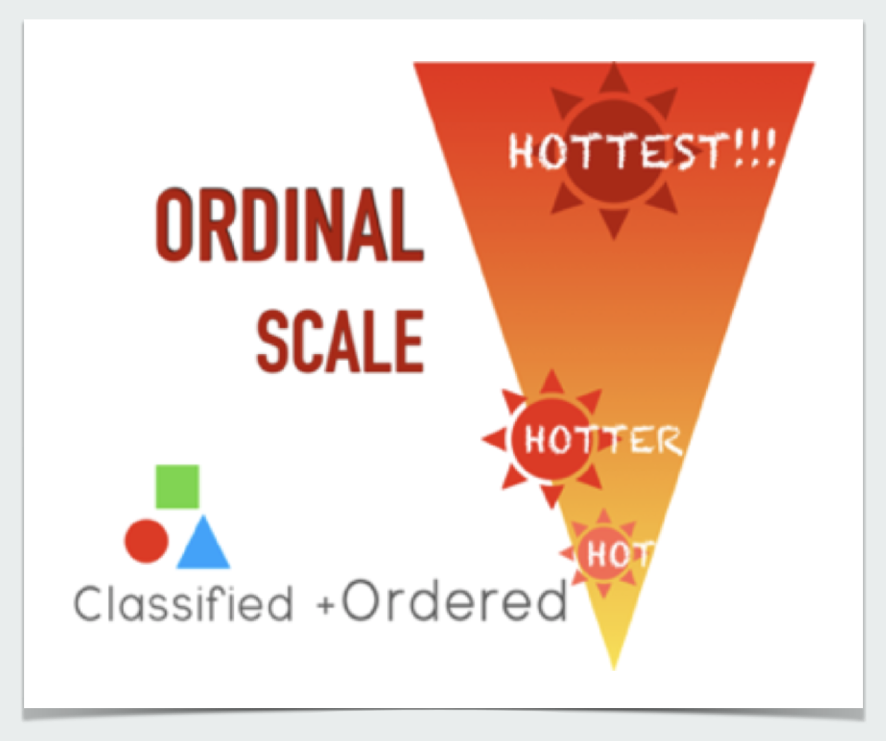

]
</small>


---
class: middle

# มาตรวัดแบบอันตรภาค

<small>

.pull-left[
- เป็นมาตรวัดระดับแรกที่ค่าสังเกตของตัวแปรมีความหมายในเชิงปริมาณ ค่าสังเกตของตัวแปรประเภทนี้จะให้รายละเอียดของคุณลักษณะที่มุ่งวัดได้เกือบสมบูรณ์ ประกอบด้วย การระบุหรือจำแนกหน่วยข้อมูล การเรียงอันดับหน่วยข้อมูลตามค่าสังเกตของตัวแปร และนอกจากนี้ยังเป็นมาตรการวัดมีคุณสมบัติช่วงเท่า (equal interval) 

- **แต่ยังไม่มีค่าศูนย์ที่แท้จริง (arbitrary zero)**  ซึ่งหมายความว่าค่าสังเกตที่มีค่าเท่ากับ 0 หน่วย ไม่ได้มีความหมายว่าไม่มีค่า แต่เป็นเพียงค่าหนึ่งของสเกลการวัดตัวแปรเท่านั้น เช่น อุณหภูมิองศาเซลเซียส ที่ 0 องศา ไม่ได้หมายความว่าไม่มีอุณหภูมิ แต่เป็นเพียงระดับอุณหภูมิ ณ จุดเยือกแข็งของน้ำเท่านั้น
]

.pull-right[
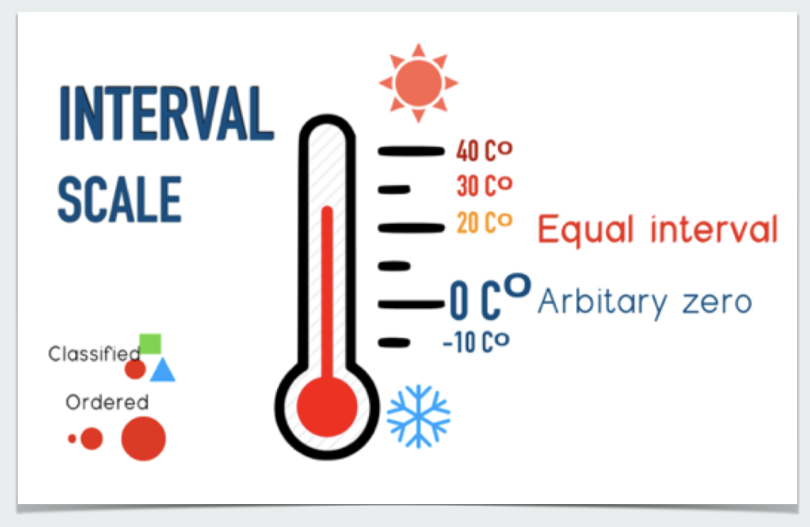

]
---
class: middle

# มาตรวัดแบบอัตราส่วน

ตัวแปรที่มีมาตรวัดแบบอัตราส่วนจะมีค่าสังเกตที่มีคุณสมบัติครบถ้วนสมบูรณ์โดยนอกจากค่าสังเกตของตัวแปรจะมีคุณสมบัติช่วงเท่าแล้วยังมีคุณสมบัติการมีค่าศูนย์ที่แท้จริง (absolute zero) ตัวอย่างของตัวแปรอัตราส่วน เช่น รายได้ต่อเดือน (บาท) จำนวนนักเรียนในห้องเรียน (คน) น้ำหนักของนักเรียน (กิโลกรัม) และส่วนสูงของนักเรียน (เซนติเมตร) เป็นต้น

<center>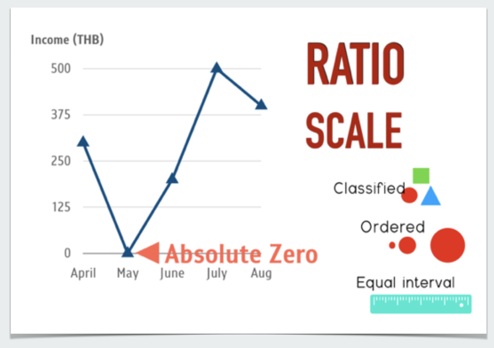</center>


---
class: middle, inverse

# 4. มโนทัศน์พื้นฐานเกี่ยวกับสถิติ


---
class: middle

## 4.1 วัตถุประสงค์การวิเคราะห์ข้อมูล

- การวิเคราะห์เชิงบรรยาย (descriptive analysis)

- การวิเคราะห์เชิงสำรวจ (exploratory analysis: EDA)

- การวิเคราะห์ความสัมพันธ์เชิงสาเหตุ (causal data analysis)

- การวิเคราะห์เชิงทำนาย (predictive analysis)

- การวิเคราะห์เชิงอ้างอิง (inferential analysis)

---
layout: true
class: middle

### การวิเคราะห์เชิงบรรยาย
---


<center>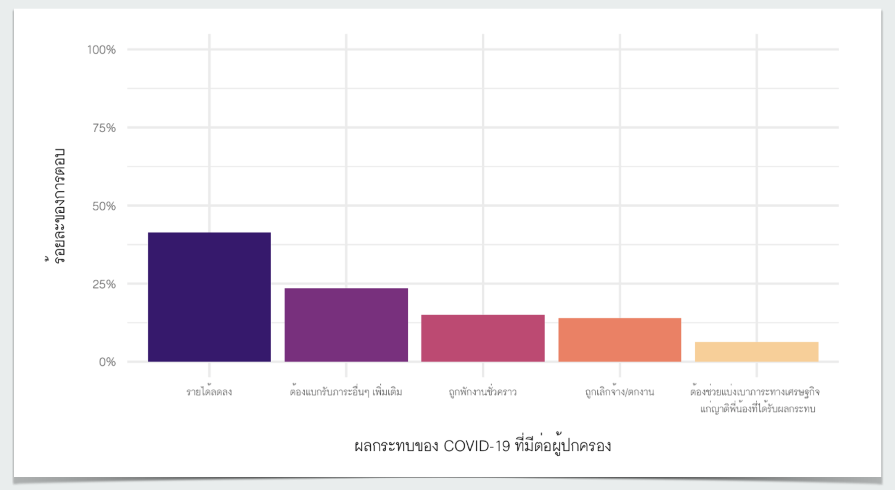</center>

---

<center>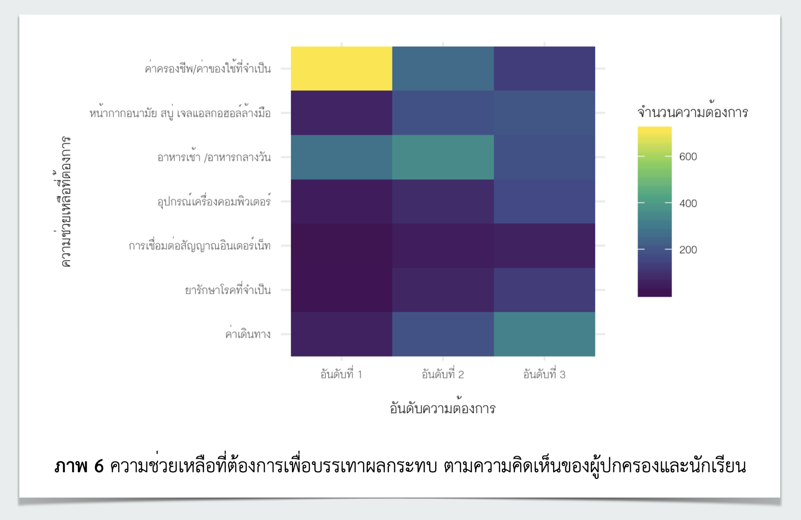</center>


---
layout: false
class: middle

### การวิเคราะห์เชิงสำรวจ

<center>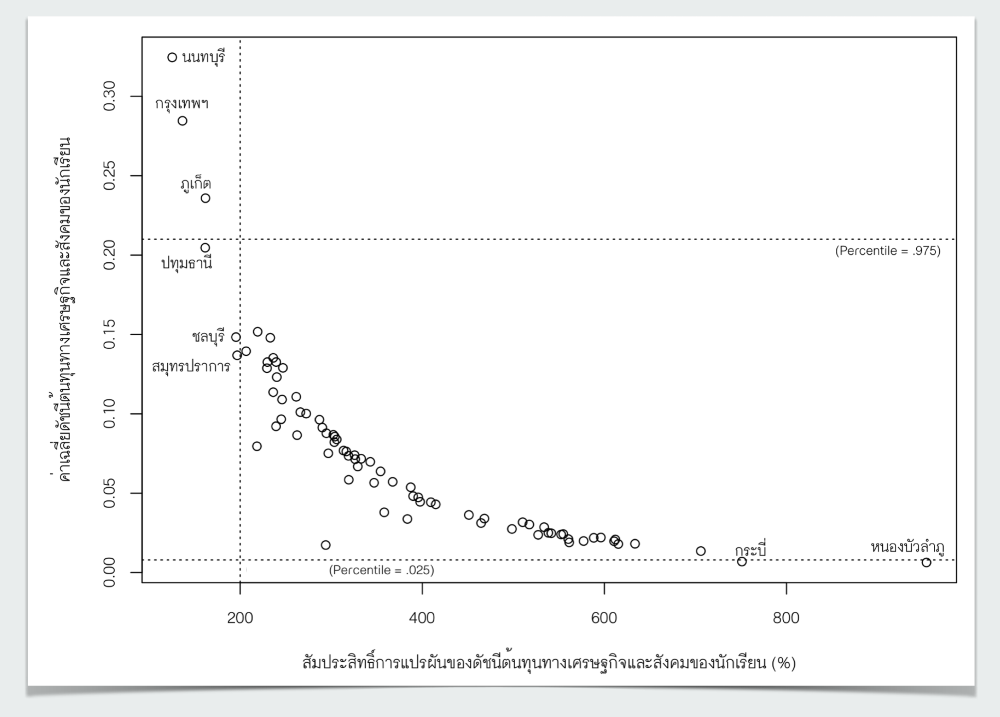</center>


---
class:  middle

### การวิเคราะห์ความสัมพันธ์เชิงสาเหตุ

ปัจจัยด้านภูมิหลังทางเศรษฐกิจและครอบครัวของนักเรียนมีผลกระทบต่อผลสัมฤทธิ์ทางการเรียนของนักเรียนหรือไม่ อย่างไร?


<center>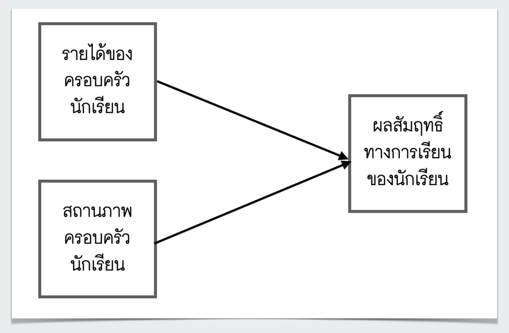</center>


---
class:  middle

### การวิเคราะห์เชิงทำนาย


<center>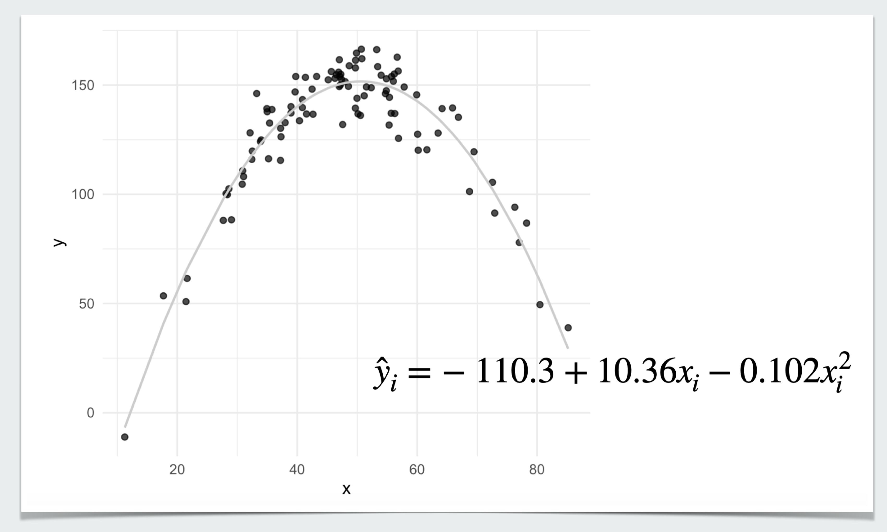</center>


---
class:  middle

### การวิเคราะห์เชิงอ้างอิง


.pull-left[
<small>

- **ค่าพารามิเตอร์ (parameters)** เป็นตัวเลขที่คำนวณจากข้อมูลจากประชากรทั้งหมดใช้สำหรับบ่งชี้สภาพต่าง ๆ ของตัวแปรหรือความสัมพันธ์ระหว่างตัวแปรภายใต้ประชากร

- **ค่าสถิติ (statistics)** เป็นตัวเลขที่คำนวณจากข้อมูลตัวอย่างใช้สำหรับบ่งชี้สภาพต่าง ๆ ของตัวแปรหรือความสัมพันธ์ระหว่างตัวแปรภายใต้ตัวอย่างที่เลือกมาจากประชากร 

- พารามิเตอร์และค่าสถิติแต่ละค่ามีความสามารถในการบ่งชี้สภาพของตัวแปรได้เพียงด้านเดียว เช่น ค่าเฉลี่ยใช้บรรยายแนวโน้มสู่ส่วนกลาง ส่วนเบี่ยงเบนมาตรฐานใช้บรรยายการกระจายของข้อมูล หรือสหสัมพันธ์ใช้บรรยายความสัมพันธ์ระหว่างตัวแปร เป็นต้น

</small>
]


.pull-right[

</br>

<center>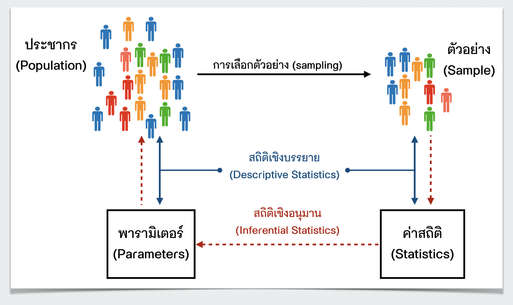</center>
]


---
class: middle

<center>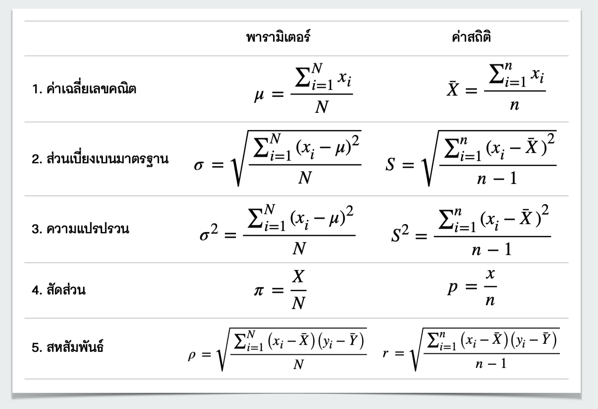</center>


