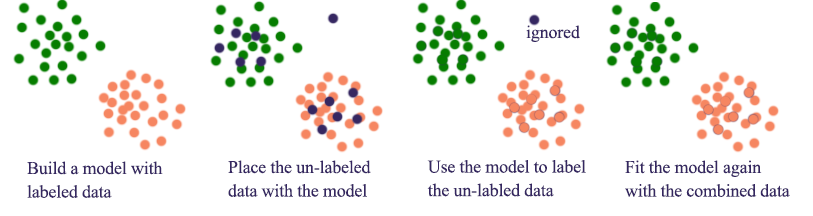

class: center, middle


```{r setup, include=FALSE}
options(htmltools.dir.version = FALSE)

library(tidyr)
library(ggplot2)
library(dplyr)
```

```{r xaringan-themer, include=FALSE, warning=FALSE}
library(xaringanthemer)

style_duo_accent(header_font_google = google_font("Tritong"),
  text_font_google   = google_font("Sarabun"),
  code_font_google   = google_font("Fira Mono"),
  primary_color = "#4d3e3e",
  secondary_color="#fff3cd",
 
text_color="#382933",

  colors = c(
  red = "#f34213",
  purple = "#3e2f5b",
  orange = "#ff8811",
  green = "#136f63",
  white = "#FFFFFF")

)

```


[https://chula.zoom.us/j/98730151094](https://chula.zoom.us/j/98730151094)


---

class: middle


### รหัสวิชา: 2758688

หลักการเรียนรู้ของเครื่องและการประยุกต์

2 หน่วยกิต (1-2-5)

--


### เนื้อหารายวิชา

<p style="text-indent:2.5em;">มโนทัศน์และหลักการของการเรียนรู้ของเครื่อง ประเภทของการเรียนรู้ของเครื่อง เทคนิคสำหรับจำแนกประเภทข้อมูล ได้แก่ การวิเคราะห์ความถดถอยโลจิสติก แรมดอมฟอร์เรสท์ ต้นไม้ตัดสินใจ ซัพพอร์ตเวกเตอร์แมทชีน เค-เนียร์เรสท์เนเบอร์ และ เนอีฟเบย์ เทคนิคสำหรับทำนายแนวโน้ม เช่น การวิเคราะห์ความถดถอยเชิงเส้น การวิเคราะห์ความถดถอยพหุนาม การวิเคราะห์ความถดถอยแบบลาสโซ่ การตัดสินใจแบบมาร์คอฟ และการทำนายแบบมอนติคาร์โล เทคนิคสำหรับจัดกลุ่มข้อมูล เช่น เค-มีน เค-เนียร์เรสท์เนเบอร์ การเรียนรู้ด้วยกฎของความสัมพันธ์ และดีบีสแกน เทคนิคสำหรับลดจำนวนมิติของข้อมูล เช่น การวิเคราะห์องค์ประกอบหลัก การแยกค่าแบบเดี่ยว และเทคนิคที-เอสเอ็นอี เทคนิคโครงข่ายใยประสาท เช่น โครงข่ายใยประสาทแบบคอนโวลูชัน โครงข่ายใยประสาทแบบวนซ้ำ โครงข่ายใยประสาทแบบแอลเอสทีเอ็ม และโครงข่ายใยประสาทแบบเกทรีเคอเรนยูนิต และเทคนิคเอ็นเซ็มเบิล การตรวจสอบ ประเมินความเหมาะสม และการปรับปรุงโมเดล การประมวลผลบนระบบคลาวด์ เน้นการประยุกต์ใช้การเรียนรู้ของเครื่องในการวิจัยและจิตวิทยาการศึกษา</p>

---
class: middle


### วัตถุประสงค์เชิงพฤติกรรม

1. สามารถอธิบายหลักการของอัลกอริทึมการเรียนรู้ของเครื่อง

2. เขียนโปรแกรม R หรือ Python เพื่อวิเคราะห์ข้อมูลโดยใช้อัลกอริทึมการเรียนรู้ของเครื่องได้

3. เลือกและประยุกต์ใช้อัลกอริทึมการเรียนรู้ของเครื่องในการวิจัยและจิตวิทยาการศึกษา


---
class: middle, inverse

# มโนทัศน์พื้นฐาน


---
background-image: url("Screen Shot 2563-08-16 at 09.16.03.png")
background-position: center
background-size: 800px

</br>
</br>
</br>
</br>
</br>
</br>
</br>
</br>
</br>
</br>
</br>
</br>
</br>
</br>
</br>
</br>
</br>
</br>
</br>
</br>
</br>

[https://www.visualcapitalist.com/wp-content/uploads/2019/04/data-generated-each-day-full.html](https://www.visualcapitalist.com/wp-content/uploads/2019/04/data-generated-each-day-full.html)


---
class: middle


---
class: middle

# ความหมายของ ML

“A computer program is said to learn from .red[**experience E**] with respect to some .orange[**task T**] and some performance .green[**measure P**], if its performance on T, as measured by P, improves with experience E.”

Tom Mitchell, 1997


---
class: middle

# traditional approach


---
class: middle

# ML approach


---
class: middle

# ลักษณะของ ML

การเรียนรู้ของเครื่องเป็นวิธีการสำหรับศึกษาทำความเข้าใจข้อมูลที่มีด้วยอัลกอริทึม (algorithm) หรือโมเดลเชิงสถิติ (statistical model) โดยที่การเรียนรู้ดังกล่าวนั้น ผู้วิเคราะห์มีส่วนร่วมในการออกแบบเพียงอัลกอริทึมหรือโมเดลการเรียนรู้เท่านั้น ส่วนในขั้นการเรียนรู้อัลกอริทึมหรือโมเดลที่กำหนดจะทำการเรียนรู้ธรรมชาติของข้อมูลจากข้อมูลตัวอย่างที่มีจำนวนเพียงพอ และมีความเป็นตัวแทน ผลการเรียนรู้ที่ได้สามารถทำให้ผู้วิเคราะห์สกัดสารสนเทศที่เป็นหลักสำคัญและซ่อนอยู่ในข้อมูล ซึ่งทำให้

- ทราบสภาพของข้อมูล (Descriptive analytic)
- สำรวจ/วินิจฉัย/อธิบายความสัมพันธ์ระหว่างข้อมูล  (Diagnoctic analytics)
- ทำนายข้อมูล (Predictive analytics)
- สร้างข้อเสนอแนะหรือให้คำแนะนำจากข้อมูล (Prescriptive analytics)


---
class: middle

# ประเภทของ ML

- Supervised learning


- Unsupervised learning

---
class: middle

# Supervised Learning

ผู้วิเคราะห์จะใช้เทคนิคการเรียนรู้แบบที่มีการชี้นำเมื่อสามารถจำแนกตัวแปรที่เกี่ยวข้องกับการวิเคราะห์ออกได้เป็น 2 กลุ่ม ได้แก่ ตัวแปรอิสระ (x)และตัวแปรตาม (y) ซึ่งทำให้ชุดข้อมูลฝึกหัดของการเรียนรู้แบบ supervised มีลักษณะ $\{(x_i,y_i)\}_{i=1}^{n}$

วัตถุประสงค์ของ supervised learning คือการอธิบายความสัมพันธ์เชิงสาเหตุ (causal relationship) และทำนายแนวโน้มของตัวแปรตาม (prediction) โดยทั่วไปโมเดลเชิงทำนายสามารถเขียนให้อยู่ในรูปทั่วไปได้ดังนี้

$$Y=f(X)+\epsilon$$
เมื่อ $f(X)$ คือส่วนความสัมพันธ์ที่เป็นระบบในข้อมูล และ $\epsilon$ คือส่วนของความคลาดเคลื่อนในการเรียนรู้

เทคนิค supervised learning อาจจำแนกได้อีกเป็นสองประเภทตามลักษณะของตัวแปรตาม ($Y$)

- เทคนิคการวิเคราะห์ความถดถอย (regression techniques) 

- เทคนิคการจำแนก (classification)


---
class: middle

# Example 1

สมมติว่าผู้บริหารทางการศึกษาต้องการยกระดับผลสัมฤทธิ์ทางการเรียนของนักเรียนภายในแต่ละโรงเรียน อย่างไรก็ตามในทางปฏิบัติผู้บริหารไม่สามารถเข้าไปเพิ่มผลสัมฤทธิ์ของนักเรียนได้โดยตรง โดยผู้บริหารเชื่อว่าวิธีการที่มีประสิทธิภาพในการยกระดับผลสัมฤทธิ์ทางการเรียนดังกล่าวคือการให้งบประมาณด้านการศึกษาที่เหมาะสม อย่างไรก็ตามยังมีประเด็นที่ผู้บริหารยังไม่แน่ใจคือลักษณะการจัดสรรงบประมาณที่เหมาะสมว่าควรมีลักษณะอย่างไร? 

--

```{r echo=F, message=F, warning=F, fig.retina = 3, fig.width=10,fig.height=5}


set.seed(246)
support.budget<-rnorm(200,150,50)
teacher.budget<-rnorm(200,150,50)
student.budget<-rnorm(200,180,50)

ach<-1+(0.2)*support.budget+
		(0.05)*student.budget+
		(0.1)*teacher.budget+
		rnorm(200,0,0.01)
ach<-(ach-min(ach))*100/(max(ach)+25-min(ach))+20
dat<-data.frame(ach,support.budget,student.budget,teacher.budget)
dat$ach<-round(dat$ach,2)

dat%>%gather(2:4,key="var",value="budget")%>%
			ggplot(aes(x=budget,y=ach))+
			geom_smooth(method="lm",se=F,col="orange",size=1.2)+
			geom_point(size=3,alpha=0.7,col="#38556a")+
			facet_wrap(~ var, ncol=3)+
			theme_minimal()+
			theme(text=element_text(family="ChulaCharasNew",size=18))+
			ylab("mean.ach")+
			xlab("Budget")
```


---
class: middle

### Statistical model and Output

$Y=f(X)+\epsilon$

$f(X)=-5.789+2.302Support+5.754Student+1.151Teacher$


```{r echo=F, message=F, warning=F, fig.retina = 3, fig.width=10,fig.height=5}


set.seed(246)
support.budget<-rnorm(200,150,50)
teacher.budget<-rnorm(200,150,50)
student.budget<-rnorm(200,180,50)

ach<-1+(0.2)*support.budget+
		(0.05)*student.budget+
		(0.1)*teacher.budget+
		rnorm(200,0,0.01)
ach<-(ach-min(ach))*100/(max(ach)+25-min(ach))+20
dat<-data.frame(ach,support.budget,student.budget,teacher.budget)
dat$ach<-round(dat$ach,2)


fit<-lm(ach~support.budget+student.budget+teacher.budget)
summary(fit)

```


---
class: middle

# Example 2: Non-linear relationship

$Y=f(X)+\epsilon$

$f(X)=?$

```{r echo=F, message=F, warning=F, fig.retina = 3, fig.width=10,fig.height=5}

set.seed(23563456)
exp<-seq(0,12,length=52)
salary<-30000+1000*exp+900*exp^2-80*(exp)^3-5*(exp-11)^4+0.01*(exp-12)^7+50000*sin(exp)+rnorm(26,0,25000)
			

dat<-data.frame(salary,exp)

dat$salary<-((dat$salary+25000-min(dat$salary))/(max(dat$salary)-min(dat$salary)))*125000
dat$exp<-round(dat$exp,1)
dat$salary<-round(dat$salary,-3)
dat%>%ggplot(aes(x=exp,y=salary))+
		geom_point(size=4,alpha=0.7,col="#fc8210")+
		geom_smooth(method="lm",formula=y~x+I(x^2)+I(x^3)+I(x^4)+I(x^5)+I(x^6)+I(x^7)+I(x^8),
					se=F,col="#303960",size=1.5,alpha=0.2)+
		geom_text(aes(x=10.2,y=120000,label="f(X)"),size=13,family="ChulaCharasNew",col="#303960")+
			theme_minimal()+
			theme(text=element_text(family="ChulaCharasNew",size=22),
			
					axis.title.x=element_text(margin=margin(10,0,0,0)),
					axis.title.y=element_text(margin=margin(0,10,0,0)),
					plot.margin=margin(10,25,10,10))+
			ylab("Salary (Bath)")+
			xlab("Experience (year)")+
			scale_y_continuous(labels=scales::comma)

```

---
class: middle

# Unsupervised Learning

ผู้วิเคราะห์จะเลือกใช้เทคนิคการเรียนรู้แบบที่ไม่มีการชี้นำ ไม่มีการจำแนกตัวแปรในชุดข้อมูลฝึกหัดออกเป็นตัวแปรอิสระกับตัวแปรตาม กล่าวคือ ชุดข้อมูลฝึกหัดสำหรับการเรียนรู้แบบที่ไม่มีการชี้นำจะมีลักษณะเป็น $\{x_i\}_{i=1}^n$


--

- Kmeans clustering

- Hierarchucal clustering

- DBSCAN

--

- PCA

- t-SNE

---
class: middle

# Example 3: Kmean clustering


<small>

- กลุ่มเขตพื้นที่ที่โรงเรียนมีแนวโน้มมีคุณภาพทางการศึกษาสูงและมีความเหลื่อมล้ำทางการศึกษาต่ำ 

- กลุ่มเขตพื้นที่ที่โรงเรียนมีแนวโน้มมีคุณภาพทางการศึกษาสูง แต่มีความเหลื่อมล้ำทางการศึกษาสูง โดยที่ความเหลื่อมล้ำนี้มีแนวโน้มเกิดจากฐานะทางเศรษฐกิจของครอบครัวนักเรียน 

- กลุ่มเขตพื้นที่ที่โรงเรียนมีแนวโน้มมีคุณภาพทางการศึกษาต่ำ มีระดับความเหลื่อมล้ำทางการศึกษาที่เกิดขึ้นจากฐานะทางเศรษฐกิจของครอบครัวนักเรียนอยู่ในระดับปานกลาง

- กลุ่มเขตพื้นที่ที่โรงเรียนมีแนวโน้มมีคุณภาพทางการศึกษาและมีความเหลื่อมล้ำทางการศึกษาอยู่ในระดับต่ำ

.pull-right[[(สิวะโชติ ศรีสุทธิยากร, 2562)](https://portal.edu.chula.ac.th/pub/jrm/index.php/jrm/article/view/651/pdf_495)]

</small>


---

# Semi-Supervised Learning

- Semi-supervised learning is, for the most part, just what it sounds like: a training dataset with both labeled and unlabeled data. This method is particularly useful when extracting relevant features from the data is difficult, and labeling examples is a time-intensive task for experts.

- Semi supervised learning builds a model with few labeled patterns as training data and treats the rest of the patterns as test data. Semi supervised learning models will draw proximity associations between unlabeled data records and groups of unlabeled data.


<center></center>

<small>
[https://medium.com/intotheblock/practical-machine-learning-for-blockchain-datasets-understanding-semi-and-omni-supervised-learning-2a2611695b2](https://medium.com/intotheblock/practical-machine-learning-for-blockchain-datasets-understanding-semi-and-omni-supervised-learning-2a2611695b2)
</small>

---
class: middle, inverse

# Challenges of ML

- Bad Data

- Bad Algorithm


---
class: middle

### Bad Data
- Insufficient training data
- Nonrepresentative training data
- Poor-quality data
- Irrelevant features
- Zero or near-zero variance features

---
class: middle
### Bad algorithm

```{r echo=F, message=F, warning=F, fig.retina = 3, fig.width=10,fig.height=7}
set.seed(23563456)
exp<-seq(0,12,length=52)
salary<-30000+1000*exp+900*exp^2-80*(exp)^3-5*(exp-11)^4+0.01*(exp-12)^7+50000*sin(exp)+rnorm(26,0,25000)
			

dat<-data.frame(salary,exp)

dat$salary<-((dat$salary+25000-min(dat$salary))/(max(dat$salary)-min(dat$salary)))*125000
dat$exp<-round(dat$exp,1)
dat$salary<-round(dat$salary,-3)

dat%>%ggplot(aes(x=exp,salary))+
			geom_point(size=4,alpha=0.7,col="#fc8210")+
			#geom_smooth(method="lm",formula=y~x+I(x^2)+I(x^3)+I(x^4)+I(x^5)+I(x^6)+I(x^7),
			#		se=F,col="#303960",size=1,alpha=0.3)+
			geom_smooth(method="lm",se=F,col="#6f0000",size=1.5,linetype=2)+
			geom_smooth(method="lm",formula=y~x+I(x^2),se=F,col="#00263b",size=1.5,linetype=2)+
			#geom_smooth(method="lm",formula=y~x+I(x^2)+
			#							I(x^3)+
			#							I(x^4)+
			#							I(x^5)+
			#							I(x^6)+
			#							I(x^7),se=F,col="#00a1ab",size=1.5,linetype=2)+
			#geom_spline(nknots=5,linetype=2,size=1.5,col="#00a1ab")+
			theme_minimal()+
			theme(text=element_text(family="ChulaCharasNew",size=22),
			
					axis.title.x=element_text(margin=margin(10,0,0,0)),
					axis.title.y=element_text(margin=margin(0,10,0,0)),
					plot.margin=margin(10,25,10,10))+
			ylab("Salary (Bath)")+
			xlab("Experience (year)")+
			scale_y_continuous(labels=scales::comma)


```

---
class: middle, inverse

# Model Evaluation

- $f_T(X)$ คือความสัมพันธ์ระหว่างตัวแปรจริงภายในประชากร (true population function)

- $f(X)$ คือฟังก์ชันความสัมพันธ์ระหว่างตัวแปรที่ผู้วิเคราะห์กำหนดให้กับประชากร (assumed fit function)

- $\hat{f}(X)$ คือความสัมพันธ์ระหว่างตัวแปรที่ประมาณได้จากข้อมูลตัวอย่าง (estimated fit function)


---
class: middle

# Theoretic Fit vs Empirical Fit


### Theoretic Fit

$f_T(X)-f(X)=0$

### Empirical Fit

$f_T(X)-\hat{f}(X)=0$


---
class: middle


[Olsson et al., 2000](https://www.researchgate.net/publication/238865142_The_Performance_of_ML_GLS_and_WLS_Estimation_in_Structural_Equation_Modeling_Under_Conditions_of_Misspecification_and_Nonnormality)


---
class: middle

# Empirical fit measures

โดยปกติการวัดความสอดคล้องเชิงประจักษ์ของโมเดลจะอยู่ในรูปของค่าสถิติที่เรียกว่า ดัชนีวัดความสอดคล้องของโมเดล ซึ่งอาจจำแนกได้เป็น 2 ประเภท ตามความหมายของดัชนี คือ ดัชนีวัดความสอดคล้องของโมเดล (goodness of fit indices) และ ดัชนีวัดความไม่สอดคล้องของโมเดล (badness of fit indices) นอกจากนี้ยังอาจจำแนกได้เป็น 2 ประเภท ตามปัญหาของการวิเคราะห์คือการวิเคราะห์ความถดถอย และการวิเคราะห์จำแนก


- ในกรณีของการวิเคราะห์ความถดถอย ดัชนีวัดความสอดคล้องเชิงประจักษ์ที่นิยมใช้กันอย่างแพร่หลายคือ ค่าเฉลี่ยของความคลาดเคลื่อนกำลังสอง (mean squared error:  ) ซึ่งมีค่าเท่ากับ

$$MSE=\frac{\sum_{i=1}^n(y_i-\hat{f}(x_i))^2}{n}$$
---
class: middle

# โมเดลไหนดีที่สุด?


---
class: middle

# Train/Test Strategy

.pull-left[

]

.pull-right[

]


- In-sample fit

- Out-sample fit

---
class: middle

# Cross validation


---
class: middle

# Biased and Variance

$$test MSE=Var(\hat{f}(x^*))+Bias(\hat{f}(x^*))^2+Var(\epsilon)$$
</br>

- $Var(\hat{f}(x^*))$ 

- $Bias(\hat{f}(x^*))$

- $Var(\epsilon)$


---
class: middle


---
class: middle

# Required Basic Skill

1. Importing data
2. Merging and Splitting dataset
3. Tidy data & Manipulating data
4. Analysis and impute missing data

<center></center>

<small>
[https://colab.research.google.com/drive/1rUPZJbAuC8JCJXyYyUeL0GDbXY9g9jjh](https://colab.research.google.com/drive/1rUPZJbAuC8JCJXyYyUeL0GDbXY9g9jjh)

[https://tidyr.tidyverse.org/](https://tidyr.tidyverse.org/)

[https://dplyr.tidyverse.org/](https://dplyr.tidyverse.org/)

[https://stringr.tidyverse.org/](https://stringr.tidyverse.org/)

</small>