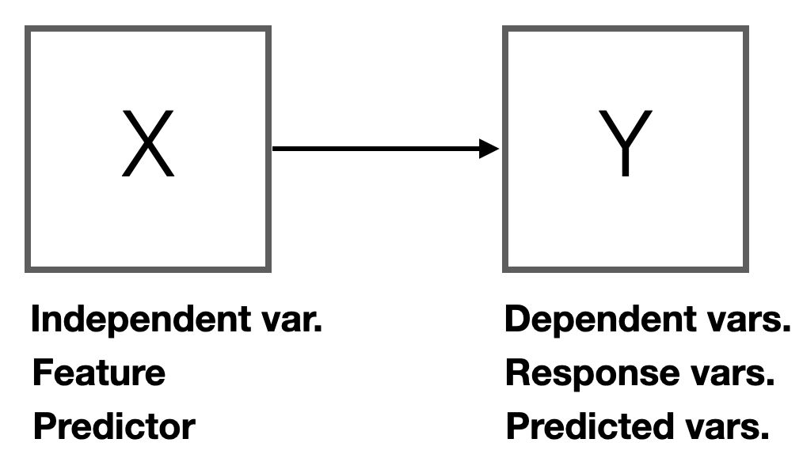
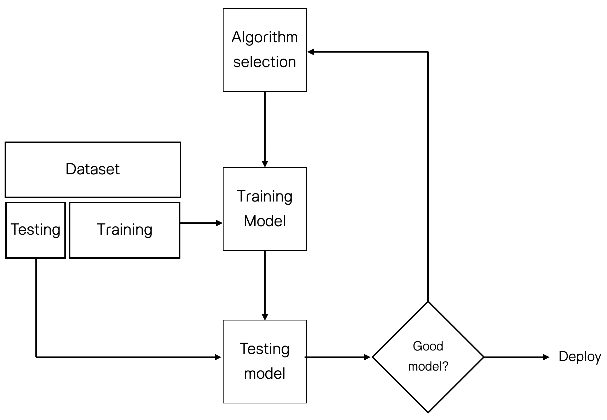
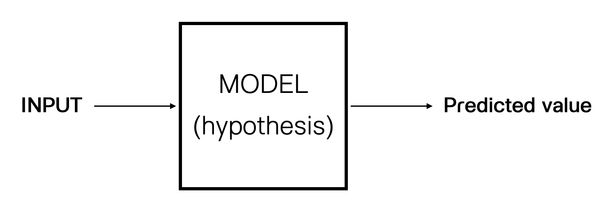
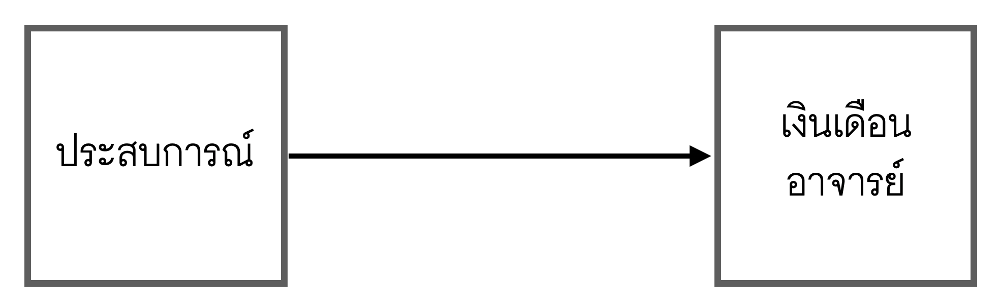
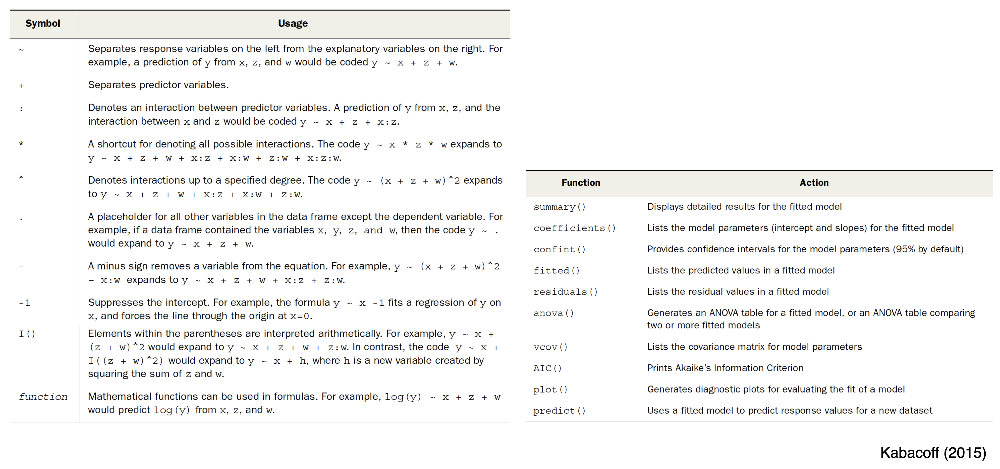
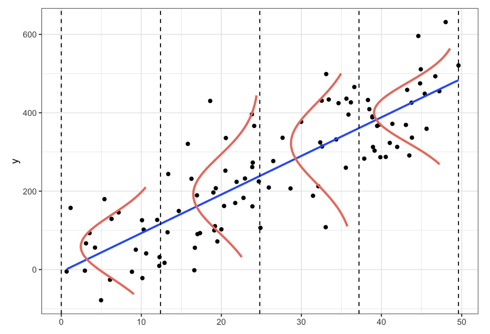

class: center, middle

```{r setup, include=FALSE}
options(htmltools.dir.version = FALSE)

library(tidyr)
library(ggplot2)
library(dplyr)
```

```{r xaringan-themer, include=FALSE, warning=FALSE}
library(xaringanthemer)


style_mono_accent(
  base_color = "#1c5253",
  header_font_google = google_font("Maitree"),
  text_font_google   = google_font("Sarabun"),
  code_font_google   = google_font("Fira Mono")
)
  

#style_duo_accent(header_font_google = google_font("Maitree"),
#  text_font_google   = google_font("Sarabun"),
#  code_font_google   = google_font("Fira Mono"),
#  primary_color = "#4d3e3e",
#  secondary_color="#fff3cd",
 
#text_color="#382933",

#  colors = c(
#  red = "#f34213",
#  purple = "#3e2f5b",
#  orange = "#ff8811",
#  green = "#136f63",
#  white = "#FFFFFF")

#)

```


---
class: middle, center, inverse


<iframe width="560" height="315" src="https://www.youtube.com/embed/aaOB-ErYq6Y" frameborder="0" allow="accelerometer; autoplay; encrypted-media; gyroscope; picture-in-picture" allowfullscreen></iframe>


---
class: middle

.left-column[

### Supervised Learning

<section style="font-size:14px;">
เป็นการเรียนรู้รูปแบบความสัมพันธ์ระหว่างตัวแปรตามกับตัวแปรอิสระที่พบเจอในชุดข้อมูลฝึกหัด (training dataset) และสร้างโมเดลทางสถิติที่เหมาะสมเพื่อทำนาย (predicting) หรือคาดการณ์ผลลัพธ์ (output) ของตัวแปรตาม ด้วยข้อมูลของตัวแปรอิสระ
</section>



]

.right-column[

Supervised Learning จำแนกได้เป็นสองประเภทตามลักษณะของตัวแปรตาม

- **Regression** (สำหรับตัวแปรตามแบบต่อเนื่อง)

- **Classification** (สำหรับตัวแปรตามแบบจัดประเภท)

.pull-left[

<small>

การพัฒนา supervised learning model หรืออาจเรียกว่า predictive model มีขั้นตอนดังนี้

1. Problem Definition

2. Hypothesis Generation

3. Data Collection

4. Data Exploration and Preparation

5. Developing ML model

6. Model Implementation

</small>
]


.pull-right[
</br>


]

]

---
class: middle, center




---
class: middle

.left-column[

### Types of Regression

<small>
regression เป็น area ที่ใหญ่ โดยสามารถจำแนกเป็นโมเดล regression ย่อย ๆ ได้หลากหลายโมเดล ทั้งนี้ขึ้นอยู่กับลักษณะค่าสังเกตของตัวแปรตาม และลักษณะความสัมพันธ์โดยธรรมชาติระหว่างตัวแปรตามกับตัวแปรอิสระ
</small>
]


.right-column[
```{r echo=F, message=F, warning=F}
library(kableExtra)
type<-c("Simple linear","Polynomial","Multiple Linear","Multilevel","Multivariate","Logistic",
        "Poisson","Cox proportaional hazards","Time-series","Nonlinear","Nonparametric","Robust")
use<-c("Predicting a quantitative response variable from quantitative/qualitative explanatory variable.",
       "Predicting a quantitative response variable from quantitative explanatory variable when the relationship is modeled as an nth order polynomial",
       "Predicting a quantitative response variable from two or more quantitative/qualitative explanatory variables.",
       "Predicting a response variable from data that have hierarchical structure.",
       "Predicting more than one response variables from one and more explanatory variables.",
       "Predicting a categorical response variable from one or more explanatory variables.",
       "Predicting a response variable representing counts from one or more explanatory variables.",
       "Predicting time to event (death, failure,...) from one or more explanatory variables.",
       "Modeling time-series data with correlated errors.",
       "Predicting a quantitative response variable from one or more explanatory variables, where the form of the model is nonlinear.",
       "Predicting a quantitative response variable from one or more explanatory variables, where the form of the model is derived from the data and not specified a priori,",
       "Predicting a quantitative response variable from one or more explanatory variables using an approach that's resistant to the effect of influential observtions.")

dat<-data.frame(type,use)
names(dat)<-c("ประเภท","ลักษณะการใช้งาน")


kable(dat)%>%kable_styling(full_width = T, font_size =12) %>%
  column_spec(1, bold = T, border_right = T)


```
]

---
class: middle


.left-column[

## Linear Regression


* Basic Concepts

* Training Models

* Evaluating Models
]

---
class: middle


.left-column[

## Linear Regression


* **Basic Concepts**

* Training Models

* Evaluating Models
]


.right-column[


**Linear regression**

<small>

 เป็นโมเดลการเรียนรู้ที่ classic และง่ายที่สุด วัตถุประสงค์ของการวิเคราะห์อาจจำแนกเป็นสองด้าน

* อธิบายความสัมพันธ์เชิงสาเหตุระหว่างตัวแปรอิสระ (independent variables) กับตัวแปรตาม (dependent variables) 

* ทำนายแนวโน้มการเกิดค่าสังเกตของตัวแปรตาม โดยใช้ linear combination

$$\hat{y}=b_0+b_1x_1+b_2x_2+...+b_px_p \approx y$$
เมื่อ $y$ คือค่าสังเกตจริงของตัวแปรตาม, $x$ คือค่าสังเกตจริงของตัวแปรอิสระ, $b_j$ คือสัมประสิทธิ์การถดถอย (regression coefficients) และ $\hat{y}$ คือค่าทำนายตัวแปรตาม $y$ โดยที่ สัมประสิทธิ์ภายใน linear combination ประมาณได้จากข้อมูลค่าสังเกตค่าด้วยอัลกอริทึมการเรียนรู้ เช่น least squares method 
</small>
]


--

.right-column[

**Simple Linear Regression**

.pull-left[
<small>
ฝ่าย HR ของมหาวิทยาลัยต้องการพัฒนาโมเดลทำนายเงินเดือนของอาจารย์ (Salary) ด้วยประสบการณ์ในการทำงานด้านวิชาการของอาจารย์ (YearsExperience) ทั้งนี้เพื่อใช้เป็นสารสนเทศประกอบการกำหนดข้อเสนอการจ้างงานสำหรับอาจารย์ใหม่ของมหาวิทยาลัย
</small>
]

.pull-right[


]


]


---
class: middle


.left-column[

## Linear Regression


* **Basic Concepts**

* Training Models

* Evaluating Models
]


.right-column[

.pull-left[
</br>

```{r echo=F,fig.retina=3, fig.height=5}
library(ggplot2)
x<-runif(100,0,50)
y<-rnorm(100,50,8)
y2<-20+1.5*x+rnorm(100,0,5)

par(mar=c(5,5,1,1))
plot(x,y,ylim=c(0,100),pch=16,col="darkblue")
abline(lm(y~x),col="orange",lwd=2)
plot(x,y2,ylim=c(0,100),ylab="y",col="darkblue",pch=16)
abline(h=mean(y2),col="black",lwd=2)
abline(lm(y2~x),col="orange",lwd=2)
text(43,60,expression(hat(y)==bar(y)+0*x),col="black",cex=1.2)
text(13,20,expression(hat(y)==19+1.5*x),col="orange",cex=1.2)


```
]

.pull-right[

</br>
</br>
</br>
</br>
</br>


**no relationship between y and x**


</br>
</br>
</br>
</br>
</br>

**linear relationship between y and x**

- 1st linear combination: 

$$\hat{y}=\bar{y}+0x$$

- 2nd linear combination: 

$$\hat{y}=19+1.5x$$

]

]

---
class: middle


.left-column[

## Linear Regression


* **Basic Concepts**

* Training Models

* Evaluating Models
]


.right-column[


### Y = signal + noise

- **signal** = some math function ---> eg. linear function: $f(x)=\beta_0+\beta_1x$

- **noise** = random error ---> $\epsilon_i=y_i-\hat{y}_i$ ---> $\sigma^2$


.pull-left[
```{r echo=F,fig.retina=3, fig.height=6}
library(ggplot2)
x<-runif(100,0,50)
y<-rnorm(100,50,8)
y2<-20+1.5*x+rnorm(100,0,5)
par(mar=c(5,5,1,1))
plot(x,y2,ylim=c(0,100),ylab="y",col="darkblue",pch=16)
abline(lm(y2~x),col="orange",lwd=3)
text(25,30,expression(hat(y)==19+1.5*x),col="orange",cex=2)
```
]

.pull-right[

<small>

* $f(x)$ ที่กำหนดในแต่ละการวิเคราะห์เป็นสมมุติฐาน ซึ่งมีความเป็นไปได้สูงที่จะไม่ใช่โมเดลจริงของประชากร

* อัลกอริทึมการเรียนรู้จะประมาณค่าพารามิเตอร์ภายในฟังก์ชัน $f(x)$ เพื่อปรับเหมาะให้ฟังก์ชันดังกล่าวสามารถเรียนรู้ความสัมพันธ์ระหว่างตัวแปรใน traning data ได้ดีที่สุด

* $b_1 \approx \beta_1$ คือพารามิเตอร์ความชัน (slope) ---> $\frac{\Delta\overline{y}}{\Delta{x}}$

* $b_0 \approx \beta_0$ คือพารามิเตอร์จุดตัดแกน (intercept)

 
</small>

]
]


---
class: middle


.left-column[

## Linear Regression


* Basic Concepts

* **Training Models**

* Evaluating Models

</br>
</br>
</br>
</br>
</br>

<small>
**Note:** ภาษา ML เรียก $SSE=\sum_{i=1}^n(y_i-\hat{y}_i)^2$ ว่า ฟังก์ชันความสูญเสีย (Loss function)
</small>
]

.right-column[

<small>

### Least Squares Algorithm

เป็นวิธีประมาณค่าโดยตรง วิธีนี้จะคำนวณหาค่าชุดของพารามิเตอร์ที่ดีที่สุดของโมเดลที่ทำให้โมเดลมีความสอดคล้องกับ training data มากที่สุด (ie. optimize intercept and slope parameter of the model) การคำนวณค่าประมาณพารามิเตอร์ดังกล่าวจะคำนวณด้วยสูตรปิด (closed form)

$$\min_{\beta}SSE \rightarrow b=(X^TX)^{-1}(X^TY)$$


### Gradient Descent Algorithm

เป็น iterative optimization approach กล่าวคือไม่ได้มีสูตรปิดตายตัวสำหรับหาค่าประมาณพารามิเตอร์ แต่จะใช้การทวนซ้ำเพื่อหาชุดของค่าพารามิเตอร์ที่เป็นคำตอบที่ดีที่สุด
1. กำหนด model และค่าเริ่มต้นของพารามิเตอร์ภายในโมเดล (initial value)

2. คำนวณค่า 1st order derivative ของ Loss function ของโมเดลด้วยค่าพารามิเตอร์ที่กำหนด (derivative=0 หรือไม่?)

3. ถ้า derivative $\neq0$ แทนพารามิเตอร์ค่าใหม่ ดังนี้ $new = old-stepSize$ $(stepSize = derivative \times LearningRate)$

4. ทวนซ้ำขั้นตอนที่ 2 และ 3 จนกระทั่ง derivative $=0$

</small>

]


---
name: yourturn
template: section

.left-column[
# .fancy[Your turn]
]
---
name: yourturn1
template: yourturn


.right-column[

### Training Simple Regression Model

<small>
ฝ่าย HR ของมหาวิทยาลัยต้องการพัฒนาโมเดลทำนายเงินเดือนของอาจารย์ (Salary) ด้วยประสบการณ์ในการทำงานด้านวิชาการของอาจารย์ (YearsExperience) ทั้งนี้เพื่อใช้เป็นสารสนเทศประกอบการกำหนดข้อเสนอการจ้างงานสำหรับอาจารย์ใหม่ของมหาวิทยาลัย


1. นำชุดข้อมูล [datasets_Salary_Data.csv](https://drive.google.com/file/d/11v2nEFVj2wfYfwruVgCUlu5eWiyJrYN6/view?usp=sharing) เข้าสู่ R

2. สำรวจข้อมูลเบื้องต้นด้วยฟังก์ชัน `summary()` และ `str()`

3. สร้าง scatter plot เพื่อสำรวจความสัมพันธ์ระหว่าง `Salary` กับ `YearsExperience` (นิสิตคิดว่าสามารถ fit linear model ให้กับข้อมูลชุดนี้ได้หรือไม่?)

4. แบ่งข้อมูลออกเป็น 2 ส่วนอย่างสุ่ม ได้แก่ trainning data และ testing data ด้วยอัตราส่วน 80:20

5. ประมาณค่าพารามิเตอร์ในโมเดลด้วย least squares algorithm โดยใช้ฟังก์ชัน `lm()`

6. ประเมินคุณภาพของโมเดล

</small>
]

---
name: yourturn1
template: yourturn

### Importing and Exploring Data


```{r eval=F}
dat<-read.csv("datasets_Salary_Data.csv")
summary(dat)
```


```{r echo=F}
dat<-read.csv("/Users/siwachoat/Library/Mobile Documents/com~apple~CloudDocs/เอกสารประกอบการสอน/Machine Learning/เอกสาร/ep2_regression/_01_simple regression/datasets_10624_14867_Salary_Data.csv")
summary(dat)
```

```{r}
str(dat)
```


---
name: yourturn1
template: yourturn

### Exploring Data


```{r eval=F}
library(ggplot2)
library(dplyr)

dat%>%ggplot(aes(x=YearsExperience,y=Salary))+
        geom_point(size=2)
```


```{r echo=F, message=F, warning=F, fig.width=9, fig.height=5, fig.retina=3, align='center'}
library(ggplot2)
library(dplyr)
dat%>%ggplot(aes(x=YearsExperience,y=Salary))+
        geom_point()
```


---
name: yourturn1
template: yourturn

### Splitting Data

```{r}
set.seed(123)# specify the initial seed
dat$id<-1:30 # create ID
train.id<-sample(dat$id,0.8*30) #random sampling 80% of data
train.dat<-dat[train.id,]
test.dat<-dat[-train.id,]
```


```{r}
str(train.dat)
```

```{r}
str(test.dat)
```

---
name: yourturn1
template: yourturn

### Training Simple Regression Model

<small>
ฟังก์ชันพื้นฐานสำหรับประมาณค่าพารามิเตอร์ใน Linear regression model คือ `lm()` ที่มีรูปแบบการเขียนคำสั่งพื้นฐานดังนี้

</small>

`fit<-lm(formula, data)`

<small>
โดยที่ `formula` คืออาร์กิวเมนท์สำหรับระบุรูปแบบของ training model โดยเขียนในรูปแบบ `y~x1+x2+x3` และ `data` คือชุดข้อมูล (data.frame) ที่ต้องประกอบด้วยค่าสังเกตของตัวแปรตามและตัวแปรอิสระ
</small>


<center>

</center>


---
name: yourturn1
template: yourturn

</br>

<small>
```{r}
fit<-lm(Salary~YearsExperience, data=train.dat)
summary(fit) #extract training model information
```
</small>

---
class: middle


.left-column[

## Linear Regression


* Basic Concepts

* Training Models

* **Evaluating Models**

<p style="text-indent:3em;">- In-sample fit</p>
<p style="text-indent:3em;">- Out-sample fit</p>

]


.right-column[

### In-sample fit (model validation)

<small>
Model validation is defined within regulatory guidance as “the set of processes and activities intended to verify that models are performing as expected, in line with their design objectives, and business uses.” It also identifies “potential limitations and assumptions, and assesses their possible impact.” (Khurana, 2019)
</small>

.pull-left[


]

.pull-right[
</br>

**Linear regression's assumptions**

<small>
1. Linearity (correct functional form)
2. Normality
3. Independence
4. Homoskedasticity
5. No outliers
6. No Multicollinearity (for MRA)
</small>
]

<small>
- ในทางปฏิบัติผู้วิเคราะห์สามารถใช้การวิเคราะห์เศษเหลือ (residual analysis) เพื่อ validate training model ดังกล่าว
</small>
]


