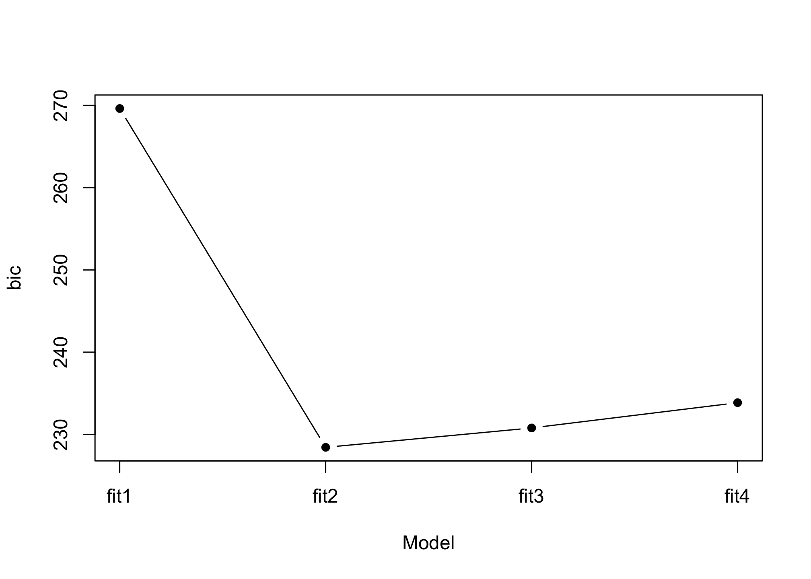

การบ้านครั้งที่ 2: Linear Regression
================
รายวิชา 2758688 หลักการเรียนรู้ของเครื่องและการประยุกต์
2020-09-01

<style>
@import url('https://fonts.googleapis.com/css2?family=Pridi:wght@200&family=Sarabun:wght@200;300&family=Taviraj:wght@200&family=Trirong:wght@300&display=swap');

body{
    font-family: 'Taviraj', serif;
    font-size: 12pt;
    color: black;
    line-height:1.7em;
}
/* Headers */
h1,h2,h3,h4,h5,h6{
  font-size: 16pt;
    font-family: 'Trirong', serif;
    }
</style>

</br>

จากบทเรียนในคาบเรียนของสัปดาห์ที่ 3 ให้นิสิตดำเนินการต่อไปนี้

1.  ทำความสะอาดและจัดกระทำข้อมูลตามที่เรียนในคาบเรียน
    จากนั้นแบ่งข้อมูลที่จัดกระทำเสร็จแล้วออกเป็นสอง
    ส่วนได้แก่ ชุดข้อมูลฝึกหัด (training data) และชุดข้อมูลทดสอบ
    (testing data) โดยใช้อัตราส่วน 60:40

2.  แปลงค่าสังเกตของตัวแปรตาม `median_house_value` ด้วยฟังก์ชัน `log()`
    เพื่อลดผลกระทบจากความเบ้ที่เกิดขึ้นในการแจกแจงของตัวแปรตาม

3.  ใช้ตัวแปรตามที่แปลงค่าด้วย log function ข้างต้น
    เพื่อประมาณค่าพารามิเตอร์ใน
    linear regression จำนวน 3 โมเดลได้แก่ **full model**
    ที่ประกอบด้วยตัวแปรอิสระทั้งหมดในชุดข้อมูล
    **reduce model (filter)** ที่คัดเลือกตัวแปรอิสระเข้าสู่โมเดลโดยใช้
    filter methods และ **reduce model (wrapper)**
    ที่คัดเลือกตัวแปรอิสระเข้าสู่โมเดลโดยใช้
    wrapper methods

4.  ตรวจสอบความเหมาะสมของโมเดลทั้งสามโดยใช้การวิเคราะห์เศษเหลือ
    (residual analysis)

5.  เปรียบเทียบความสอดคล้องเชิงประจักษ์ (empirical fit)
    ระหว่างโมเดลทั้งสามในชุดข้อมูลฝึกหัดโดยใช้่ค่าสถิติวัดความสอดคล้องเชิงประจักษ์ได้แก่
    RMSE, R-squared, adjR-squared และ BIC และสถิติทดสอบ partial F-test
    และ likelihood ratio test

6.  เปรียบเทียบประสิทธิภาพในการทำนายของโมเดลทั้งสาม โดยใช้ชุดข้อมูลทดสอบ
    (testing data) โดยใช้ค่า RMSE และ R-squared

**Note:** การคำนวณค่า BIC ของโมเดลสามารถทำได้โดยใช้ฟังก์ชัน `BIC()`
ยกตัวอย่างเช่น

``` r
#importing and fitting models to the data
dat<-data.frame(state.x77)
fit1<-lm(Murder~HS.Grad, data=dat)
fit2<-lm(Murder~HS.Grad+Illiteracy+Life.Exp, data=dat)
fit3<-lm(Murder~HS.Grad+Illiteracy+Life.Exp+Income, data=dat)
fit4<-lm(Murder~HS.Grad+Illiteracy+Life.Exp+Income+Area, data=dat)

# extract BIC value 
bic<-c(BIC(fit1),BIC(fit2),BIC(fit3),BIC(fit4))

# visualize
plot(1:4,bic,type="b",pch=16, xaxt="n",xlab="Model")
axis(1,at=1:4,labels=c("fit1","fit2","fit3","fit4"))
```



### การส่งงาน

[กดตรงนี้](https://docs.google.com/forms/d/e/1FAIpQLScukMNziyayICAeOLHgMipTTbvVFnzj1VNfLhlFLWjPKghi-w/viewform?usp=sf_link)
เพื่อส่งงานของนิสิต โดยให้ส่งการบ้าน**ภายใต้วันศุกร์ที่ 4 กันยายน 2563**
