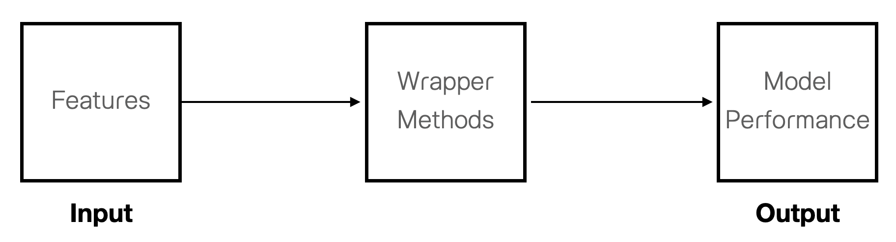

class: center, middle, inverse

```{r setup, include=FALSE}
options(htmltools.dir.version = FALSE)

library(tidyr)
library(ggplot2)
library(dplyr)
```

```{r xaringan-themer, include=FALSE, warning=FALSE}
library(xaringanthemer)


style_mono_accent(
  base_color = "#1c5253",
  header_font_google = google_font("Maitree"),
  text_font_google   = google_font("Sarabun"),
  code_font_google   = google_font("Fira Mono")
)
  

#style_duo_accent(header_font_google = google_font("Maitree"),
#  text_font_google   = google_font("Sarabun"),
#  code_font_google   = google_font("Fira Mono"),
#  primary_color = "#4d3e3e",
#  secondary_color="#fff3cd",
 
#text_color="#382933",

#  colors = c(
#  red = "#f34213",
#  purple = "#3e2f5b",
#  orange = "#ff8811",
#  green = "#136f63",
#  white = "#FFFFFF")

#)

```


# housing.csv


---
name: outline1
class: middle

.left-column[

### Multiple Regression

- **Importing data**

- Feature Selection

- Dummy variables

- Interaction effects

- CARET package


]

.right-column[

### housing.csv

```{r}
library(dplyr)
dat<-data.frame(state.x77)
dat<-dat%>%select(5,1,2,3,4,6,7,8) # reorder variables
summary(dat)

```

]

---
.left-column[

### Multiple Regression

- **state.x77**

- Feature Selection

- Dummy variables

- Interaction effects

- CARET package


]

.right-column[


```{r}
round(cor(dat),2)
```


]

---
.left-column[

### Multiple Regression

- **state.x77**

- Feature Selection

- Dummy variables

- Interaction effects

- CARET package


]

.right-column[


```{r fig.retina=3, fig.height=7.5,fig.width=10, message=F}
library(GGally)
ggpairs(dat, lower=list(continuous=wrap("smooth",method="loess")),switch="y")
```

]


---
.left-column[

### Multiple Regression

- **state.x77**

- Feature Selection

- Dummy variables

- Interaction effects

- CARET package


]

.right-column[

.pull-left[

### All-in

```{r}
## feature scaling
dat[,2:dim(dat)[2]]<-scale(dat[,2:dim(dat)[2]],
                           center=T,scale=T) 
dat$id<-1:length(dat$Murder)

# splitting data
set.seed(1234)
train.id<-sample(dat$id,0.8*length(dat$Murder))
train.dat<-dat[train.id,]
test.dat<-dat[-train.id,]

### All-in regression
fit.all<-lm(Murder~.,data=train.dat%>%select(-id))
```

**Extract the output**

```{r eval=F}
summary(fit.all) # extract the regression output
par(mfrow=c(2,2))
plot(fit.all) # extract the residual's plot
```
]


.pull-right[

```{r echo=F}
summary(fit.all)
```

]
]


---
.left-column[

### Multiple Regression

- **state.x77**

- Feature Selection

- Dummy variables

- Interaction effects

- CARET package


]


.right-column[


**Variance Inflation factor (VIF)**

```{r echo=F, fig.retina=3, fig.height=6.5, fig.width=8, message=F}
#install.packages("car")
library(car)
vif(fit.all)
```

**Residual plot**

```{r echo=F, fig.retina=3, fig.height=6.5, fig.width=8, message=F}
# residual plot
par(mfrow=c(2,2))
plot(fit.all)
```

]


---
.left-column[

### Multiple Regression

- state.x77

- **Feature Selection**

- Dummy variables

- Interaction effects

- CARET package


]

.right-column[

<small>

### Feature Selection

**Filter Methods**

วิธีการในกลุ่มนี้ไม่ได้ใช้ ML algorithm มาช่วยในการเลือกตัวแปรอิสระ แต่เป็นวิธีการเลือกตัวแปรอิสระเข้าสู่โมเดลโดยใช้ความสัมพันธ์ระหว่างตัวแปรตามกับตัวแปรอิสระเป็นเกณฑ์ ความสัมพันธ์ดังกล่าวพิจารณาจากสถิติต่าง ๆ เช่น correlation matrix (Pearson, Spearman, Distance), Chi-squared test, ANOVA etc.


**Wrapper Methods**

เลือกตัวแปรอิสระด้วยการเปรียบเทียบประสิทธิภาพของโมเดลที่มีการใส่/ถอดตัวแปรอิสระต่าง ๆ กัน  วิธีการในกลุ่มนี้ เช่น Backward, Forward, Bidirectional, Best Subset regression 


<center></center>


**Models with build-in feature selection**

เป็น ML algorithm ที่สามารถลดทอนอิทธิพลหรือเลือกตัวแปรอิสระภายในโมเดลได้โดยตัวอัลกอริทึมเอง เช่น LASSO regression, ridge regression, AdaBoost เป็นต้น

</small>

]


---

.left-column[

### Multiple Regression

- state.x77

- **Feature Selection**

- Dummy variables

- Interaction effects

- CARET package


]

.right-column[

**Regression model using filter method**

```{r}
fit.filter<-lm(Murder~Illiteracy+Life.Exp+Frost, data=train.dat%>%select(-id))
summary(fit.filter)
```


]

---

.left-column[

### Multiple Regression

- state.x77

- **Feature Selection**

- Dummy variables

- Interaction effects

- CARET package


]


.right-column[

```{r fig.retina=3,fig.height=7,fig.width=10}
par(mfrow=c(2,2))
plot(fit.filter)
```

]

---

.left-column[

### Multiple Regression

- state.x77

- **Feature Selection**

- Dummy variables

- Interaction effects

- CARET package


]

.right-column[

### Comparing Models: Partial F-test

.pull-left[

<small>

**Hypotheses**


$H_0:$ Reduced model = Full model


$H_1:$ Reduced model worse than Full model

</small>


<small>

**test statistics**


$$F=\frac{\frac{SSE_{reduce}-SSE_{full}}{p^*}}{\frac{SSE_{full}}{n-p_{full}-1}} \sim F_{p^*,n-p_{full}-1}$$
</small>


<small>

$p$ คือจำนวนตัวแปรอิสระภายในโมเดลทำนาย

$p^*=p_{full}-p_{reduce}$

$n$ คือจำนวนหน่วยข้อมูล

</small>

]


.pull-right[

```{r}
# fit.all <--full model (All-in)
# fil.filter <-- reduced model
anova(fit.filter,fit.all)
```


]

]

---

.left-column[

### Multiple Regression

- state.x77

- **Feature Selection**

- Dummy variables

- Interaction effects

- CARET package


]

.right-column[

### Comparing Models: Likelihood ratio test


.pull-left[

<small>

**Hypotheses**

$H_0:$ Reduced model = Full model


$H_1:$ Reduced model worse than Full model

</small>

<small>

**test statistics**

$$deviance=-2LL_{reduce}-(-2LL_{full})\sim \chi^2_{p^*}$$

</small>

<small>

$p$ คือจำนวนตัวแปรอิสระภายในโมเดลทำนาย

$p^*=p_{full}-p_{reduce}$

$n$ คือจำนวนหน่วยข้อมูล

**Note:** normality assumption must be assumed.
</small>

]


.pull-right[

```{r message=F, warning=F}
# install.packages("lmtest")
library(lmtest)
lrtest(fit.filter,fit.all)
```


]

]

---

.left-column[

### Multiple Regression

- state.x77

- **Feature Selection**

- Dummy variables

- Interaction effects

- CARET package


]

.right-column[

### Wrapper methods

<small>

- Backward elemination (`backward`)

- Forward selection (`forward`)

- Bidirectional (`seqrep`)

- All possible (`exhaustive`)

</small>

<small>

`regsubsets()` [leaps package], which has the tuning parameter nvmax specifying the maximal number of predictors to incorporate in the model. It returns multiple models with different size up to nvmax. You need to compare the performance of the different models for choosing the best one. regsubsets() has the option method, which can take the values “backward”, “forward” and “seqrep” (seqrep = sequential replacement, combination of forward and backward selections).

</small>

```{r eval=F}
#install.packages("leaps")
library(leaps)
reg<-regsubsets(Murder~., data = train.dat%>%select(-id), nvmax = 8,
                     method = "backward")
summary(reg)

```

]
่
---

.left-column[

### Multiple Regression

- state.x77

- **Feature Selection**

- Dummy variables

- Interaction effects

- CARET package


]

.right-column[

```{r echo=F, message=F, warning=F}
library(leaps)
reg<-regsubsets(Murder~., data = train.dat%>%select(-id), nvmax = 7,
                     method = "backward")
summary(reg)
```

]

---

.left-column[

### Multiple Regression

- state.x77

- **Feature Selection**

- Dummy variables

- Interaction effects

- CARET package


]

.right-column[

```{r echo=T, fig.retina=3, fig.height=6, fig.width=10}
temp<-summary(reg)
objects(temp)
```

```{r echo=F, fig.retina=3, fig.height=6, fig.width=10}
model<-1:7
fit.measures<-data.frame(model,temp$rss,temp$adjr2,temp$cp,temp$bic)
names(fit.measures)[2:5]<-c("SSE","adjR2","CP","BIC")
par(mfrow=c(2,2))
plot(fit.measures$model,fit.measures$SSE,type="b",pch=16,ylab="SSE",xlab="Model")
plot(fit.measures$model,fit.measures$adjR2,type="b",pch=16,ylab="adjR2",xlab="Model")
plot(fit.measures$model,fit.measures$CP,type="b",pch=16,ylab="CP",xlab="Model")
plot(fit.measures$model,fit.measures$BIC,type="b",pch=16,ylab="BIC",xlab="Model")

```

]
