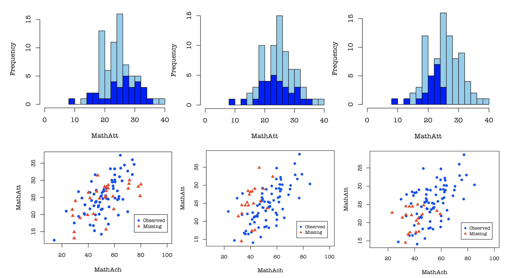
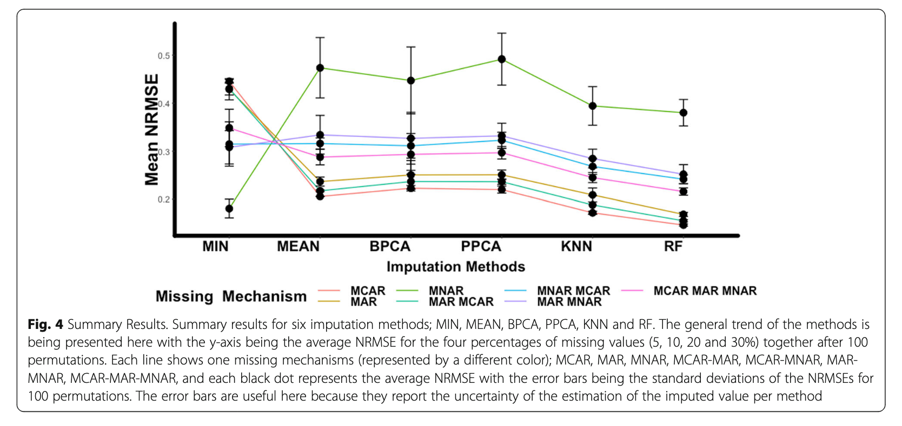
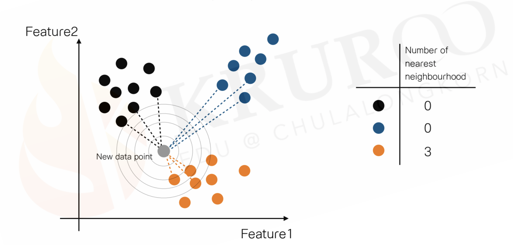
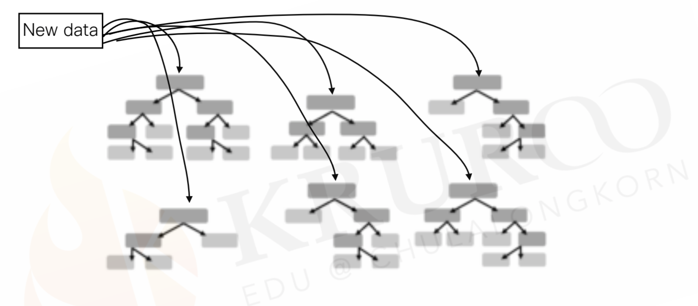

class: center, middle

```{r setup, include=FALSE}
options(htmltools.dir.version = FALSE)

library(tidyr)
library(ggplot2)
library(dplyr)
```

```{r xaringan-themer, include=FALSE, warning=FALSE}
library(xaringanthemer)


style_mono_accent(
  base_color = "#1c5253",
  header_font_google = google_font("Maitree"),
  text_font_google   = google_font("Sarabun"),
  code_font_google   = google_font("Fira Mono")
)
  

#style_duo_accent(header_font_google = google_font("Maitree"),
#  text_font_google   = google_font("Sarabun"),
#  code_font_google   = google_font("Fira Mono"),
#  primary_color = "#4d3e3e",
#  secondary_color="#fff3cd",
 
#text_color="#382933",

#  colors = c(
#  red = "#f34213",
#  purple = "#3e2f5b",
#  orange = "#ff8811",
#  green = "#136f63",
#  white = "#FFFFFF")

#)

```


# housing.csv


---
class: middle

.left-column[

### housing.csv

- **Importing Data**

- Data Preprocessing

- Modelling

- Models Evaluating


]

.right-column[

### Importing Data

```{r eval=F}
#setwd() # <--- setting working directory
#getwd() # <--- checking working directory
#dir() # <--- List the Files in a Directory/Folder
dat<-read.csv("housing.csv")
head(dat)
```

```{r echo=F}
dat<-read.csv("/Users/siwachoat/Library/Mobile Documents/com~apple~CloudDocs/github/ssiwacho/2758501/ssiwacho.github.io/2758688/week3/housing.csv")
head(dat)
```


]


---
class: middle, center

# Any Problem?


---
class: middle

.left-column[

### housing.csv

- Importing Data

- **Data Preprocessing**

- Modelling

- Models Evaluating


]


.right-column[


### Data Preprocessing

Data preprocessing techniques generally refer to addition, deletion, or transformation of data.

- Exploring data

- Handling missing data

- Outlier detection

- Transforming data

- Feature Extraction

- Features Scaling

The need for data preprocessing is depended on data in hand and the type of model being used.


- Learning algorithm of linear regression is relied on $(X^TX)^{-1}$ matrix, hence it is sensitive to characteristics of predictor data.

- Tree-based model are insensitive to characteristics of the variables.


]


---
class: middle

.left-column[

### housing.csv

- Importing Data

- **Data Preprocessing**

- Modelling

- Models Evaluating


]

.right-column[

```{r}
str(dat)
```
]


---
class: middle

.left-column[

### housing.csv

- Importing Data

- **Data Preprocessing**

- Modelling

- Models Evaluating


]


.right-column[

```{r}
summary(dat)
```

]

---
class: middle

.left-column[

### housing.csv

- Importing Data

- **Data Preprocessing**

- Modelling

- Models Evaluating


]


.right-column[


### Exploring data: Frequency Distribution

```{r fig.retina=3,fig.height=3,fig.width=7}
#convert character data into factor
dat$ocean_proximity<-factor(dat$ocean_proximity) 
#generate frequency distribution of ocean_proximity
table(dat$ocean_proximity) 
par(mar=c(3,3,1,1))
barplot(table(dat$ocean_proximity))
```


]

---
class: middle

.left-column[

### housing.csv

- Importing Data

- **Data Preprocessing**

- Modelling

- Models Evaluating


]

.right-column[

### Exploring data: Frequency Distribution


```{r eval=T,fig.retina=3, fig.height=5, fig.width=12, warning=F, message=F}
library(tidyr) # tidying datatable tools
library(dplyr) # manipulating data tools
par(mfrow=c(2,4),mar=c(5,4,0.5,0.5))
for(i in 1:7)
{
  hist(dat[,i+2],main="",xlab=names(dat)[i+2])
}
```

]

---
class: middle

.left-column[

### housing.csv

- Importing Data

- **Data Preprocessing**

- Modelling

- Models Evaluating


]

.right-column[

### Frequency Distribution (`nclass=30`)

```{r echo=F,fig.retina=3, fig.height=7, fig.width=12, warning=F, message=F}
library(tidyr) # tidying datatable tools
library(dplyr) # manipulating data tools
par(mfrow=c(2,4))
for(i in 1:7)
{
  hist(dat[,i+2],main="",xlab=names(dat)[i+2],nclass=50)
}
```


]


---
class: middle

.left-column[

### housing.csv

- Importing Data

- **Data Preprocessing**

- Modelling

- Models Evaluating

</br>
</br>
</br>
</br>
</br>
</br>
</br>
</br>
</br>
</br>
</br>

<small>
**Note:** [California Map](https://www.google.com/maps/place/%E0%B9%81%E0%B8%84%E0%B8%A5%E0%B8%B4%E0%B8%9F%E0%B8%AD%E0%B8%A3%E0%B9%8C%E0%B9%80%E0%B8%99%E0%B8%B5%E0%B8%A2+%E0%B8%AA%E0%B8%AB%E0%B8%A3%E0%B8%B1%E0%B8%90%E0%B8%AD%E0%B9%80%E0%B8%A1%E0%B8%A3%E0%B8%B4%E0%B8%81%E0%B8%B2/data=!4m2!3m1!1s0x808fb9fe5f285e3d:0x8b5109a227086f55?sa=X&ved=2ahUKEwjT98DtnrvrAhUjyzgGHbdiAnUQ8gEwHHoECBkQBg)
</small>

]

.right-column[

### Visualizing geographical data: ocean_proximity

.pull-left[
```{r eval=F,fig.retina=3, fig.height=6,fig.width=6}
library(ggplot2)

ggplot()+geom_point(data=dat,
              aes(x=longitude,
                  y=latitude,
                  col=ocean_proximity),
              alpha=0.7)+
        theme_minimal()+
        coord_fixed(1.3)
```

]

.pull-right[
```{r echo=F,eval=T,fig.retina=3, fig.height=7,fig.width=7, message=F, warning=F}
library(ggplot2)
ggplot()+geom_point(data=dat,
              aes(x=longitude,
                  y=latitude,
                  col=ocean_proximity),
              alpha=0.7)+
        theme_minimal()+
        theme(plot.margin=margin(1,1,1,10))+
        coord_fixed(1.3)
```


]
]


---
class: middle

.left-column[

### housing.csv

- Importing Data

- **Data Preprocessing**

- Modelling

- Models Evaluating


]

.right-column[

### Visualizing geographical data: median_house_value

.pull-left[
```{r eval=F,fig.retina=3, fig.height=6,fig.width=6}
library(ggplot2)
library(viridis)

ggplot()+geom_point(data=dat,
              aes(x=longitude,
                  y=latitude,
                  col=median_house_value),
                  alpha=0.7)+
        theme_minimal()+
        coord_fixed(1.3)
```

]

.pull-right[

```{r echo=F,eval=T,fig.retina=3, fig.height=6, message=F, warning=F}
library(ggplot2)
library(viridis)
ggplot()+geom_point(data=dat,
              aes(x=longitude,
                  y=latitude,
                  col=median_house_value),
                  alpha=0.7)+
        theme_minimal()+
        theme(plot.margin=margin(1,1,1,10))+
        scale_color_viridis()+
        coord_fixed(1.3)
```

]
]
---
.left-column[

### housing.csv

- Importing Data

- **Data Preprocessing**

- Modelling

- Models Evaluating


]

.right-column[

### Manipulating Data

```{r fig.retina=3, fig.height=3, fig.width=12}
# manipulating data
dat<-dat%>%mutate(room.per.household=total_rooms/households,
                  bedroom.per.room=total_bedrooms/total_rooms,
                  household.size=population/households)

summary(dat[,11:13])
```

]

---
.left-column[

### housing.csv

- Importing Data

- **Data Preprocessing**

- Modelling

- Models Evaluating


]

.right-column[

### Outlier Detecting

```{r}
dat%>%filter(household.size>1000)%>%select(longitude,latitude,room.per.household,household.size,population,households)
dat%>%filter(room.per.household>100)
```


]

---
.left-column[

### housing.csv

- Importing Data

- **Data Preprocessing**

- Modelling

- Models Evaluating

</br>
</br>
</br>
</br>
</br>
</br>
</br>
</br>
</br>
</br>

<small>

**Note:** [reference](https://www.google.co.th/maps/place/38°19'12.0%22N+121°58'48.0%22W/@38.320686,-121.9783531,919m/data=!3m1!1e3!4m5!3m4!1s0x0:0x0!8m2!3d38.32!4d-121.98)

</small>

]

.right-column[


.pull-left[


```{r eval=F,fig.retina=3, fig.height=8,fig.width=6}
ggplot()+geom_point(data=dat,
              aes(x=longitude,
                  y=latitude),
                  col="grey",
                  alpha=0.5)+
         geom_point(aes(x=-121.98,
                        y=38.32),
                     col="red",
                     size=5)+
         geom_point(aes(x=-120.10,
                        y=38.91),
                     col="red",
                     size=5)        +

         geom_point(aes(x=-120.08,
                        y=38.80),
                     col="red",
                     size=5)  +
        theme_minimal()+
        scale_color_viridis()+
        coord_fixed(1.3)
```

]

.pull-right[
```{r echo=F,eval=T,fig.retina=3, fig.height=8, message=F, warning=F}
ggplot()+geom_point(data=dat,
              aes(x=longitude,
                  y=latitude),
                  col="grey",
                  alpha=0.5)+
          geom_point(aes(x=-121.98,y=38.32),
                     col="red",size=5)+
          
         geom_point(aes(x=-120.10,
                        y=38.91),
                     col="red",
                     size=5)    +    

         geom_point(aes(x=-120.08,
                        y=38.80),
                     col="red",
                     size=5)  +
        theme_minimal()+
        scale_color_viridis()+
        coord_fixed(1.3)
```
]

]

---
class: middle


```{r}
library(DT)
dat%>%filter(room.per.household>10)%>%
      select(longitude,latitude,room.per.household,household.size,population,households)%>%
      datatable(rownames=F, 
                options = list(pageLength=5,
                lengthMenu=c(5,10)))%>%
      formatRound(columns=c('room.per.household', 'household.size'), digits=2)
```


---
class: middle

.left-column[

### housing.csv

- Importing Data

- **Data Preprocessing**

- Modelling

- Models Evaluating

]

.right-column[


.pull-left[

### Outliers ???

```{r eval=F,fig.retina=3, fig.height=8,fig.width=6}
ggplot()+
  geom_point(data=dat,
          aes(x=longitude,
              y=latitude),
              col="grey",
              alpha=0.5)+
  geom_point(data=dat%>%
             filter(room.per.household>10),
             aes(x=longitude,
             y=latitude),
             col="red",
             size=5)+
  theme_minimal()+
  scale_color_viridis()+
  coord_fixed(1.3)
```

]

.pull-right[

```{r echo=F,eval=T,fig.retina=3, fig.height=8, message=F, warning=F}
ggplot()+geom_point(data=dat,
              aes(x=longitude,
                  y=latitude),
                  col="grey",
                  alpha=0.5)+
         geom_point(data=dat%>%
                    filter(room.per.household>10),
                    aes(x=longitude,
                        y=latitude),
                     col="red",
                     size=3)+
        theme_minimal()+
        scale_color_viridis()+
        coord_fixed(1.3)
```


]
]


---
class: middle

.left-column[

### housing.csv

- Importing Data

- **Data Preprocessing**

- Modelling

- Models Evaluating

]

.right-column[

### Outliers???

```{r}
dat%>%filter(room.per.household>10)%>%
          mutate(bedroom.per.household=total_bedrooms/households, bedroom.per.pop=total_bedrooms/population)%>%
            summarise(mean.bed=mean(bedroom.per.pop,na.rm=T),
                      min.bed=min(bedroom.per.pop,na.rm=T),
                      max.bed=max(bedroom.per.pop,na.rm=T),
                      mean.room=mean(room.per.household),
                      min.room=min(room.per.household),
                      max.room=max(room.per.household))
```


]
---
class: middle

.left-column[

### housing.csv

- Importing Data

- **Data Preprocessing**

- Modelling

- Models Evaluating

]

.right-column[

### Outliers??? (K-means clustering)

```{r}
dat$id<-1:dim(dat)[1]
temp<-dat%>%filter(room.per.household>10, is.na(total_bedrooms)==F)%>%
          mutate(bedroom.per.household=total_bedrooms/households, 
                 bedroom.per.pop=total_bedrooms/population)
#Kmeans clustering
km<-kmeans(temp%>%select(bedroom.per.household,
                         bedroom.per.pop,
                         room.per.household),
           center=3) 
#print the output
km
temp$cluster<-km$cluster
```

```{r echo=F}
x<-ifelse(km$size>100,1,0)*c(1,2,3)
x<-x%>%sum()
```


]
---
class: middle

.left-column[

### housing.csv

- Importing Data

- **Data Preprocessing**

- Modelling

- Models Evaluating

]

.right-column[

### Remove the outliers

```{r}
# specify outliers
dat$cluster<-0
dat$cluster[temp$id]<-temp$cluster
dat$cluster<-ifelse(dat$cluster==x,0,ifelse(dat$cluster==0,0,1))
dat<-dat%>%filter(cluster==0)
table(dat$cluster)
```

]


---
class: middle

.left-column[

### housing.csv

- Importing Data

- **Data Preprocessing**

- Modelling

- Models Evaluating

</br>
</br>
</br>
</br>
</br>


<small>
* [naniar package](https://cran.r-project.org/web/packages/naniar/index.html)
* [mice package](https://cran.r-project.org/web/packages/mice/index.html)
* [flexible imputation of missing data](https://stefvanbuuren.name/fimd/)
</small>

]

.right-column[

### Missing value analysis (1)

```{r eval=T, message=F, warning=F, fig.retina=3, fig.width=10, fig.height=4}
# install.packages("naniar")
library(naniar)
library(gridExtra)
#any_na(dat)
p1<-gg_miss_var(dat)
p2<-vis_miss(dat, sort_miss=T)
grid.arrange(p1,p2, nrow=1)
```
]

---
class: middle

.left-column[

### housing.csv

- Importing Data

- **Data Preprocessing**

- Modelling

- Models Evaluating


]

.right-column[


### Type of Missing value

**Missing completely at random (MCAR): ** $p_{ij}=\pi$

**Missing at random (MAR): ** $p_{ij}=p(Missing|Y_{obs})$

**Missing not at rondom (MNAR): ** $p_{ij}=p(Missing|Y_{obs},Y_{miss})$
]

<center></center>


---

.pull-left[

### Missing value analysis (2)

```{r echo=T,eval=F,fig.retina=3, fig.height=8, message=F, warning=F}
ggplot()+geom_point(data=dat,
              aes(x=longitude,
                  y=latitude,
                  col=total_bedrooms),
                  alpha=0.5)+
         geom_point(data=dat%>%
                    filter(is.na(total_bedrooms)==T),
                    aes(x=longitude,
                        y=latitude),
                     col="red",
                     alpha=0.2,
                     size=3)+
        theme_minimal()+
        scale_color_viridis()+
        coord_fixed(1.3)
```


]

.pull-right[
```{r echo=F,eval=T,fig.retina=3, fig.height=9, message=F, warning=F}
ggplot()+geom_point(data=dat,
              aes(x=longitude,
                  y=latitude,col=total_bedrooms),
                  #col="grey",
                  alpha=0.5)+
         geom_point(data=dat%>%
                    filter(is.na(total_bedrooms)==T),
                    aes(x=longitude,
                        y=latitude),
                     col="red",alpha=0.2,
                     size=3)+
        theme_minimal()+
        scale_color_viridis()+
        coord_fixed(1.3)
```
]


---
class: middle

### Missing value analysis (3)


```{r echo=T,eval=T, message=F, warning=F, fig.retina=3, fig.width=16, fig.height=4}
p3<-ggplot(dat,aes(x=bedroom.per.room,y=median_house_value))+geom_miss_point()
p4<-ggplot(dat,aes(x=bedroom.per.room,y=median_house_value))+geom_miss_point()+facet_wrap(~ocean_proximity)
grid.arrange(p3,p4, nrow=1)
```


---

class: middle


### Missing value analysis (4)

```{r echo=T,eval=T, message=F, warning=F, fig.retina=3, fig.width=16, fig.height=4}
p5<-ggplot(dat,aes(x=bedroom.per.room,y=room.per.household))+geom_miss_point()
p6<-ggplot(dat,aes(x=bedroom.per.room,y=room.per.household))+geom_miss_point()+facet_wrap(~ocean_proximity)
grid.arrange(p5,p6,nrow=1)
```


---
class: middle

.left-column[

### housing.csv

- Importing Data

- **Data Preprocessing**

- Modelling

- Models Evaluating

</br>
</br>
</br>
</br>
</br>
</br>
</br>
</br>
</br>
</br>

[**Kokla et al.(2019)**](https://bmcbioinformatics.biomedcentral.com/articles/10.1186/s12859-019-3110-0)

]

.right-column[

### Imputation




]


---
class: middle

.left-column[

### housing.csv

- Importing Data

- **Data Preprocessing**

- Modelling

- Models Evaluating

]

.right-column[

### Imputation using K-NN algorithm

- CARET package offers `preProcess` function that can predict missing values. 

- To impute missing values, we need to set argument `method=knnImpute` for K-Nearest Neighbors imputation and set the argument `method=bagImpute` for bagged tree imputation.



]


---
class: middle

.left-column[

### housing.csv

- Importing Data

- **Data Preprocessing**

- Modelling

- Models Evaluating

]

.right-column[

```{r message=F, warning=F}
library(caret)
#install.packages("RANN")
library(RANN)
dat$id.missing<-ifelse(is.na(dat$total_bedrooms)==T,1,0)
impute.knn<-preProcess(dat%>%select(-id.missing),method="knnImpute",k=5,knnSummary = mean)
impute.dat.knn<-predict(impute.knn,dat)
summary(impute.dat.knn)
```

]
---
class: middle

.left-column[

### housing.csv

- Importing Data

- **Data Preprocessing**

- Modelling

- Models Evaluating


</br>
</br>
</br>
</br>
</br>
</br>
</br>
</br>
</br>
</br>
</br>

* [missRanger](https://cran.r-project.org/web/packages/missRanger/index.html)

]

.right-column[

### Imputation using Random forest





```{r}
#install.packages("missRanger")
library(missRanger)
impute.dat.rf<-missRanger(dat,.~.-id.missing,seed=1234,num.trees=500)
```


]

---
class: middle

.left-column[

### housing.csv

- Importing Data

- **Data Preprocessing**

- Modelling

- Models Evaluating

]

.right-column[

```{r}
summary(impute.dat.rf)
```


]
---

class: middle

.left-column[

### housing.csv

- Importing Data

- **Data Preprocessing**

- Modelling

- Models Evaluating

]

.right-column[

### Splitting data


- using `sample()` function from base package.

```{r eval=F}
set.seed(1234)
train.id<-sample(rownames(impute.dat.rf),0.6*dim(impute.dat.rf)[1])
train.dat<-impute.dat.rf[train.id,]
test.dat<-impute.dat.rf[-as.numeric(train.id),]
```

- using `createDataPartition()` function from caret package.

```{r eval=F}
#install.packages("caret")
library(caret)
set.seed(1234)
train.id.caret<-createDataPartition(impute.dat.rf$median_house_value,
                                    p=0.6,
                                    list=F)
train.dat.caret<-impute.dat.rf[train.id.caret,]
test.dat.caret<-impute.dat.rf[-train.id.caret,]
```


]

---
class: middle

.left-column[

### housing.csv

- Importing Data

- **Data Preprocessing**

- Modelling

- Models Evaluating

]

.right-column[

```{r echo=F, fig.retina=3, fig.width=8,fig.height=4, message=F, warning=F}
set.seed(1234)
train.id<-sample(rownames(impute.dat.rf),0.6*dim(impute.dat.rf)[1])
train.dat<-impute.dat.rf[train.id,]
test.dat<-impute.dat.rf[-as.numeric(train.id),]
p1<-ggplot()+
  geom_histogram(data=train.dat,aes(x=median_house_value),fill="orange",alpha=0.5)+
  geom_histogram(data=test.dat,aes(x=median_house_value),fill="darkgreen",alpha=0.5)+
  theme_minimal()+
  labs(title="Using sample() function")
#### ------------------------------------------------------------------------- ####
#install.packages("caret")
library(caret)
set.seed(1234)
train.id.caret<-createDataPartition(impute.dat.rf$median_house_value,p=0.6,list=F)
train.dat.caret<-impute.dat.rf[train.id.caret,]
test.dat.caret<-impute.dat.rf[-train.id.caret,]

p2<-ggplot()+
  geom_histogram(data=train.dat.caret,aes(x=median_house_value),fill="red",alpha=0.5)+
  geom_histogram(data=test.dat.caret,aes(x=median_house_value),fill="darkblue",alpha=0.5)+
  theme_minimal()+
  labs(title="Using createDataPartition() function")
```


```{r fig.retina=3, fig.width=12,fig.height=6, message=F, warning=F}
grid.arrange(p1,p2,nrow=1)
```

]

---
class: middle

.left-column[

### housing.csv

- Importing Data

- **Data Preprocessing**

- Modelling

- Models Evaluating

]

.right-column[

### Exploring correlations in training data

```{r}
train.dat.caret<-train.dat.caret%>%
                    select(-total_rooms,-total_bedrooms,-population,-households)%>%
                        select(5,1:4,5:9)
# correlation between numeric variables.
round(cor(train.dat.caret%>%select(-ocean_proximity)),2)[1,]
#correlation between continuous outcome and categorical predictor.
lm<-lm(median_house_value~ocean_proximity,data=train.dat.caret)
summary(lm)$r.squared%>%sqrt() 
```
]

---
class: middle

.left-column[

### housing.csv

- Importing Data

- **Data Preprocessing**

- Modelling

- Models Evaluating

]

.right-column[

### Scatter plot matrix

```{r message=F, warning=F, fig.retina=3, fig.width=14, fig.height=7.5}
library(GGally)
ggpairs(train.dat.caret,switch="y")
```

]


---
class: middle

.left-column[

### housing.csv

- Importing Data

- **Data Preprocessing**

- Modelling

- Models Evaluating

]

.right-column[

```{r fig.retina=3, fig.width=8}
ggplot(data=dat,aes(x=median_income,y=median_house_value))+
  geom_point(alpha=0.5,col="darkblue")+
  theme_minimal()
```

]

---
class: middle

.left-column[

### housing.csv

- Importing Data

- **Data Preprocessing**

- Modelling

- Models Evaluating

]

.right-column[

### Exploring correlation in training data

```{r fig.retina=3, fit,width=12, fig.height=5.5}
ggplot(train.dat.caret,
       aes(x=ocean_proximity,y=median_house_value))+
  geom_boxplot()
```

]

---

class: middle

.left-column[

### housing.csv

- Importing Data

- **Data Preprocessing**

- Modelling

- Models Evaluating

]


.right-column[

### Near-Zero Variance Predictors

```{r}
#install.packages("caret")
library(caret)
nearZeroVar(train.dat.caret)
```

### filtering data

```{r}
train<-train.dat.caret%>%filter(median_house_value<500000)%>%
          select(median_house_value,
                 median_income,
                 ocean_proximity,
                 room.per.household,
                 bedroom.per.room)
```


]

---

class: middle

.left-column[

### housing.csv

- Importing Data

- **Data Preprocessing**

- Modelling

- Models Evaluating

]


.right-column[

### Feature Scaling

- Normalization: $x^* = \frac{x-min(x)}{max(x)-min(x)} \in [0,1]$

- Standardization: $x^*=\frac{x-\overline{x}}{SD} \in [-\inf,\inf]$


```{r}
###----  standardized using scale function
# scale(train[,c(1,2,4,5)],center=T,scale=T)

###----- using caret package
# preProcess(train,method=c("range")) #normalized
preprocess<-preProcess(train,method=c("center","scale")) #standardized
preprocess
```


]

---

class: middle

.left-column[

### housing.csv

- Importing Data

- **Data Preprocessing**

- Modelling

- Models Evaluating

]


.right-column[

### Feature Scaling

```{r}
train.scale<-predict(preprocess,train)
summary(train.scale)
```

]


---

class: middle

.left-column[

### housing.csv

- Importing Data

- Data Preprocessing

- **Modelling**

- Models Evaluating

]

.right-column[


```{r}
fit.train<-lm(median_house_value~.,data=train.scale)
summary(fit.train)
```


]

---

class: middle

.left-column[

### housing.csv

- Importing Data

- Data Preprocessing

- **Modelling**

- Models Evaluating

]

.right-column[


```{r fig.retina=3, fig.width=8}
par(mfrow=c(2,2))
plot(fit.train)
```

]

