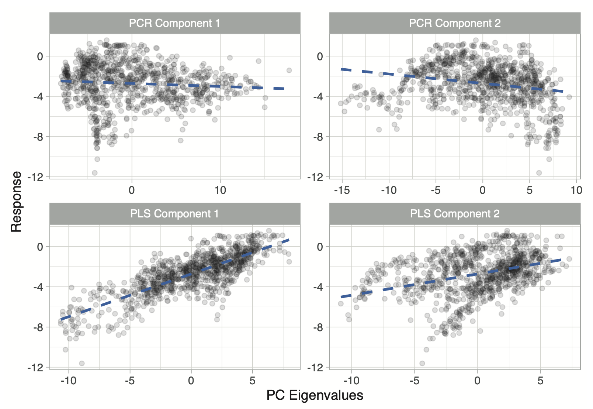

class: center, middle

```{r setup, include=FALSE}
options(htmltools.dir.version = FALSE)

library(tidyr)
library(ggplot2)
library(dplyr)
library(e1071)
```

```{r xaringan-themer, include=FALSE, warning=FALSE}
library(xaringanthemer)


style_mono_accent(
  base_color = "#1c5253",
  header_font_google = google_font("Maitree"),
  text_font_google   = google_font("Sarabun"),
  code_font_google   = google_font("Fira Mono"),
  text_color="#382933",

  colors = c(
  red = "#f34213",
  purple = "#3e2f5b",
  orange = "#ff8811",
  green = "#136f63",
  white = "#FFFFFF")
)
  

#style_duo_accent(header_font_google = google_font("Maitree"),
#  text_font_google   = google_font("Sarabun"),
#  code_font_google   = google_font("Fira Mono"),
#  primary_color = "#4d3e3e",
#  secondary_color="#fff3cd",
 
#text_color="#382933",

#  colors = c(
#  red = "#f34213",
#  purple = "#3e2f5b",
#  orange = "#ff8811",
#  green = "#136f63",
#  white = "#FFFFFF")

#)

```


---
class: middle

.left-column[

### Classification: Logistic regression

- **What's logistic regression?**

- Fitting the model

- Interpreting the logistic regression

- Predicting the outcome

- Classification thresholds

- Model's Evaluating


]

.right-column[

### Linear Regression

.pull-left[
<small>

การวิเคราะห์ความถดถอยเชิงเส้นเป็นเทคนิคการเรียนรู้ที่ใช้สร้างโมเดลทางคณิตศาสตร์เพื่อเรียนรู้ความสัมพันธ์ระหว่างตัวแปรตามแบบต่อเนื่องกับตัวแปรอิสระใด ๆ ภายในชุดข้อมูล โดยมีวัตถุประสงค์การวิเคราะห์ที่อาจจำแนกได้เป็น 2 ข้อ ได้แก่

1. เพื่อวิเคราะห์อิทธิพลของตัวแปรอิสระที่มีต่อตัวแปรตาม

2. เพื่อทำนายแนวโน้มของค่าสังเกตของตัวแปรตามโดยใช้ข้อมูลของตัวแปรอิสระ

ทั้งนี้การวิเคราะห์ความถดถอยเชิงเส้นจะเรียนรู้ความสัมพันธ์ระหว่างตัวแปรจากชุดข้อมูลดังกล่าว แล้วนำความสัมพันธ์ที่เรียนรู้ได้นี้มาสร้างเป็นสมการทำนาย $\hat{y}$ ที่อยู่ในรูปผลรวมเชิงเส้นของตัวแปรอิสระดังนี้

$$\hat{y}_i=b_0+b_1x_{1i}+b_2x_{2i}+...+b_px_{pi}$$
</small>

]

.pull-right[

```{r fig.retina=3, echo=F, fig.height=5, fig.width=6, fig.align="left"}
set.seed(12345)
x<-rnorm(50,50,10)
y<-2+1.5*x+rnorm(50,0,5)
par(mar=c(5,5,0.5,0.5))
plot(x,y,pch=16, xlab="Performance", ylab="Achievement", cex.lab=1.5,cex=1.5,col="darkblue")
abline(lm(y~x),col="orange")
text(58,50,expression(hat(y)==3.60+1.50*performance),cex=1.5)
```
]

]

---
class: middle

.left-column[

### Classification: Logistic regression

- **What's logistic regression?**

- Fitting the model

- Interpreting the logistic regression

- Predicting the outcome

- Classification thresholds

- Model's Evaluating


]

.right-column[

```{r echo=F, message=F, warning=F}
set.seed(1234)
age<-runif(50,25,95)
deposit<--10+0.2*age+rnorm(50,0,1)
p<-exp(deposit)/(1+exp(deposit))
deposit<-ifelse(p>0.7,1,0)
temp<-data.frame(round(age,0),deposit)
names(temp)<-c("Engagement","Success")
#library(kableExtra)
#temp%>%kbl()%>%
#    kable_paper(full_width=F,
 
#                 html_font = "Maitree", 
 #                 position="left", 
  
#                font_size=13)
logistic1<-temp
```


```{r}
str(logistic1)
```


```{r eval=F}
fit<-lm(Success~Engagement, data=logistic1)
summary(fit)
```


```{r echo=F}
fit<-lm(Success~Engagement, data=logistic1)
summary(fit)
```


]


---
class: middle

.left-column[

### Classification: Logistic regression

- **What's logistic regression?**

- Fitting the model

- Interpreting the logistic regression

- Predicting the outcome

- Classification thresholds

- Model's Evaluating


]

.right-column[


```{r echo=F, fig.retina=3, fig.height=7, message=F, fig.width=8}
library(ggpubr)
formula <- y ~ x
logistic1%>%ggplot(aes(x=Engagement,y=Success))+
              geom_point(aes(col=factor(Success,labels=c("Fail","Pass"))),size=4,alpha=0.8)+
              stat_smooth(method="lm", formula=formula, se=F, linetype="dashed",col="black")+
              labs(col="")+
              theme_minimal()+
              theme(axis.title=element_text(margin=margin(10,10,10,10)))+
              stat_regline_equation(label.x = 60,label.y = 0.4,
                                    aes(label =  paste(..eq.label.., ..rr.label.., sep = "~~~~")),size=5)
```

]


---
class: middle

.left-column[

### Classification: Logistic regression

- **What's logistic regression?**

- Fitting the model

- Interpreting the logistic regression

- Predicting the outcome

- Classification thresholds

- Model's Evaluating


]

.right-column[

```{r echo=F, fig.retina=3, message=F, warning=F, fig.width=12, fig.height=8}
par(mfrow=c(2,2))
plot(fit, pch=16)
```

]

---
class: middle

.left-column[

### Classification: Logistic regression

- **What's logistic regression?**


- Fitting the model

- Interpreting the logistic regression

- Predicting the outcome

- Classification thresholds

- Model's Evaluating


]


.right-column[


### Logistic regression


การวิเคราะห์ความถดถอยแบบ logistic ถูกพัฒนาขึ้นเพื่อ

1. เพื่ออธิบายความสัมพันธ์หรือวิเคราะห์อิทธิพลของตัวแปรอิสระที่มีต่อตัวแปรตามแบบจัดประเภท

2. เพื่อจัดประเภทหน่วยข้อมูล (ทำนายประเภทของหน่วยข้อมูล) ด้วยข้อมูลค่าสังเกตของตัวแปรอิสระ

logistic regression อาจจำแนกได้ 3 ประเภท

- **Binary logistic regression**

- **Multinomial logistic regression**

- **Ordinal logistic regression**


]


---
class: middle

.left-column[

### Classification: Logistic regression

- **What's logistic regression?**


- Fitting the model

- Interpreting the logistic regression

- Predicting the outcome

- Classification thresholds

- Model's Evaluating


]


.right-column[


### Binary Logistic regression

<small>

โมเดลที่แสดงความสัมพันธ์ระหว่างความน่าจะเป็นของการเกิดเหตุการณ์กับตัวแปรอิสระ 

- $p = P(Success=1|Engagement)=f(X)$ มีรูปแบบความสัมพันธ์เป็นอย่างไร?

- เราสามารถสร้างสมการทำนาย $p$ ข้างต้นโดยใช้ least squares algorithm ได้อยู่มั้ย?

</small>


.pull-left[
```{r echo=F, fig.retina=3, fig.height=4.5, message=F, fig.width=6}
library(ggpmisc)
logistic1$pred<-predict(fit)
logistic1<-logistic1%>%mutate(pred=ifelse(pred>1,1,ifelse(pred<0,0,pred)))

logistic1%>%ggplot()+
              geom_point(aes(x=Engagement,y=Success,col=factor(Success,labels=c("Fail","Pass"))),size=4,alpha=0.8)+
             # geom_point(aes(x=Engagement,y=pred))+
              geom_line(aes(x=Engagement,y=pred),col="#2E2836",linetype="dashed",size=1)+
              labs(col="")+
              theme_minimal()+
              theme(axis.title.x=element_text(margin=margin(8,8,8,8),vjust=-3,size=14),
                    axis.title.y=element_text(margin=margin(8,8,8,8),vjust=3,size=14),
                    plot.margin=margin(5,5,5,5))+
              ylab("P(Success=1|Engagement) = p")
```
]

.pull-right[

```{r echo=F, fig.retina=3, fig.height=4, message=F, fig.width=6, warning=F}
logistic1%>%ggplot()+
              geom_point(aes(x=Engagement,y=Success,col=factor(Success,labels=c("Fail","Pass"))),size=4,alpha=0.8)+
             # geom_point(aes(x=Engagement,y=pred))+
              geom_smooth(aes(x=Engagement,y=pred),method="glm",se=F,
                          method.args=list(family="binomial"),
                          col="#2E2836",linetype="dashed",size=1)+
              labs(col="")+
              theme_minimal()+
              theme(axis.title.x=element_text(margin=margin(8,8,8,8),vjust=-3,size=14),
                    axis.title.y=element_text(margin=margin(8,8,8,8),vjust=3,size=14),
                    plot.margin=margin(5,5,5,5))+
              ylab("")

```

]

]


---
class: middle

.left-column[

### Classification: Logistic regression

- **What's logistic regression?**

- Fitting the model

- Interpreting the logistic regression

- Predicting the outcome

- Classification thresholds

- Model's Evaluating


]

.right-column[


```{r echo=F, fig.retina=3, fig.height=4, message=F, fig.width=6, warning=F}
logistic1%>%ggplot()+
              geom_point(aes(x=Engagement,y=Success,col=factor(Success,labels=c("Fail","Pass"))),size=4,alpha=0.8)+
             # geom_point(aes(x=Engagement,y=pred))+
              geom_smooth(aes(x=Engagement,y=pred),method="glm",se=F,
                          method.args=list(family="binomial"),
                          col="#2E2836",linetype="dashed",size=1)+
              labs(col="")+
              theme_minimal()+
              theme(axis.title.x=element_text(margin=margin(8,8,8,8),vjust=-3,size=14),
                    axis.title.y=element_text(margin=margin(8,8,8,8),vjust=3,size=14),
                    plot.margin=margin(5,5,5,5))+
              ylab("P(Success=1|Engagement)")+
              annotate(geom="text",x=78,y=0.4,label="P(Y=1|X)=F(X)",size=8)

```

<small>

ถ้าผู้วิเคราะห์สามารถประมาณหรือทราบ $f(X)$ ก็จะสามารถใช้ $f(X)$ ดังกล่าวประมาณค่าความน่าจะเป็น $P(Success=1|X)$ จากนั้นยังสามารถใช้ค่าความน่าจะเป็นที่ประมาณได้นี้เพื่อทำนายกลุ่ม (จัดประเภท) ของหน่วยข้อมูลที่สนใจ

การทำนายกลุ่มของหน่วยข้อมูลด้วยความน่าจะเป็นทำโดยการเปรียบเทียบค่าความน่าจะเป็นกับจุดตัด ดังนี้ ถ้า $P(Success_i=1|X)>c$ จะให้หน่วยข้อมูล $i$ อยู่ในกลุ่ม 1 แต่ถ้าไม่ใช่จะจัดให้อยู่ในกลุ่ม 0

- $P(Success_i=1|X)=0.75 \implies$ จัดให้หน่วยข้อมูล $i$ อยู่ในกลุ่ม **"PASS"**.

- $P(Success_j=1|X)=0.25 \implies$ จัดให้หน่วยข้อมูล $j$ อยู่ในกลุ่ม **"FAIL"**.

*note:* เรียก $c$ ว่า **classification threshold**


</small>


]


---
class: middle

.left-column[

### Classification: Logistic regression

- What's logistic regression?

- **Fitting the model**

- Interpreting the logistic regression

- Predicting the outcome

- Classification thresholds

- Model's Evaluating


]

.right-column[

## Fitting the Model

### Odds and log-Odds

Let $p = P(Y=1 | X)$ be a probability of success given independent variables $X$. The odds of Success event given the independent variable $X$ is: 

$Odds=\frac{p}{1-p} \geq 0 \implies log(Odds) \in \mathbb{R}$

```{r echo=F, fig.retina=3, fig.height=4, fig.width=12}
p<-runif(1000,0,1)
odds<-p/(1-p)
log_odds<-log(odds)

par(mfrow=c(1,3), mar=c(5,5,1,1))
hist(p, main="", xlab="P(Y=1|X)",cex.lab=2,col="#DB7F8E")
hist(odds, main="", xlab="Odds",cex.lab=2,col="#DB7F8E",ylab="")
hist(log_odds, main="",xlab="log(Odds)",cex.lab=2,col="#DB7F8E",ylab="")
```

]

---
class: middle

.left-column[

### Classification: Logistic regression

- What's logistic regression?

- **Fitting the model**

- Interpreting the logistic regression

- Predicting the outcome

- Classification thresholds

- Model's Evaluating


]

.right-column[


### log-Odds model

<small>

เนื่องจาก $log(Odds) \in \mathbb{R}$ ดังนั้นจึงสามารถ fit linear regression ให้กับความสัมพันธ์ระหว่าง $log(Odds)$ กับตัวแปรอิสระ $X$ ได้ดังนี้

$$log(Odds_i)=log(\frac{p_i}{1-p_i})=\beta_0+\beta_1X_{1i}+\beta_2X_{i2}+...+\beta_pX_{pi}$$
</small>

### Odds model


<small>

take exponential ทั้งสองข้างของสมการจะได้สมการของ Odds ดังนี้

$$\frac{p_i}{1-p_i}=\exp(\beta_0+\beta_1X_{1i}+\beta_2X_{i2}+...+\beta_pX_{pi})$$
</small>

### Probability model 

<small>

จากสมการ Odds จัดรูปใหม่ จะได้ฟังก์ชันของความน่าจะเป็นอยู่ในรูปของ logistic function ดังนี้

$$p_i=P(y_i=1|X)=\frac{\exp(\beta_0+\beta_1X_{1i}+\beta_2X_{i2}+...+\beta_kX_{ki})}{1+\exp(\beta_0+\beta_1X_{1i}+\beta_2X_{i2}+...+\beta_kX_{ki})}$$
</small>

]


---
class: middle

.left-column[

### Classification: Logistic regression

- What's logistic regression?


- **Fitting the model**

- Interpreting the logistic regression

- Predicting the outcome

- Classification thresholds

- Model's Evaluating


]

.right-column[

### Estimate the model parameter

<small>

การประมาณค่าพารามิเตอร์ใน logistic regression จำเป็นต้องมีการกำหนดข้อสมมุติที่แสดงความเชื่อมโยงระหว่างค่าสังเกตของตัวแปรตาม ($y$) กับฟังก์ชันความน่าจะเป็นของการเกิดเหตุการณ์ที่สนใจ ($p=P(Y=1|X)$)

**Per-observation model**

กำหนดให้ $Y$ เป็นตัวแปรแบบจัดประเภทที่มีค่าสังเกตคือ $y_i=0,1$ และ $p=P(y_i=1)$ คือความน่าจะเป็นของการเกิดเหตุการณ์ที่สนใจ จากทฤษฎีความน่าจะเป็นจะได้ว่าโมเดลความน่าจะเป็นของค่าสังเกต (probability observation model) ในกรณีนี้คือ bernoulli model ดังนี้

$y_i \sim Ber(p) \implies p(y_i)=p^{y_i}(1-p)^{1-y_i}\ \ \ \  ; y_i=0,1$

**Likelihood function**

ภายใต้ข้อสมมุติว่าค่าสังเกต $y_i$ ได้มาจากตัวอย่างสุ่มขนาดเท่ากับ $n$ ที่เป็นอิสระซึ่งกันและกัน ดังนั้นจะได้ว่า โมเดลความน่าจะเป็นของตัวอย่างทั้งชุดมีค่าเท่ากับ

$p(\bf{y})=\Pi_{i=1}^np(y_i)=p^{\sum_{i=1}^ny_i}(1-p)^{n-\sum_{i=1}^ny_i}$

โดยทางการแล้วเรียกสมการนี้ว่า **ฟังก์ชันภาวะความควรจะเป็น (likelihood function)**  
</small>
]


---
class: middle

.left-column[

### Classification: Logistic regression

- What's logistic regression?**


- **Fitting the model**

- Interpreting the logistic regression

- Predicting the outcome

- Classification thresholds

- Model's Evaluating


]

.right-column[

### Maximum likelihood Estimation


<small>

เนื่องจากในกรณีนี้ความน่าจะเป็น $p$ มีความสัมพันธ์กับตัวแปรอิสระ ค่าของความน่าจะเป็นจึงมีตวามแตกต่างไปตามคุณลักษณะของหน่วยตัวอย่างแต่ละหน่วย likelhood function ที่เหมาะสมจึงมีค่าเท่ากับ

$$p(\bf{y})=\Pi_{i=1}^np_i(y_i)=p_i^{\sum_{i=1}^ny_i}(1-p_i)^{n-\sum_{i=1}^ny_i}\ ;i=1,2,...,n$$

โดยที่ 
$p_i=P(y_i=1|X)=\frac{\exp(\beta_0+\beta_1X_{1i}+\beta_2X_{i2}+...+\beta_kX_{ki})}{1+\exp(\beta_0+\beta_1X_{1i}+\beta_2X_{i2}+...+\beta_kX_{ki})}$

</br>

เนื่องจากข้อมูล $X$ และ $y$ เป็นสิ่งที่ทราบค่า และต้องการหาค่า $\beta$ ที่ดีที่สุดจึงมักเขียนสมการ likelihood ข้างต้นใหม่ดังนี้


$L(\beta|X,y)=p_i^{\sum_{i=1}^ny_i}(1-p_i)^{n-\sum_{i=1}^ny_i}$


$\implies log(L(\beta|X,y))=lnL=-\sum_{i=1}^n{y_ilog(p_i)+(1-y_i)log(1-p_i)}$

เกณฑ์การพิจารณาค่า $\beta$ ที่ดีที่สุดคือ หาค่า $\beta$ ที่ทำให้ log-likelhood function มีค่าสูงที่สุดหรือ

$\max_{\beta}L(\beta|X,y)$

เรียกวิธีการหาค่าประมาณพารามิเตอร์นี้ว่า  **maximum likelihood**


</small>

]


---
class: middle

.left-column[

### Classification: Logistic regression

- What's logistic regression?

- **Fitting the model**

- Interpreting the logistic regression

- Predicting the outcome

- Classification thresholds

- Model's Evaluating


]

.right-column[

```{r eval=F}
fit.logistic<-glm(Success~Engagement,data=logistic1,family="binomial")
summary(fit.logistic)
```


$P(Success=1|Engagement)=\frac{exp(-19.6652+0.3420Engagement)}{1+exp(-19.6652+0.3420Engagement)}$

```{r echo=F}
fit.logistic<-glm(Success~Engagement,data=logistic1,family="binomial")
summary(fit.logistic)
```


]


---
class: middle

.left-column[

### Classification: Logistic regression

- What's logistic regression?

- Fitting the model

- **Interpreting the logistic regression**

- Predicting the outcome

- Classification thresholds

- Model's Evaluating


]


.right-column[


### Odd-ratio: OR

เป็นค่าสถิติสำหรับบ่งชี้ขนาดอิทธิพลของตัวแปรอิสระที่มีต่อตัวแปรตาม (ทำนองเดียวกับค่า $R^2$)

$OR=\frac{Odds_1}{Odds_2} \geq 0$

- ถ้า OR=1 หมายถึง

- ถ้า OR>1 หมายถึง

- ถ้า OR<1 หมายถึง


<small>

**ความยึดมั่นผูกพันในการเรียนออนไลน์มีผลต่อความสำเร็จในการเรียนหรือไม่?**

</small>

```{r}
engage<-ifelse(logistic1$Engagement>60,1,0)
engage<-factor(engage,labels=c("low","high"))
success<-factor(logistic1$Success, labels=c("no","yes"))
table(engage,success)
```


]


---
class: middle

.left-column[

### Classification: Logistic regression

- What's logistic regression?

- Fitting the model

- **Interpreting the logistic regression**

- Predicting the outcome

- Classification thresholds

- Model's Evaluating


]


.right-column[

### Odd-ratio in logistic regression

**กรณี X เป็นตัวแปรเชิงปริมาณ**

$OR = \frac{Odd_{x_j+1}}{Odds_{x_j}} = \frac{\exp(\beta_0+\beta_1X_{1i}+\beta_2X_{i2}+...+\beta_j(X_{ji}+1)+...+\beta_pX_{pi})}{\exp(\beta_0+\beta_1X_{1i}+\beta_2X_{i2}+...+\beta_j(X_{ji})+...\beta_pX_{pi})} =exp(\beta_j)$


**กรณี X เป็นตัวแปรจัดประเภท**

$OR = \frac{Odd_{x_j=1}}{Odds_{x_j=0}} = \frac{exp(\beta_j)}{exp(0)} = exp{(\beta_j)}$


```{r}
## extract coefficient values from fit.logistic
coef(fit.logistic)

## -- Odds ratio
exp(coef(fit.logistic)[2])
```


]


---
class: middle

.left-column[

### Classification: Logistic regression

- What's logistic regression?

- Fitting the model

- **Interpreting the logistic regression**

- Predicting the outcome

- Classification thresholds

- Model's Evaluating


]


.right-column[

### OR: significant testing


การทดสอบนัยสำคัญของ OR อาจทำได้ 4 วิธีการได้แก่

- [**Fisher's Exact test**](https://en.wikipedia.org/wiki/Fisher%27s_exact_test)

- [**Chi-square test of independent**](https://www.ncbi.nlm.nih.gov/pmc/articles/PMC3900058/)

- **Wald's test**

- **Likelihood ratio test (LR)**


]


---
class: middle

.left-column[

### Classification: Logistic regression

- What's logistic regression?

- Fitting the model

- **Interpreting the logistic regression**

- Predicting the outcome

- Classification thresholds

- Model's Evaluating


]

.right-column[

````{r}
tab<-table(engage,success)
fisher.test(tab)
```


````{r}
chisq.test(tab)
```

]


---
class: middle

.left-column[

### Classification: Logistic regression

- What's logistic regression?

- Fitting the model

- **Interpreting the logistic regression**

- Predicting the outcome

- Classification thresholds

- Model's Evaluating


]

.right-column[

### [Wald's test](https://en.wikipedia.org/wiki/Wald_test)

เป็น test ที่มักใช้ทดสอบนัยสำคัญของ odds-ratio ใน logistic regression นอกจากนี้ยังสามารถใช้สร้าง confidence interval ของ odds-ratio ได้อีกด้วย

$H_0: OR=\theta_0$

$H_1: OR \neq \theta_0$

**test statistics**

$W=\frac{(\hat{OR}-\theta_0)^2}{var(\hat{OR})} \sim \chi^2_{df=1}$ $\implies \sqrt{W} \sim N(0,1)$

```{r eval=F}
Coefficients:
            Estimate Std. Error z value Pr(>|z|)   
(Intercept) -19.6652     7.5191  -2.615  0.00891 **
Engagement    0.3420     0.1264   2.705  0.00683 **
---
Signif. codes:  0 ‘***’ 0.001 ‘**’ 0.01 ‘*’ 0.05 ‘.’ 0.1 ‘ ’ 1
```


]


---
class: middle

.left-column[

### Classification: Logistic regression

- What's logistic regression?

- Fitting the model

- **Interpreting the logistic regression**

- Predicting the outcome

- Classification thresholds

- Model's Evaluating


]

.right-column[

### Likelihood Ratio Test

Wald test uses two approximations (SE, and sampling distribution $\chi^2$), whereas the LR-test uses only one approximation (only sampling distribution $\chi^2$) [(Harrell, 2001)](https://link.springer.com/book/10.1007/978-3-319-19425-7),[(Paek, 2009)](https://files.eric.ed.gov/fulltext/EJ1110990.pdf)

<small>

**Hypotheses**

$H_0:$ Reduced model = Full model

$H_1:$ Reduced model worse than Full model

</small>

<small>

**test statistics**

$$deviance=-2LL_{reduce}-(-2LL_{full})\sim \chi^2_{p^*}$$

</small>

<small>

$p$ คือจำนวนตัวแปรอิสระภายในโมเดลทำนาย

$p^*=p_{full}-p_{reduce}$

$n$ คือจำนวนหน่วยข้อมูล

</small>


]


---
class: middle

.left-column[

### Classification: Logistic regression

- What's logistic regression?

- Fitting the model

- **Interpreting the logistic regression**

- Predicting the outcome

- Classification thresholds

- Model's Evaluating


]

.right-column[

### Likelihood ratio test

$H_0: OR_{Engagement}=1 \ (or \  \beta_1=0)$  vs  $H_1: OR_{Engagement} \neq 1$

```{r message=F, warning=F}
# significanct test for OR of Engagement
###1. full model
fit.full<-glm(Success~Engagement,data=logistic1,family="binomial")
###2. reduce model
fit.reduce<-glm(Success~1,data=logistic1,family="binomial")

### Likelihood ratio test
library(lmtest)
lrtest(fit.reduce,fit.full)
```

]


---
class: middle

.left-column[

### Classification: Logistic regression

- What's logistic regression?

- Fitting the model

- Interpreting the logistic regression

- **Predicting the outcome**

- Classification thresholds

- Model's Evaluating

]

.right-column[

### Predicting the outcome

```{r fig.retina=3, fig.width=8, fig.height=4}
#?predict.glm()
pred.logOdds<-predict(fit.logistic) #log-odds scale
pred.prob<-predict(fit.logistic, type="response") # probability scale

par(mfrow=c(1,2), mar=c(5,5,0.5,0.5))
hist(pred.logOdds, main="")
hist(pred.prob, main="")
```


]


---
class: middle

.left-column[

### Classification: Logistic regression

- What's logistic regression?

- Fitting the model

- Interpreting the logistic regression

- Predicting the outcome

- **Model's Evaluating**

]

.right-column[

### Pseudo R-square

- $R^2$ ใน linear model นิยามไว้เป็นอัตราส่วนระหว่างความผันแปรในตัวแปรตามที่อธิบายได้โดยโมเดลต่อความผันแปรทั้งหมดในตัวแปรตาม ดังนี้

$$R^2=\frac{\sum_{i=1}^n(\hat{y}_i-\overline{y})^2}{\sum_{i=1}^n(y_i-\overline{y})^2}=\frac{SSR}{SST}$$

ใน logistic regression ไม่สามารถคำนวณค่า $R^2$ โดยใช้แนวคิดเดียวกับ $R^2$ ข้างต้นได้ (ทำไม?)

- Efron's $R^2$ $= 1- \frac{\sum_{i=1}^n(y_i-\hat{p}_i)^2}{\sum_{i=1}^n(y_i-\overline{y})^2}$

- McFadden' $R^2$ $= 1-\frac{lnL_{full}}{lnL_{null}}$

- McFadden's adjusted $R^2$ $= 1-\frac{lnL_{full}-k}{lnL_{null}}$

- Cox & Snell $R^2=1-[\frac{L_{null}}{L_{full}}]^{2/N}$

- Nagelkerke/ Cragg & Uhler $R^2=\frac{1-[\frac{L_{null}}{L_{full}}]^{2/N}}{1-[L_{null}]^{2/N}}$


]


---
class: middle

.left-column[

### Classification: Logistic regression

- What's logistic regression?

- Fitting the model

- Interpreting the logistic regression

- Predicting the outcome

- **Model's Evaluating**

]

.right-column[

### Confusion matrix

- confusion matrix เป็นเครื่องมือสำคัญสำหรับตรวจสอบประสิทธิภาพในการเรียนรู้ของ classification model ต่าง ๆ 

- confusion matrix เป็นตารางแจกแจงความถี่สองทาง โดยปกติมักให้ด้านคอลัมน์เป็นค่าสังเกตจริงของตัวแปรตาม และด้านแถวเป็นค่าทำนายที่ได้จากการจำแนกของโมเดล classification


]


---
class: middle

.left-column[

### Classification: Logistic regression

- What's logistic regression?

- Fitting the model

- Interpreting the logistic regression

- Predicting the outcome

- **Model's Evaluating**

]

.right-column[

### Confusion matrix


]


---
class: middle

.left-column[

### Classification: Logistic regression

- What's logistic regression?

- Fitting the model

- Interpreting the logistic regression

- Predicting the outcome

- **Model's Evaluating**

]

.right-column[

### logistic2.csv

```{r eval=F}
dat<-read.csv("logistic2.csv", header=T)
str(dat)
```

```{r echo=F, message=F, warning=F}
dat<-read.csv("/Users/siwachoatsrisuttiyakorn/Downloads/logistic2.csv", header=T, stringsAsFactors=T)
names(dat)[1]<-"id"
str(dat)
```

]


---
class: middle

.left-column[

### Classification: Logistic regression

- What's logistic regression?

- Fitting the model

- Interpreting the logistic regression

- Predicting the outcome

- **Model's Evaluating**

]

.right-column[


```{r message=F, warning=F}
library(caret)

#splitting data
train.id<-createDataPartition(dat$deposit,p=0.8,list=F)
train.dat<-dat[train.id,]
test.dat<-dat[-train.id,]
```

.pull-left[

**training data**

```{r echo=F}
table(train.dat$deposit)*100/dim(train.dat)[1]
```

```{r echo=F, fig.retina=3, fig.width=4, fig.height=2}
par(mar=c(3,5,0.5,0.5))
barplot(table(train.dat$deposit)*100/dim(train.dat)[1])
```

]

.pull-right[

**testing data**

```{r echo=F}
table(test.dat$deposit)*100/dim(test.dat)[1]
```


```{r echo=F, fig.retina=3, fig.width=4, fig.height=2}
par(mar=c(3,5,0.5,0.5))
barplot(table(test.dat$deposit)*100/dim(test.dat)[1])
```

]

]


---
class: middle

.left-column[

### Classification: Logistic regression

- What's logistic regression?

- Fitting the model

- Interpreting the logistic regression

- Predicting the outcome

- **Model's Evaluating**

]

.right-column[

```{r message=F, warning=F}
### fit logistic regression using glm()
# fit.glm<-glm(deposit~.,data=train.dat%>%select(-id),family="binomial")

### install.packages("e1071")
### fit logistic regression using glm engine via caret package
train.Control<-trainControl(method ="cv", number = 5)
fit<-train(form = deposit~.,data=train.dat%>%select(-id), method="glm", 
          family="binomial", trControl=train.Control)
fit
```

]


---
class: middle

.left-column[

### Classification: Logistic regression

- What's logistic regression?

- Fitting the model

- Interpreting the logistic regression

- Predicting the outcome

- **Model's Evaluating**

]

.right-column[

### Confusion matrix


```{r results=F}
## calculate predicted probability of deposit given Xs.
prob<-predict(fit, newdata=test.dat, type="prob")
prob<-prob[,2]
#hist(prob, main="")

## convert probability into class (deposit = yes, no)
pred.class<-factor(ifelse(prob>0.5, "yes", "no"))
#table(pred.class)

## create confusion matrix
confusionMatrix(pred.class,test.dat$deposit, positive="yes")
```

```{r eval=F}
Confusion Matrix and Statistics
          Reference
Prediction   no  yes
       no  7816  837
       yes  168  220
```


]


---
class: middle

.left-column[

### Classification: Logistic regression

- What's logistic regression?

- Fitting the model

- Interpreting the logistic regression

- Predicting the outcome

- **Model's Evaluating**

</br>
</br>

<small>


`?confusionMatrix()`

</small>
]


.right-column[


.pull-left[

```{r eval=F}
Confusion Matrix and Statistics

          Reference
Prediction   no  yes
       no  7816  837
       yes  168  220
                                          
               Accuracy : 0.8888          
                 95% CI : (0.8822, 0.8952)
    No Information Rate : 0.8831          
    P-Value [Acc > NIR] : 0.04517         
                                          
                  Kappa : 0.2579          
                                          
 Mcnemar's Test P-Value : < 2e-16   

            Sensitivity : 0.20814         
            Specificity : 0.97896         
         Pos Pred Value : 0.56701         
         Neg Pred Value : 0.90327         
             Prevalence : 0.11691         
         Detection Rate : 0.02433         
   Detection Prevalence : 0.04292         
      Balanced Accuracy : 0.59355         
                                          
       'Positive' Class : yes         
```
]

.pull-right[

<center></center>

<small>

- Accuracy: $= \frac{A+D}{A+B+C+D}$

- No Information Rate: $= \frac{major \ class}{total}$

- [Kappa](https://en.wikipedia.org/wiki/Cohen%27s_kappa): $\kappa=\frac{p_0-p_e}{1-p_e}$

- [Mcnemar's test](https://en.wikipedia.org/wiki/McNemar%27s_test)

- Sensitivity: $= \frac{A}{A+C}$

- Specificity: $= \frac{D}{B+D}$

- Prevalence $= \frac{A+C}{A+B+C+D}$

- [PPV](https://en.wikipedia.org/wiki/Positive_and_negative_predictive_values) $=\frac{true \ positives}{true \ positives + false \ positives}$

- NPV $=\frac{false \ positives}{true \ positives + false \ positives}$

</small>
]

]


---
class: middle


### Classification thresholds

.pull-left[

```{r eval=F}
Confusion Matrix and Statistics

          Reference
Prediction   no  yes
       no  7816  837
       yes  168  220
                                          
               Accuracy : 0.8888          
    No Information Rate : 0.8831          

                  Kappa : 0.2579          
                                        
            Sensitivity : 0.20814         
            Specificity : 0.97896         
      Balanced Accuracy : 0.59355         
                                          
       'Positive' Class : yes    
```


]


.pull-right[


```{r echo=F}
temp<-test.dat
temp$pred.prob<-prob
log.odds<-log(prob/(1-prob))
temp$log.odds<-log.odds
```

```{r fig.retina=3, echo=F, fig.width=10, fig.height=8}
temp%>%ggplot(aes(x=log.odds,y=pred.prob,col=deposit))+
          geom_point(size=2)+
          geom_abline(intercept=0.5,slope=0,linetype="dashed")+
          annotate("text",x=8,y=0.55,label="threshold=0.5",size=8)+
          theme_minimal()+
          theme(plot.margin = margin(1,1,10,20),
                text=element_text(size=22))+
          xlab("linear combination of Xs")+
          ylab("predicted probability")
```

]


---
class: middle


### Classification thresholds

.pull-left[

```{r eval=F, echo=F}
pred.class0.7<-factor(ifelse(prob>0.7,"yes","no"))
confusionMatrix(pred.class0.7,test.dat$deposit, positive="yes")
```


```{r eval=F}
Confusion Matrix and Statistics

          Reference
Prediction   no  yes
       no  7915  943
       yes   69  114
                                          
               Accuracy : 0.8881             
    No Information Rate : 0.8831          

                  Kappa : 0.1547          
                                        
            Sensitivity : 0.10785         
            Specificity : 0.99136         
      Balanced Accuracy : 0.54961         
                                          
       'Positive' Class : yes    
```


]


.pull-right[


```{r fig.retina=3, echo=F, fig.width=10, fig.height=8}
temp%>%ggplot(aes(x=log.odds,y=pred.prob,col=deposit))+
          geom_point(size=2)+
          geom_abline(intercept=0.7,slope=0,linetype="dashed")+
          annotate("text",x=8,y=0.75,label="threshold=0.7",size=8)+
          theme_minimal()+
          theme(plot.margin = margin(1,1,10,20),
                text=element_text(size=22))+
          xlab("linear combination of Xs")+
          ylab("predicted probability")
```


]

---
class: middle


### Classification thresholds

.pull-left[

```{r eval=F, echo=F}
pred.class0.2<-factor(ifelse(prob>0.2,"yes","no"))
confusionMatrix(pred.class0.2,test.dat$deposit, positive="yes")
```


```{r eval=F}
Confusion Matrix and Statistics

          Reference
Prediction   no  yes
       no  7227  492
       yes  757  565
                                          
               Accuracy : 0.8619             
    No Information Rate : 0.8831          

                  Kappa : 0.3966          
                                        
            Sensitivity : 0.53453         
            Specificity : 0.90519         
      Balanced Accuracy : 0.71986         
                                          
       'Positive' Class : yes    
```

]


.pull-right[


```{r fig.retina=3, echo=F, fig.width=10, fig.height=8}
temp%>%ggplot(aes(x=log.odds,y=pred.prob,col=deposit))+
          geom_point(size=2)+
          geom_abline(intercept=0.2,slope=0,linetype="dashed")+
          annotate("text",x=8,y=0.25,label="threshold=0.2",size=8)+
          theme_minimal()+
          theme(plot.margin = margin(1,1,10,20),
                text=element_text(size=22))+
          xlab("linear combination of Xs")+
          ylab("predicted probability")
```


]


---
class: middle

.left-column[

### Classification: Logistic regression

- What's logistic regression?

- Fitting the model

- Interpreting the logistic regression

- Predicting the outcome

- **Model's Evaluating**

]

.right-column[

### ROC curve

- ค่า thresholds ที่เหมาะสมมีความแตกต่างกันในแต่ละสถานการณ์

- ROC ย่อมาจาก receiver operating chracteristic curve

- ROC เป็นเครื่องมือหนึ่งที่สามารถใช้เพื่อพิจารณา thresholds ที่เหมาะสมได้ โดยมีลักษณะเป็นแผนภาพการกระจายที่แกน Y คือ sensitivity และแกน X คือ 1-specificity 


]


---

.pull-left[

</br>
</br>
</br>
</br>


]

.pull-right[

</br>
</br>
</br>
</br>


]

---
class: middle

.left-column[

### Classification: Logistic regression

- What's logistic regression?

- Fitting the model

- Interpreting the logistic regression

- Predicting the outcome

- **Model's Evaluating**

]

.right-column[

### Area Under Curve: AUC

- Summarises performance (accuracy) across all thresholds.

- We can compare the performance of different models within the same dataset.


]

---
class: middle

.left-column[

### Classification: Logistic regression

- What's logistic regression?

- Fitting the model

- Interpreting the logistic regression

- Predicting the outcome

- **Model's Evaluating**

]

.right-column[

### Area Under Curve: AUC


]

---
class: middle

.left-column[

### Classification: Logistic regression

- What's logistic regression?

- Fitting the model

- Interpreting the logistic regression

- Predicting the outcome

- **Model's Evaluating**

]

.right-column[

```{r warning=F}
control<-trainControl(method="cv",number=10,
                      summaryFunction=twoClassSummary,
                      classProbs=TRUE,
                      savePredictions = "all")
train.dat$deposit<-factor(train.dat$deposit, levels=c("yes","no"))
fit.full<-train(deposit~., data=train.dat,
                 method="glm",
                 family="binomial",
                 trControl=control)

resampling_stat<-thresholder(fit.full,
                       threshold=seq(0.0,1.0,by=0.05),
                       final=TRUE)

fit.reduce<-train(deposit~age+job, data=train.dat,
                 method="glm",
                 family="binomial",
                 trControl=control)

resampling_stat2<-thresholder(fit.reduce,
                       threshold=seq(0.0,1.0,by=0.05),
                       final=TRUE)
```


]


---
class: middle

.left-column[

### Classification: Logistic regression

- What's logistic regression?

- Fitting the model

- Interpreting the logistic regression

- Predicting the outcome

- **Model's Evaluating**

]

.right-column[

```{r fig.retina=3, fig.width=10, fig.height=8, eval=F}
resampling_stat%>%ggplot()+
          geom_point(aes(x=1-Specificity, y=Sensitivity),col="orange",size=6)+
          geom_line(aes(x=1-Specificity, y=Sensitivity),col="orange",size=2)+
          geom_point(data=resampling_stat2,
                     aes(x=1-Specificity, y=Sensitivity),
                     col="darkblue",size=6)+
          geom_line(data=resampling_stat2,
                    aes(x=1-Specificity, y=Sensitivity),
                    col="darkblue",size=2)+
          theme_minimal()+
          theme(text=element_text(size=22))+
          ylim(0,1)+
          xlim(0,1)+
          annotate(geom="text",x=0.25,y=0.8,label="full model")+
          annotate(geom="text",x=0.75,y=0.75,label="reduce model")


```

]
---
class: middle

.left-column[

### Classification: Logistic regression

- What's logistic regression?

- Fitting the model

- Interpreting the logistic regression

- Predicting the outcome

- **Model's Evaluating**

</br>
</br>
</br>


]

.right-column[

```{r fig.retina=3, fig.width=10, fig.height=8, echo=F}
resampling_stat%>%ggplot()+
          geom_point(aes(x=1-Specificity, y=Sensitivity),col="orange",size=6)+
          geom_line(aes(x=1-Specificity, y=Sensitivity),col="orange",size=2)+
          geom_point(data=resampling_stat2,
                     aes(x=1-Specificity, y=Sensitivity),
                     col="darkblue",size=6)+
          geom_line(data=resampling_stat2,
                    aes(x=1-Specificity, y=Sensitivity),
                    col="darkblue",size=2)+
          theme_minimal()+
          theme(text=element_text(size=22))+
          ylim(0,1)+
          xlim(0,1)+
          annotate(geom="text",x=0.25,y=0.8,label="full model",size=8)+
          annotate(geom="text",x=0.75,y=0.75,label="reduce model", size=8)


```


]


---
class: middle

.left-column[

### Classification: Logistic regression

- What's logistic regression?

- Fitting the model

- Interpreting the logistic regression

- Predicting the outcome

- **Model's Evaluating**

]

.right-column[

```{r message=F, fig.retina=3, eval=F}
#install.packages(pROC)
library(pROC)
ROC<-roc(test.dat$deposit,prob)

par(pty="s")
plot(ROC, col="orange", 
     legacy.axes=T, 
     axes=TRUE,
     auc.polygon=TRUE,
     print.auc=TRUE)
```


```{r message=F, fig.retina=3, echo=F, fig.height=5}
#install.packages(pROC)
library(pROC)
ROC<-roc(test.dat$deposit,prob)

par(pty="s", mar=c(5,10,0,1))
plot(ROC, col="orange", 
     legacy.axes=T, 
     axes=TRUE,
     auc.polygon=TRUE,
     print.auc=TRUE, size=2)
```

]


---
class: middle

.left-column[

### Classification: Logistic regression

- What's logistic regression?

- Fitting the model

- Interpreting the logistic regression

- Predicting the outcome

- **Model's Evaluating**

- Model Concern

</br>
</br>

[Youden's J Statistic](https://en.wikipedia.org/wiki/Youden%27s_J_statistic)

]

.right-column[

```{r fig.retina=3, fig.height=4, fig.width=8}
resampling_stat%>%
  select(prob_threshold,Sensitivity, Specificity)%>%
  gather(2:3, key="stat", value="value")%>%
  ggplot(aes(x=prob_threshold,y=value,col=stat))+
  geom_point()+
  geom_line()+
  theme_minimal()
              
```


]

---
class: middle

.left-column[

### Classification: Logistic regression

- What's logistic regression?

- Fitting the model

- Interpreting the logistic regression

- Predicting the outcome

- **Model's Evaluating**


]

.right-column[


```{r eval=F}
pred.class0.15<-ifelse(prob>0.15,"yes","no")
pred.class0.15<-factor(pred.class0.15)
confusionMatrix(pred.class0.15, test.dat$deposit, positive="yes")
```


```{r eval=F}
Confusion Matrix and Statistics

          Reference
Prediction   no  yes
       no  6781  346
       yes 1203  711
                                          
               Accuracy : 0.8287          
    No Information Rate : 0.8831          
    
            Sensitivity : 0.67266         
            Specificity : 0.84932         
      Balanced Accuracy : 0.76099         
                                          
       'Positive' Class : yes        
```


]


---
class: middle

.left-column[

### Classification: Logistic regression

- What's logistic regression?

- Fitting the model

- Interpreting the logistic regression

- Predicting the outcome

- Model's Evaluating

- **Residual analysis**

- PCR and PLS regression

]

.right-column[


### Residual analysis

- ในทำนองเดียวกับ linear regression model ที่ผู้วิเคราะห์จำเป็นต้องมีการตรวจสอบความเหมาะสมของโมเดลก่อนการนำไปใช้ 

- โดยทั่วไปการตรวจสอบความเหมาะสมของโมเดลจะใช้การวิเคราะห์เศษเหลือ (residual analysis) อย่างไรก็ตามเศษเหลือใน logistic regression model นิยามได้หลากหลาย เช่นการใช้ pseudo residuals ([Harrell, 2015]()) หรือ surrogate residuals ([Liu and Zhang, 2018](https://www.tandfonline.com/doi/full/10.1080/01621459.2017.1292915))


] 

---
class: middle

.left-column[

### Classification: Logistic regression

- What's logistic regression?

- Fitting the model

- Interpreting the logistic regression

- Predicting the outcome

- Model's Evaluating

- Residual analysis

- **PCR and PLS regression**

]

.right-column[

### Multicollinearity Problem

<small>

- Two or more predictor variables are closely related to one another ---> Multicollinearity

- The presense of multicollinearity can pose problems in OLS regression (also MLE in logistic regression), since it can be difficult to separate out the individual effects of collinear variables on the response

</small>


]


---
class: middle

.left-column[

### Classification: Logistic regression

- What's logistic regression?

- Fitting the model

- Interpreting the logistic regression

- Predicting the outcome

- Model's Evaluating

- Residual analysis

- **PCR and PLS regression**

]

.right-column[

### Principal Component Regression (PCR)

<small>

PCR (Massy, 1965) สามารถใช้แก้ปัญหา multicollinearity ได้ หลักการของวิธีการใช้เป็นการผสมกันระหว่างเทคนิค PCA กับ OLS regression

</small>


]


---
class: middle

.left-column[

### Classification: Logistic regression

- What's logistic regression?

- Fitting the model

- Interpreting the logistic regression

- Predicting the outcome

- Model's Evaluating

- Residual analysis

- **PCR and PLS regression**

]

.right-column[

```{r}
dat2<-read.csv("/Users/siwachoatsrisuttiyakorn/Documents/github/ssiwacho.github.io/2758688/week4/PCR_PLS.csv")
set.seed(12345)
train.id<-createDataPartition(dat2$y, p=0.7, list=F)
train.dat2<-dat2[train.id,]
test.dat2<-dat2[-train.id,]
```

```{r eval=F}
control<-trainControl(method="cv", number=5)
lm.fit<-train(y~., data=train.dat2, method="lm",
              trControl=control,
              preProcess=c("zv","center","scale"))
```


```{r eval=F}
control<-trainControl(method="cv", number=5)
pcr.fit<-train(y~., data=train.dat2, method="pcr",
              trControl=control,
              preProcess=c("zv","center","scale"),
              tuneLength=20)
#pcr.fit
#ggplot(pcr.fit)
pred2<-predict(pcr.fit, test.dat2)
RMSE(pred2,test.dat2$y)
R2(pred2,test.dat2$y)
```

]

---
class: middle

.left-column[

### Classification: Logistic regression

- What's logistic regression?

- Fitting the model

- Interpreting the logistic regression

- Predicting the outcome

- Model's Evaluating

- Residual analysis

- **PCR and PLS regression**

]

.right-column[


]


---
class: middle

.left-column[

### Classification: Logistic regression

- What's logistic regression?

- Fitting the model

- Interpreting the logistic regression

- Predicting the outcome

- Model's Evaluating

- Residual analysis

- **PCR and PLS regression**

]

.right-column[



]

---
class: middle

.left-column[

### Classification: Logistic regression

- What's logistic regression?

- Fitting the model

- Interpreting the logistic regression

- Predicting the outcome

- Model's Evaluating

- Residual analysis

- **PCR and PLS regression**

]

.right-column[

```{r}
control<-trainControl(method="cv", number=5)
pls.fit<-train(y~., data=train.dat2, method="pls",
               trControl=control,
               preProcess=c("zv","center","scale"),
               tuneLength=20)
pred2.pls<-predict(pls.fit,test.dat2)
RMSE(pred2.pls,test.dat2$y)
R2(pred2.pls,test.dat2$y)
```


]


---


```{r eval=F}
pls.fit.logistic<-train(form = deposit~.,data=train.dat%>%select(-id), method="pls", 
          family="binomial", trControl=control,
               preProcess=c("zv","center","scale"),
               tuneLength=20)
prob.pls<-predict(pls.fit.logistic,test.dat,"prob")
prob.pls<-prob.pls[,1]
pred.class.pls<-ifelse(prob.pls>0.5,"yes","no")
confusionMatrix()
```