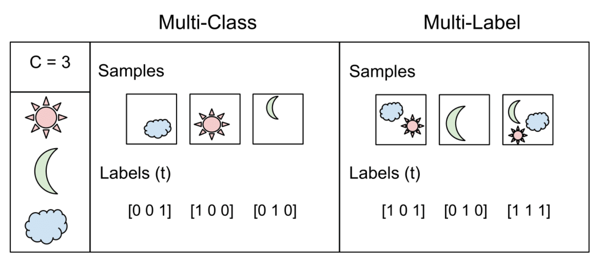

```{r setup, include=FALSE}
library(knitr)
library(rmdformats)
library(reticulate)
use_condaenv("r-reticulate")
py_install("opencv")

## Global options
options(max.print="150")
opts_chunk$set(echo=TRUE,
	             cache=TRUE,
               prompt=FALSE,
               tidy=TRUE,
               comment=NA,
               message=FALSE,
               warning=FALSE)
opts_knit$set(width=100)
```


<p style="line-height:1.3; font-size:16px; color: #353b48; text-align:right;">
สิวะโชติ ศรีสุทธิยากร
</br>
</br>
ภาควิชาวิจัยและจิตวิทยาการศึกษา คณะครุศาสตร์
</br>
จุฬาลงกรณ์มหาวิทยาลัย
</br>
</font> 13 May 2021 </font>
</p>


</body>
</html>


# **Introduction**

DL model กลุ่มของอัลกอริทึมการเรียนรู้ของเครื่องที่มีความสามารถสูงมากในปัจจุบัน โดยสามารถทำนายค่าของตัวแปรเป้าหมายได้อย่างมีประสิทธิภาพ และแม่นยำ DL ถูกนำไปประยุกต์ใช้ในหลากหลายวงการทั้งทางการแพทย์ เช่น การวินิจฉัยโรคจากภาพ X-ray หรือ CT Scan ทางการศึกษา เช่น การตรวจจับใบหน้าหรือเสียงของผู้เรียนเพื่อวินิจฉัยอารมณ์ความรู้สึกหรือความยึดมั่นผูกพันทางการเรียนของนักเรียน เป็นต้น

อัลกอริทึมหลักของ DL คือ Artificial neural network ซึ่งเป็นอัลกอริทึมที่มีจุดเด่นคือรองรับข้อมูลนำเข้าที่หลากหลายทั้งในรูปแบบข้อมูลที่มีโครงสร้าง และไม่มีโครงสร้าง แตกต่างจาก traditional ML algorithm ที่มักใช้ได้กับข้อมูลที่มีโครงสร้างเท่านั้น 

นอกจากนี้โครงสร้างการเรียนรู้ของ neural network ยังมีประสิทธิภาพและมีความยืดหยุ่น และมีลักษณะการเรียนรู้ที่สอดคล้องใกล้เคียงกับการเรียนรู้ของมนุษย์มากกว่า traditional ML รูปต่อไปนี้แสดงลักษณะการเรียนรู้แบบ traditional ML 

<left>{width=60%}</left>

*tradition ML algorithm*

จากรูปจะเห็นว่า traditional ML algorithm ประกอบด้วย 3 ส่วนหลักได้แก่ 

1. ส่วนข้อมูลนำเข้า (Input)

2. ส่วน Model

3. ส่วนการทำนาย

ส่วน neural network model มีลักษณะการเรียนรู้ดังรูป

<left>{width=80%}</left>


จากรูปจะเห็นว่า neural network ประกอบด้วยส่วนประกอบหลักที่เรียกว่า layer จำนวน 3 ส่วนได้แก่ 

1. input layer 

2. hidden layer

3. output layer

จากรูปจะเห็นว่าโมเดลมี input layer ที่ประกอบด้วยหน่วยย่อยหรือที่เรียกว่า นิวรอน (neurons) จำนวน 3 หน่วย โดยนิวรอนใน input layer จะใช้แทนตัวแปรอิสระของโมเดล ในที่นี้จะได้ว่า $X = [x_1, x_2, x_3]$ 

โมเดลจะนำข้อมูลนำเข้าใน input layer ที่กำหนดมาประมวลผลร่วมกับพารามิเตอร์ $w[1]$ และ $b[1]$ เพื่อนำส่งไปยัง neuron แต่ละตัวภายใน hidden layer ผู้อ่านจะเห็นว่าการประมวลผลเพื่อให้ได้ neuron ดังกล่าวสามารถเขียนเป็นแผนภาพได้ดังนี้

<left>{width=50%}</left>

เมื่อได้ค่าของ neuron แต่ละตัวในชั้นของ hidden layer จึงทำการประมวลผลร่วมกับพารามิเตอร์ $w[2]$ และ $b[2]$ เพื่อคำนวณค่าทำนายใน output layer เรียกกระบวนการนี้ว่า **forward propagation**


การประมวลผลของ neuron ใน hidden layer จะนำข้อมูลของ neuron ที่อยู่ใน layer ก่อนหน้ามาคำนวณผลรวมเชิงเส้นแบบถ่วงน้ำหนัก จากตัวอย่างของ deep learning model ในข้างต้น จะได้ว่าผลรวมเชิงเส้นของแต่ละ neuron ใน hidden layer คำนวณได้ดังนี้

$h_j=b+w_1x_1+w_2x_2$

เรียก $w_k$ ว่าน้ำหนัก (weight) และ $b$ ว่าค่าความลำเอียง (bias) 

โดยทั่วไปมีความเป็นไปได้ที่ค่าของผลรวมเชิงเส้นที่คำนวณได้ข้างต้นจะมีพิสัยที่ไม่สอดคล้องกับตัวแปรตามที่ต้องการทำนาย จึงมีการนำค่าผลรวมเชิงเส้นดังกล่าวมาแปลงค่าด้วยฟังก์ชันที่เรียกว่า activation function ก่อนที่จะส่งค่าไปยัง neuron ใน layer ถัดไป ดังตัวอย่างในรูปด้านล่าง


## **Forward propagation**

โดยปกติแล้วเมื่อเริ่มต้นกระบวนการผู้วิเคราะห์จะยังไม่ทราบค่าพารามิเตอร์ที่เหมาะสมของโมเดลดังนั้นจึงต้องมีการประมาณค่าพารามิเตอร์ดังกล่าวก่อนการใช้งานจริง กระบวนการ forward propagation จะเริ่มจากการสุ่มค่าเริ่มต้นของพารามิเตอร์ทั้งหมดภายในโมเดลขึ้นมาก่อน 1 ชุด และใช้ชุดของพารามิเตอร์นี้ไปใช้กับชุดข้อมูลฝึกหัดเพื่อคำนวณเป็นผลลัพธ์ใน output layer 

เมื่อได้ผลลัพธ์ดังกล่าวจะนำผลลัพธ์นี้ไปเปรียบเทียบกับค่าจริงของผลลัพธ์ในชุดข้อมูลฝึกหัดโดยใช้ cost function จากนั้นจะใช้กระบวนการ **backward propagation** เพื่อปรับค่าพารามิเตอร์ในโมเดลเพื่อให้ค่าของ loss function ลดลง และได้ชุดของพารามิเตอร์ที่มีความสมเหตุสมผลมากยิ่งขึ้น

กระบวนการทำงานข้างต้นจะดำเนินการแบบทวนซ้ำหลายรอบจนกระทั่งค่า cost function ของโมเดลลดลงอยู่ในระดับที่ต้องการ ในเชิงเทคนิคจะเรียกกระบวนการ forward + backward propagation 1 ชุด นี้ว่า 1 Epoch

## **Backward propagation**

กระบวนการ forward propagation จะสิ้นสุดลงเมื่อคำนวณค่าทำนายของตัวแปรเป้าหมายในโมเดลได้ เมื่อได้ค่าทำนายดังกล่าวผู้วิเคราะห์จะทำการประเมินความสอดคล้องเชิงประจักษ์ของโมเดลด้วยการเปรียบเทียบค่าทำนายนี้กับค่าจริงในชุดข้อมูลฝึกหัดผ่านฟังก์ชันวัตถุประสงค์หรือฟังก์ชันต้นทุน (cost function) ซึ่งมีหลากหลายตัวขึ้นกับปัญหาของการทำงาน เช่นในปัญหา regression อาจใช้ cost function เป็นค่า mean squares error (MSE) หรือปัญหา binary classification อาจใช้ cost function เป็น cross entropy ดังนี้

$J = -\frac{1}{n}\sum_{i=1}^n (y_ilog(\hat{y}_i)+(1-y_i)log(1-\hat{y}_i))$

กระบวนการ backward propagation จะปรับค่าพารามิเตอร์ในโมเดลเพื่อให้ได้โมเดลที่มีความสอดคล้่องกับข้อมูลฝึกหัดมากขึ้น โดยพิจารณาชุดของค่าพารามิเตอร์ที่ทำให้ cost function มีค่าต่ำที่สุด โดยใช้อัลกอริทึม gradient descent เป็นเครื่องมือ ดังนี้

1. หา first-order derivative ของ cost function เทียบกับค่าพารามิเตอร์ในโมเดลเขียนแทนด้วย $\frac{\partial J(w)}{\partial w}$

2. นำ $\frac{\partial J(w)}{\partial w}$ ไปหักลบออกจากค่าพารามิเตอร์ในรอบก่อนหน้าโดยควบคุมความเร็วในการเรียนรู้ผ่าน learning rate ($\alpha$)

3. นำค่าพารามิเตอร์ที่ปรับปรุงใหม่ใน 2 ไปประมวลผลร่วมในกระบวนการ forward propagation ซึ่งจะทำให้ cost function มีค่าลดลง

ทวนซ้ำกระบวนการข้างต้นจนกระทั่ง cost function มีแนวโน้มคงที่


## **Activation function**

activation function เป็นฟังก์ชันทางคณิตศาสตร์ ที่ผู้วิเคราะห์ใช้สำหรับแปลงค่าผลรวมเชิงเส้นของข้อมูลนำเข้า ให้มีพิสัยอยู่ในช่วงที่สมเหตุสมผลหรือสอดคล้องกับตัวแปรตามที่ต้องการทำนาย 

activation function ที่ใช้ในการวิเคราะห์มีได้หลากหลาย โดยอาจจำแนกเป็น 2 ประเภทได้แก่ **linear activation function** ซึ่งเขียนในรูปทั่วไปดังนี้

$\sigma(x)=m(x)+c$ 
 
ฟังก์ชันประเภทนี้จะไม่ได้ทำให้พิสัยของข้อมูลนำเข้าเปลี่ยนแปลงไปจากเดิม กล่าวคือหาก $x \in [-\infty, \infty]$ แล้ว $\sigma(x) \in [-\infty, \infty]$ เช่นเดิม แต่อาจช่วยแปลงสเกลของข้อมูลนำเข้าให้เหมาะสมมากหรือใกล้เคียงกับช่วงที่เป็นไปได้ของตัวแปรตามมากขึ้น ดังตัวอย่างในรูปด้านล่าง

```{r echo=F, fig.width=5, fig.height=4}
x<-seq(-10,10,1)
y<-1+0.2*x
par(mar=c(4,4,1,1))
plot(x,y, xlab="x", ylab=expression(sigma(x)),type="l")
```

และ **nonlinear activation function** ซึ่งมักใช้ใช้บ่อยกว่า linear activation function ทั้งนี้เป็นเพราะมีความสามารถที่จะแปลงพิสัยของข้อมูลนำเข้าให้อยู่ในช่วงที่เหมาะสมได้ เช่นแปลง $x \in [-\infty, \infty]$ ให้อยู่ในช่วง $[0,1]$ หรือ $[0, \infty]$ หรือ $[-1,1]$ 


### ตัวอย่าง activation function

**Sigmoid function:** $\sigma(x)=\frac{1}{1+exp(-x)}$

เหมาะสำหรับใช้เป็น activation function ในปัญหา binary classification ฟังก์ชันนี้จะแปลงข้อมูลนำเข้าในอยู่ในพิสัย $[0,1]$ 

**Hyperbolic Tangent function:** $\sigma(x)=\frac{e^x-e^{-x}}{e^x+e^{-x}}$

ฟังก์ชันนี้มีลักษณะคล้ายกับ sigmoid function แต่พิสัยของฟังก์ชันจะอยู่ในช่วง $[-1,1]$ บางครั้งเรียกว่า sigmoidal funcion หรือ tanh function

```{r echo=F, fig.width=4, fig.height=3, fig.align="left"}
x<-seq(-10,10,1)
y<-1/(1+exp(-x))
z<-(exp(x)-exp(-x))/(exp(x)+exp(-x))
par(mar=c(4,4,1,1))
plot(x,y, xlab="x", ylab="Sigmoid function",type="l", ylim=c(-1,1))
points(x,z, xlab="x", ylab="tanh function",type="l", lty=2)
legend(3,-0.5, lty=c(1,2), legend=c("Sigmoid","tanh"),cex=0.6)
abline(h=0, lty=3, col="grey")
abline(h=-1, lty=3, col="grey")
abline(h=1, lty=3, col="grey")
```

**Rectified Linear Unit:** $\sigma(x)=max(0,x)$

เป็น activation function ที่มักใช้บ่อยใน hidden layer โดยพิสัยของฟังก์ชันจะอยู่ในช่วง $[0,\infty]$ ดังรูป

```{r echo=F, fig.width=4, fig.height=3, fig.align="left"}
x<-seq(-10,10,1)
y<-ifelse(x>0,x,0)
par(mar=c(4,4,1,1))
plot(x,y, xlab="x", ylab="ReLU function",type="l")
grid(5,5)
```

**Leaky Rectified Linear Unit:** $\sigma(x)= \begin{cases} x,& \text{if } x\geq 1\\ax, & \text{otherwise}\end{cases}$

```{r echo=F, fig.width=4, fig.height=3, fig.align="left"}
x<-seq(-10,10,1)
y<-ifelse(x>0,x,0.05*x)
par(mar=c(4,4,1,1))
plot(x,y, xlab="x", ylab="ReLU function",type="l")
grid(5,5)
```

**Softmax** 

softmax activation function เป็น function ที่เหมาะสำหรับใช้ในปัญหา multi-class classification จากสูตรของฟังก์ชันจะเห็นว่าผลลัพธ์ที่ได้จะเป็นความน่าจะเป็นที่มีพิสัยอยู่ในช่วง $[0,1]$

กำหนดให้ $x=(x_1, x_2, x_3, x_4)$ เป็นเวกเตอร์ของข้อมูลนำเข้า และตัวแปรตามเป็นตัวแปรแบบจัดประเภทที่มี 3 ระดับได้แก่ $a, b, c$ 

สมมุติว่าต้องการหาความน่าจะเป็นของการเกิดผลลัพธ์ $a, b, c$ เมื่อกำหนดข้อมูลนำเข้า $x$ จะสามารถหาได้โดยใช้ความน่าจะเป็นแบบมีเงื่อนไข (conditional probability) ดังนี้


$P(a|x)=\frac{y_a}{y_a+y_b+y_c}$

$P(b|x)=\frac{y_b}{y_a+y_b+y_c}$

$P(c|x)=\frac{y_c}{y_a+y_b+y_c}$

เมื่อ

$y_a=w_{1,a}x_1+w_{2,a}x_2+w_{3,a}x_3+w_{4,a}x_4$

$y_b=w_{1,b}x_1+w_{2,b}x_2+w_{3,b}x_3+w_{4,b}x_4$

$y_c=w_{1,c}x_1+w_{2,c}x_2+w_{3,c}x_3+w_{4,c}x_4$

จะสังเกตเห็นว่า $P(a|x)+P(b|x)+P(c|x)=1$

เนื่องจากผลรวมเชิงเส้นในข้างต้นมีพิสัยเป็นจำนวนจริง จึงทำให้ผลรวมเชิงเส้นดังกล่าวสามารถมีค่าติดลบได้ ซึ่งอาจส่งผลให้ค่าความน่าจะเป็นแบบมีเงื่อนไขมีค่าอยู่นอกช่วง $[0,1]$ 

เพื่อแก้ปัญหานี้จึงมีการใช้ฟังก์ชัน exponential แปลงพิสัยของผลรวมเชิงเส้นที่เป็นจำนวนจริงให้อยู่ในช่วง $[0, \infty]$ ซึ่งทำให้ sofmax activation function สามารถเขียนในรูปทั่วไปได้ดังนี้

กำหนดให้ $x = (x_1, x_2, x_3, ..., x_p)^T$ เป็นเวกเตอร์ข้อมูลนำเข้าของตัวแปรอิสระจำนวน $p$ ตัว และ $y$ เป็นตัวแปรตามแบบจัดประเภทที่มีจำนวน $k$ ระดับ softmax activation function นิยามดังนี้


$\sigma(x)=P(y=y_m|x)=\frac{exp(x_i)}{\sum_{j=1}^pexp(x_j)}$

เมื่อ $i = 1,2,...,p$ และ $m = 1,2,...,k$


์Note: สังเกตว่า DL model ทำนายตัวแปรตามที่ต้องการด้วยการแยกส่วนการประมวลผลออกเป็นส่วนย่อย ๆ หลาย ๆ ส่วน โดยที่แต่ละส่วนถูกบรรจุอยู่ใน neuron


## **ประเภทของ ​DL model**

- Multilayer Perceptron Model (MLP models)

- Convolutional Neural Network (CNNs)

- Recurrent Neural Network (RNNs)

- Restricted Boltzmann Machines (RBMs)

- Deep Belief Networks (DBNs)


# **The first DL model (MLP) with Keras**

multi-layer perceptron เป็น neural network ประเภทหนึ่งที่เรียกว่า Feedforward neural networks (FFNNs) ซึ่งเป็นโมเดลพื้นฐานที่ใช้ในการทำงานทั่วไป ภายในโมเดลประกอบด้วย input, hidden และ output layers ดังที่กล่าวมาแล้ว โมเดลประเภทนี้สามารถประยุกต์ใช้ได้กับทั้งปัญหา classification และ regression


*(a) Single layer perceptron; (b) multi-layer perceptron*

หัวข้อนี้จะกล่าวถึงการสร้าง MLP โดยใช้ package-keras 

<iframe width="560" height="315" src="https://www.youtube.com/embed/j_pJmXJwMLA" title="YouTube video player" frameborder="0" allow="accelerometer; autoplay; clipboard-write; encrypted-media; gyroscope; picture-in-picture" allowfullscreen></iframe>

## ติดตั้ง package

keras สามารถติดตั้งและเรียกใช้งานได้ทั้งบน python และ R โดยสำหรับภาษา python ให้ดำเนินการดังนี้

1. ในหน้าต่าง terminal ให้ดำเนินการดาวน์โหลดและติดตั้ง tensorflow และ keras ดังนี้

```{python eval=F}
pip install --upgrade tensorflow
pip install keras
```

2. ใน python ก่อนการใช้งานแต่ละครั้งจะเป็นต้องเรียกใช้โดยพิมพ์คำสั่งดังนี้

```{python eval=F}
from keras.models import Sequential
from keras.layers import Dense
```

สำหรับโปรแกรม R ให้ดำเนินการดาวน์โหลดและติดตั้ง package-keras โดยพิมพ์คำสั่งดังนี้

```{r eval=F}
install.packages("keras")
install_keras()
library(keras)
```

## Regression

จากชุดข้อมูล crimm.csv สมมุติว่่าต้องการสร้าง MLP เพื่อทำนายอัตราการเกิดคดีโจรกรรมของแต่ละพื้นที่ 

ใน python สามารถดำเนินการได้ดังนี้ ---> [MLP in Python](https://161.200.152.253/2758604/DL/DL1/DL_reg_1.html)

ใน R สามารถดำเนินการได้ดังนี้

1. นำเข้าชุดข้อมูล 

```{r}
library(dplyr)
library(caret)
dat<-read.csv("/Users/siwachoat/Library/Mobile Documents/com~apple~CloudDocs/เอกสารประกอบการสอน/Machine Learning/เอกสาร/ep2_regression/_02_multiple regression/crimm.csv")
dat<-dat[,-1]
glimpse(dat)
```

2. normalized ค่าของตัวแปรอิสระ

```{r}
dat[,1:16]<-scale(dat[,1:16], center=TRUE, scale=TRUE)
summary(dat)
```

3. แบ่งชุดข้อมูลเป็น train and test data โดยให้เก็บค่าไว้ในรูปแบบของเมทริกซ์ (matrix) จำแนกเป็นเมทริกซ์ของตัวแปรอิสระ และเมทริกซ์ของตัวแปรตาม 

```{r}
train.id<-createDataPartition(dat$TheifperPop, p = 0.8 , list=F)
train_x<-as.matrix(dat[train.id, 1:16])
train_y<-as.numeric(dat[train.id, 17])

test_x<-as.matrix(dat[-train.id, 1:16])
test_y<-as.numeric(dat[-train.id, 17])

#remove column name
dimnames(train_x)<-NULL
dimnames(train_y)<-NULL
```

4. สร้างโมเดล MLP ด้วย package-keras

```{r eval=F}
#1. Create a Sequential model
model.r <- keras_model_sequential()

#2. Add input, hidden and output layer
model.r %>% layer_dense(units = 32, input_shape=c(16), activation="relu") %>%
            layer_dense(units=16, activation="relu")%>%
            layer_dense(units = 1)

#3. summary the model
model.r

#4. compile model
model.r %>% compile(optimizer = "adam", loss = "mse")

#5. train the model
history <- model.r %>% keras::fit(train_x, train_y, epoch = 500, validation_split=0.2)
```

```{r echo=F}
#1. Create a Sequential model
model.r <- keras_model_sequential()

#2. Add input, hidden and output layer
model.r %>% layer_dense(units = 32, input_shape=c(16), activation="relu") %>%
            layer_dense(units=16, activation="relu")%>%
            layer_dense(units = 1)

#3. summary the model
model.r

#4. compile model
model.r %>% compile(optimizer = "adam", loss = "mse")

#5. train the model
history <- model.r %>% keras::fit(train_x, train_y, epoch = 500, verbose=0, validation_split=0.2)

#6. Evaluate the model
mse <-model.r %>% evaluate (test_x, test_y)
pred<-model.r%>%predict(test_x)
```

5. ประเมินคุณภาพของโมเดล

```{r}
plot(history)
mse #MSE
sqrt(mse) #RMSE
par(mar=c(4,4,1,1))
plot(pred, test_y)
```

## Binary Classification

จงสร้างโมเดลตรวจจับการทุจริตบัตรเครดิต (fraud detection model) โดยใช้ชุดข้อมูล creditcard.csv 


ใน python สามารถดำเนินการได้ดังนี้ ---> [MLP in Python](https://161.200.152.253/2758604/DL/DL1/DL_Class_1.html)

นำข้อมูลเข้า

```{r}
dat2<-read.csv("/Users/siwachoat/Library/Mobile Documents/com~apple~CloudDocs/เอกสารประกอบการสอน/Machine Learning/เอกสาร/ep3_classification/creditcard.csv")
dat2<-dat2[,-1]
train.id<-createDataPartition(dat2$Class, p = 0.7 , list=F)
train<-dat2[train.id,]
test<-dat2[-train.id,]
```

ตรวจสอบและแก้ไขปัญหา imbalance data


```{r}
table(train$Class)
```

```{r}
# install.packages("smotefamily")
library(smotefamily)


smote.train<-SMOTE(train[,1:29], train[,30], K=3, dup_size=500)
smote.train<-smote.train$data
table(smote.train$class)
```

เตรียมชุดข้อมูลสำหรับ train MLP 

```{r}
train_x<-as.matrix(smote.train[, 1:29])
train_y<-as.numeric(smote.train[, 30])

test_x<-as.matrix(test[,1:29])
test_y<-as.numeric(test[,30])

#remove column name
dimnames(train_x)<-NULL
dimnames(train_y)<-NULL
```

สร้างโมเดล MLP ด้วย package-keras โดยในกรณีนี้เลือกใช้ sigmoid เป็น activation function ใน output layer 

```{r echo=F, fig.width=4, fig.height=3, fig.align="left"}
x<-seq(-10,10,1)
y<-1/(1+exp(-x))
par(mar=c(4,4,1,1))
plot(x,y, xlab="x", ylab="Sigmoid function",type="l", ylim=c(-1,1))
abline(h=0, lty=3, col="grey")
abline(h=-1, lty=3, col="grey")
abline(h=1, lty=3, col="grey")
```

<left>{width=50%}</left>


```{r eval=F}
#1. Create a Sequential model
model.r <- keras_model_sequential()

#2. Add input, hidden and output layer
model.r %>% layer_dense(units = 15, input_shape=c(29), activation="tanh") %>%
            layer_dense(units = 8, activation="tanh") %>%
            layer_dense(units = 1, activation="sigmoid")

#3. summary the model
model.r

#4. compile model
model.r %>% compile(optimizer = "adam", metrics=c('accuracy'), loss="binary_crossentropy")

#5. train the model
history <- model.r %>% keras::fit(train_x, train_y, epoch = 20, validation_split=0.2)
```

```{r echo=F}
#1. Create a Sequential model
model.r <- keras_model_sequential()

#2. Add input, hidden and output layer
model.r %>% layer_dense(units = 15, input_shape=c(29), activation="tanh") %>%
            layer_dense(units = 8, activation="tanh") %>%
            layer_dense(units = 1, activation="sigmoid")

#3. summary the model
model.r

#4. compile model
model.r %>% compile(optimizer = "adam", metrics=c('accuracy'), loss="binary_crossentropy")

#5. train the model
history <- model.r %>% keras::fit(train_x, train_y, epoch = 20, validation_split=0.2)

#6. Evaluate the model
model.r %>% evaluate (test_x, test_y)
pred<-model.r%>%predict(test_x)
```

ประเมินประสิทธิภาพของโมเดล

```{r}
library(verification)
class.pred<-ifelse(pred>=0.5,1,0)
tab<-table(class.pred, test$Class)
caret::confusionMatrix(tab)
```

## Multi-Class Classification

```{r}
dat<-iris
dat[,1:4]<-scale(dat[,1:4], center=T, scale=T)
str(dat)
X<-as.matrix(dat[,1:4])
dimnames(X)<-NULL

library(mltools)
library(data.table)

dummy<-dummyVars(" ~ .", data=dat)
dummy<-predict(dummy, newdata = dat)
str(dummy)
y<-dummy[,5:7]
```

สร้าง MLP ที่มี 

- 4 inputs

- hidden layer1 มี 3 neurons

- hidden layer2 มี 2 neurons


- output layer มี 3 neurons

สร้างโมเดล

```{r}

#1. Create a Sequential model
model.r <- keras_model_sequential()

#2. Add input, hidden and output layer
model.r %>% layer_dense(units = 3, input_shape=c(4), activation="tanh") %>%
            layer_dense(units = 3, activation="softmax")

#3. summary the model
model.r

#4. compile model
model.r %>% compile(optimizer = "adam", loss="categorical_crossentropy")

#5. train the model
history <- model.r %>% keras::fit(X, y, epoch = 1000, validation_split=0.1)
```


```{r}
plot(history)
```

## Multi-label Classification

Multi-label Classification เป็นโมเดลทำนายที่สามารถจำแนกหน่วยข้อมูลให้อยู่ในหลายกลุ่มพร้อมกันได้ ซึ่งแตกต่างจาก multi-class classfication model ที่จะจำแนกหน่วยข้อมูลให้อยู่ภายในกลุ่มเป้าหมายเพียงกลุ่มเดียวเท่านั้น ดังตัวอย่างในรูปด้านล่าง 




การสร้างโมเดล Multi-label classification ไม่แตกต่างจากการสร้าง multi-class classification มากนัก โดยสามารถเขียนคำสั่งได้ดังนี้

```{python eval=F}
from keras.models import Sequential
from keras.layers import Dense

model = Sequential()
model.add(Dense(2, input_shape=[1], activation="relu"))
model.add(Dense(3, activation="sigmoid"))

model.compile(optimizer="adam", loss="binary_crossentropy")

model.fit(X_train, y_train, 
          epochs=100,
          validation_split=0.2)
```

จากคำสั่งข้างต้น เราใช้ sigmoid activation function แทนการใช้ softmax ทั้งนี้เพื่อในแต่ละ neuron ของ output layer แสดงผลลัพธ์เป็นค่าความน่าจะเป็นที่จะถูกจำแนกอยู่ในแต่ละ category ดังรูป

<left>{width=50%}</left>

ตัวอย่างการวิเคราะห์

```{python eval=T}
from sklearn.datasets import make_multilabel_classification
# define dataset
X, y = make_multilabel_classification(n_samples=1000, n_features=10, n_classes=3, n_labels=2, random_state=1)
# summarize dataset shape
print(X.shape, y.shape)


from keras.models import Sequential
from keras.layers import Dense

model = Sequential()
model.add(Dense(20, input_shape=[10], activation='relu'))
model.add(Dense(10, activation='relu'))
model.add(Dense(3, activation='sigmoid'))

model.summary()
```

```{python eval=T}
model.compile(loss='binary_crossentropy', optimizer='adam')
history = model.fit(X, y,
          epochs=100,
          validation_split=0.2,
          verbose=0)


import matplotlib.pyplot as plt
plt.plot(history.history['loss'])
plt.plot(history.history['val_loss'])
plt.title('model loss')
plt.ylabel('loss')
plt.xlabel('epoch')
plt.legend(['train', 'test'], loc='upper left')
plt.show()
```

```{python}
pred = model.predict(X)
```

```{r}
head(py$pred)
```


# Overfitting and Underfitting

ทำนองเดียวกัน overfitting และ underfitting ของโมเดลเป็นปัจจัยที่ผู้วิเคราะห์จำเป็นต้องพิจารณาในการสร้าง DL model

model = signal + noise

<left>{width=50%}</left>

รูปด้านบนเรียกว่า trace plot หรือ learning curves แผนภาพนี้ใช้สารสนเทศเกี่ยวกับการเรียนรู้ของโมเดล โดยปกติ learning curve อาจจำแนกได้เป็นสองประเภทได้แก่

1. **loss learning curve** แผนภาพนี้มีแกน Y เป็นค่าของ loss function และแกน X เป็น epoch โมเดลที่เรียนรู้ได้อย่างไม่มีปัญหาจะมีแนวโน้มของ loss learning curve ที่ลดลงเมื่อจำนวน epoch เพิ่มขึ้น และเมื่อ loss function ลดลงถึงค่าหนึ่งก็จะมีแนวโน้มคงที่ แสดงถึงการลู่เข้าของโมเดล อย่างไรก็ตามโมเดลที่มี loss learning curve ลักษณะดังกล่าวไม่จำเป็นต้องเป็นโมเดลที่ดีที่สุด ต้องพิจารณาระดับของ loss function ประกอบด้วย

2. **accuracy learning curve** แผนภาพนี้มีลักษณะคล้ายกับ loss learning curve แต่ตรงกันข้ามกัน แกน Y ของแผนภาพเป็นค่าความแม่นยำหรือ accuracy ส่วนแกน X เป็น epoch ในโมเดลที่เรียนรู้ได้อย่างปกติแผนภาพดังกล่าวจึงจะมีแนวโน้มเพิ่มขึ้นเมื่อจำนวน epoch เพิ่มขึ้น และแนวโน้มการเพิ่มขึ้นดังกล่าวจะดำเนินไประยะหนึ่งค่า accuracy ของโมเดลก็จะมีแนวโน้มคงที่

การประเมินการเรียนรู้ของโมเดลมัก plot แผนภาพข้างต้น โดยเปรียบเทียบกันระหว่างพล็อตของชุดข้อมูลฝึกหัด และชุดข้อมูลตรวจสอบ (validation data) แนวโน้มของ learning curve จากชุดข้อมูลทั้งสองจะช่วยให้ผู้วิเคราะห์สามารถประเมิน overfiting ของโมเดลได้

โมเดลที่ validation learning curve มีแนวโน้มให้ค่าแตกต่างจาก training learning curve บ่งชี้ว่าเป็นโมเดลที่มีการระบุเกินพอดี (overfitting model) กล่าวคือโมเดลดังกล่าวไม่สามารถใช้งานได้ดีในชุดข้อมูลที่ไม่เคยรู้จักมาก่อน แม้ว่าจะเป็นชุดข้อมูลที่ได้จากประชากรเดียวกันก็ตาม อย่างไรก็ตามในการประเมิน learning curve ของโมเดล ผู้วิเคราะห์ควรกำหนดจำนวน epoch ให้มากเพียงพอเพื่อรับประกันได้ว่าแนวโน้มที่พบนั้นถูกต้องน่าเชื่อถือแล้ว 

การแก้ปัญหา overfitting สามารถทำได้หลายวิธี วิธีการหนึ่งคือการกำหนดโมเดลทำนายใหม่ให้มีความซับซ้อนน้อยลง อีกวิธีการหนึ่งคือการกำหนดจุด early stopping เพื่อให้โมเดลหยุดการเรียนรู้ก่อนที่จะเรียนสารสนเทศจากข้อมูลมากจนเกินไป


# ปัญหาเกี่ยวกับการ train model

การที่ learning curve ของโมเดลลู่เข้าช้า หรือไม่ลู่เข้าเกิดขึ้นได้จากหลายสาเหตุ เช่น การกำหนดค่าเริ่มต้น learning rate, batch size, โครงสร้างของโมเดล, activation function และ optimizer เป็นต้น

ปัจจัยข้างต้นนี้เรียกว่า hyperparameters ของโมเดลซึ่งสามารถปรับแต่งให้มีค่าที่เหมาะสมเพื่อเพิ่มประสิทธิภาพการทำนายของโมเดลได้ เรียกกระบวนการนี้ว่า tuning hyperparameters ที่จะกล่าวถึงในหัวข้อถัดไป หัวข้อนี้จะกล่าวรายละเอียดเกี่ยวกับปัจจัยต่าง ๆ ที่ก่อให้เปิดปัญหาการไม่ลู่เข้าของโมเดล เพื่อเป็นพื้นฐานสำหรับการปรับแต่งโมเดล รายละเอียดมีดังนี้


## ปัญหาเกี่ยวกับการกำหนดค่าเริ่มต้น

การเรียนรู้เชิงลึกเป็นอัลกอริทึมที่จำเป็นต้องมีการกำหนดค่าเริ่มต้น (initial values) ให้กับโมเดลก่อน แล้วจึงใช้อัลกอริทึมที่เรียกว่า optimization algorithm เพื่อหาค่าประมาณพารามิเตอร์ที่เหมาะสม ผ่านกระบวนการ forward และ backward propagation ดังที่ได้กล่าวไปแล้ว 

วิธีที่ง่ายที่สุดสำหรับกำหนดค่า initial values ของพารามิเตอร์ในโมเดลคือการใช้เลขสุ่ม (random number) ในบางสถานการณ์วิธีการดังกล่าวอาจใช้ได้ดี แต่ในหลายสถานการณ์ค่าเริ่มต้นอาจเป็นปัจจัยสำคัญที่ส่งผลอย่างมากต่อประสิทธิภาพของโมเดล การกำหนดค่าเริ่มต้นที่ไม่เหมาะสมอาจะทำให้เกิดปัญหาในการประมาณค่าพารามิเตอร์ในโมเดลอย่างร้ายแรง เช่น อัลกอริทึมไม่สามารถลู่เข้าได้ หรือค่าพารามิเตอร์ที่ประมาณได้ยังไม่ได้ทำให้ loss function มีค่าต่ำที่สุดอย่างแท้จริง (กล่าวคือโมเดลยังมี bias ในปริมาณที่มากเกินไป) เป็นต้น

หัวข้อนี้จะลงรายละเอียดเกี่ยวกับผลกระทบที่เกิดขึ้นจากการกำหนดค่าเริ่มต้นของพารามิเตอร์ในโมเดลในลักษณะต่าง ๆ และจะกล่าวถึงวิธีการเฉพาะที่ใช้สำหรับการกำหนดค่าเริ่มต้นที่เหมาะสม รายละเอียดมีดังนี้

สมมุติให้รูปด้านล่างเป็น DL model ที่ผู้วิเคราะห์ต้องการประมาณค่าพารามิเตอร์

<left>{width=80%}</left>

ในขั้นแรกของการประมาณค่าพารามิเตอร์ คือการกำหนดค่าเริ่มต้นให้กับพารามิเตอร์ของโมเดล จากสถานการณ์ข้างต้นประกอบด้วย พารามิเตอร์น้ำหนักและความลำเอียงสำหรับประมวลผลเป็น hidden layer ชั้นที่ 1 เขียนแทนด้วย $w[1]$ และ $b[1]$ และพารามิเตอร์น้ำหนักและความลำเอียงสำหรับประมวลผลเป็น hidden layer ชั้นที่ 2 เขียนแทนด้วย $w[2]$ และ $b[2]$

สมมุติว่าผู้วิเคราะห์กำหนดค่าเริ่มต้นของโมเดลข้างต้นเป็นค่าคงที่ โดยที่ $w[1]=w[2]=w$ และ $b[1]=b[2]=0$ เมื่อเริ่มกระบวนการ forward propagation จากข้อมูลนำเข้า $x = [x_1, x_2, x_3]$ เมื่อนำไปประมวลผลเป็น neuron ภายใน hidden layer ชั้น 1 และ 2 จะให้ผลลัพธ์เท่ากันทุก neuron และส่งผลให้ gredient ของ loss function เมื่อเปรียบเทียบกับพารามิเตอร์แต่ละตัวภายในโมเดลมีค่าเท่ากันด้วย การเรียนรู้ของแต่ละ neuron ภายสถานการณ์นี้จึงจะเรียนรู้เหมือนกันหมด ซึ่งส่งผลให้ประสิทธิภาพการทำนายของโมเดลไม่สามารถพัฒนาได้

ในกรณีส่งผลให้ค่าพารามิเตอร์บางตัวภายในโมเดลมีจุดเริ่มต้นที่ห่างจากค่าที่เหมาะสมมากเกินไป จึงต้องใช้วงรอบในการประมาณค่าพารามิเตอร์จำนวนมากจึงจะลู่เข้าสู่ค่าที่เหมาะสม (slow learning) หรือในกรณีที่ร้ายแรงกว่านั้นคือการประมาณค่าพารามิเตอร์รอบนั้นอาจไม่ลู่เข้า (divergence)

- ในกรณีที่กำหนดค่าเริ่มต้นของพารามิเตอร์ให้มีค่าน้อยเกินไป จะทำให้ค่า first-order derivative ของ cost function เมื่อเทียบกับค่าพารามิเตอร์มีแนวโน้มจะน้อยไปด้วย ซึ่งทำให้การปรับปรุงค่าพารามิเตอร์ในแต่ละวงรอบทำได้ช้า และในบางกรณีอาจทำให้ผู้วิเคราะห์เข้าใจผิดว่าลู่เข้าแล้ว ทั้ง ๆ ที่ cost function ของโมเดลยังมีค่าสูงมากอยู่ ส่งผลให้โมเดลมีความลำเอียงมากกว่าที่ควรจะเป็น เรียกปัญหานี้ว่า vanishing gradients

- ในกรณีที่กำหนดค่าเริ่มต้นให้มีค่ามากเกินไป จะทำให้ $\frac{\partial{J(w)}}{\partial{w}}$ มีแนวโน้มที่จะมีค่ามาก ซึ่งทำให้การปรับปรุงค่าพารามิเตอร์ในแต่ละวงรอบสามารถทำได้ช้าอย่างก้าวกระโดด และอาจไม่สามารถหาจุดต่ำสุดหรือจุด optimum ของ cost function ได้ ทั้งนี้เป็นเพราะการปรับปรุงในแต่ละวงรอบมีขนาดของการปรับปรุงค่าพารามิเตอร์ที่มากเกินไป ภายใต้สถานการณ์ดังกล่าวการประมาณค่าพารามิเตอร์จึงไม่สามารถระบุจุดที่โมเดลลู่เข้าได้อย่างสมบูรณ์ เรียกปัญหานี้ว่า exploding gradient

### Xavier and He initialization

การกำหนดค่าเริ่มต้นที่เหมาะสมสำหรับโมเดล DL มีหลายวิธีการ วิธีการแรกเรียกว่า [**Xavier initialization**](http://proceedings.mlr.press/v9/glorot10a/glorot10a.pdf?hc_location=ufi) วัตถุประสงค์ของวิธีการนี้คือการสุ่มค่าเริ่มต้นให้กับพารามิเตอร์ของโมเดลที่ทำให้ความแปรปรวนของข้อมูลนำเข้า (x) กับผลลัพธ์ในแต่ละ neuron (y) มีความเป็นเอกพันธ์กัน 

กำหนดให้ $y = w_1x_1+w_2x_2+...+w_px_p+b$ เป็นผลรวมเชิงเส้นสำหรับ neuron แต่ละตัวใน network จะได้ว่าความแปรปรวนของผลลัพธ์ที่ได้จาก neuron ดังกล่าวมีค่าเท่ากับ

$Var(y)=Var(w_1x_1+w_2x_2+...+w_px_p+b)$

ในกรณีที่เป็นการคำนวณผลลัพธ์ของ hidden layer ชั้นใน ผลรวมเชิงเส้นข้างต้นสามารถเขียนในรูปทั่วไปได้ดังนี้

$Var(y)=Var(w_1a_1+w_2a_2+...+w_pa_p+b)$

เมื่อ $a_j=tanh(y^{[l-1]}$


เนื่องจากค่าเริ่มต้นของน้ำหนักภายในโมเดลสร้างขึ้นด้วยกระบวนการสุ่ม ดังนั้นน้ำหนักแต่ละตัวจึงเป็นตัวแปรสุ่มเช่นเดียวกับข้อมูลนำเข้าแต่ละตัว ดังนั้นความแปรปรวนของผลคูณระหว่างน้ำหนักและข้อมูลนำเข้าแต่ละเทอม จะมีค่าเท่ากับ

$Var(w_jx_j)=E(w_j)^2Var(x_j)+E(x_j)^2Var(w_j)+Var(w_j)Var(x_j)$

เมื่อ $E(.)$ คือค่าคาดหวังของตัวแปรสุ่ม

สมมุติให้ข้อมูลนำเข้าและน้ำหนักของผลรวมเชิงเส้นเป็นตัวแปรสุ่มที่มีค่าเฉลี่ยเท่ากับ 0 จะได้ว่า

$Var(w_jx_j)=Var(w_j)Var(x_j)$

แทนผลลัพธ์ที่ได้ข้างต้นลงในสมการความแปรปรวนรวม จะได้ว่า


$Var(y)=Var(w_1)Var(x_1)+Var(w_2)Var(x_2)+...+Var(w_p)Var(x_p)$

สมมุติให้การแจกแจงของ $w_j$ และ $x_j$ มีการแจกแจงเหมือนกันทุก $j = 1, 2, ...,p$ ดังนั้นความแปรปรวนข้างต้นสามารถเขียนใหม่ได้เป็น

$Var(y)=pVar(w_j)Var(x_j)$

ดังนั้นหากต้องการให้ความแปรปรวนของข้อมูลนำเข้า (x) กับผลลัพธ์ในแต่ละ neuron (y) มีความเป็นเอกพันธ์กัน ต้องกำหนดให้เทอมความแปรปรวน $pVar(w_j) = 1$ ซึ่งจะได้ว่า

$Var(w_j)=\frac{1}{p}$

จากผลลัพธ์ข้างต้น Xavier initialization จึงกำหนดให้ค่าเริ่ิมต้นของน้ำหนักสำหรับ layer ที่ $l$ สร้างขึ้นเลขสุ่ม $w_j^{[l]}$ ที่มีความแปรปรวนเท่ากับ $\frac{1}{p^{[l-1]}}$ เมื่อ $p^{[l-1]}$ คือขนาดของ layer การสุ่มน้ำหนักดังกล่าวอาจทำได้ 2 ลักษณะ คือสุ่มจากการแจกแจงแบบสม่ำเสมอ (uniform distribution) ดังนี้

$w_j^{[l]} \sim U(-\frac{1}{p^{[l-1]}}), \frac{1}{p^{[l-1]}})$

หรือสุ่มจากการแจกแจงแบบปกติ (normal distribution) ดังนี้

$w_j^{[l]} \sim N(0, \frac{1}{p^{[l-1]}})$ 


คำสั่งใน package-keras สามารถกำหนดค่าเริ่มต้นของพารามิเตอร์ด้วยวิธีการดังกล่าวได้ดังนี้

```{python eval=F}
model.add(Dense(16, kernal_initializer='glorot_uniform', #Xavier uniform unitializer
                    bias_initializer ='zero'))
```

หรือ

```{python eval=F}
model.add(Dense(16, kernal_initializer='glorot_normal', #Xavier normal unitializer
                    bias_initializer ='zero'))
```

**note: ** การกำหนดค่าเริ่มต้นด้วย Xavier initializer นี้ถูกพัฒนาขึ้นให้ใช้กับ Tanh actication function ในกรณีที่ผู้วิเคราะห์ต้องการใช้ activation function ในกลุ่มของ ReLU ควรเปลี่ยน initializer เป็น [**He initializer**](https://arxiv.org/pdf/1502.01852.pdf) ดังนี้

$w_j^{[l]} \sim U(-\frac{2}{p^{[l-1]}}), \frac{2}{p^{[l-1]}})$

หรือสุ่มจากการแจกแจงแบบปกติ (normal distribution) ดังนี้

$w_j^{[l]} \sim N(0, \frac{2}{p^{[l-1]}})$ 


โดยใน package-keras สามารถเขียนคำสั่งได้ดังนี้

```{python eval=F}
model.add(Dense(16, kernal_initializer='he_uniform', #Xavier uniform unitializer
                    bias_initializer ='zero'))
```

หรือ

```{python eval=F}
model.add(Dense(16, kernal_initializer='he_normal', #Xavier normal unitializer
                    bias_initializer ='zero'))
```


## การเลือก activation function

นอกจากปัจจัยด้าน initialization ของโมเดลที่อาจก่อให้เกิดปัญหา vanishing gradient problem แล้วการกำหนด activation function ก็เป็นอีกปัจจัยหนึ่งที่อาจส่งผลให้เกิดปัญหาดังกล่าวได้เช่นเดียวกัน

หน้าที่ของ activation function คือการแปลงพิสัยหรือควบคุมพิสัยของผลลัพธ์จาก neuron ให้อยู่ในสเกลที่สมเหตุสมผลหรือ neuron ในชั้นถัดไปสามารถรับไปคำนวณได้ง่าย และสำหรับ hidden layer ชั้นสุดท้ายที่เชื่อมต่อกับ output layer ก็จะมีหน้าที่ควบคุมให้พิสัยของ output อยู่ในช่วงที่สอดคล้องกับค่าทำนายหรือคำตอบที่ต้องการ


```{r echo=F, fig.width=4, fig.height=3, fig.align="left"}
x<-seq(-10,10,1)
y<-1/(1+exp(-x))
z<-(exp(x)-exp(-x))/(exp(x)+exp(-x))
par(mar=c(4,4,1,1))
plot(x,y, xlab="x", ylab="Sigmoid function",type="l", ylim=c(-1,1))
points(x,z, xlab="x", ylab="tanh function",type="l", lty=2)
legend(3,-0.5, lty=c(1,2), legend=c("Sigmoid","tanh"),cex=0.6)
abline(h=0, lty=3, col="grey")
abline(h=-1, lty=3, col="grey")
abline(h=1, lty=3, col="grey")
```

การใช้ sigmoid และ hyperbolic tangent ในข้างต้นเป็น activation function อาจทำให้เกิดปัญหาในการประมวลผล 2 ปัญหาหลัก ได้แก่ (1) ทั้งสองฟังก์ชันมีส่วนประกอบเป็น exponential function ซึ่งใช้ทรัพยากรในการประมวลผลสูง และ (2) สังเกตลักษณะของฟังก์ชันทั้งสองจากรูป จะเห็นว่า gradient ของฟังก์ชันทั้งสองไม่คงที่โดยจะมีแนวโน้มลดลงเข้าใกล้ 0 (vanishing gradients) เมื่อข้อมูลนำเข้าของฟังก์ชันมีค่าน้อยหรือมากเกินไป ซึ่งทำให้การปรับปรุงค่าพารามิเตอร์ในวงรอบถัดไปจะมีการเปลี่ยนแปลงที่น้อยกว่าที่ควรจะเป็น กระบวนการประมาณค่าพารามิเตอร์จึงอาจลู่เข้าหาค่าพารามิเตอร์ที่เหมาะสมช้า หรืออาจไม่ลู่เข้าก็ได้ 

การแก้ปัญหาทั้งสองในข้างต้นสามารถทำได้โดยเปลี่ยน activation function เป็น ReLU (rectified linear unit) ซึ่งมีค่าเท่ากับ $\sigma(x)=max(0,x)$ จุดเด่นของการใช้ activation function นี้คือ (1) เนื่องจากเป็นฟังก์ชันเชิงเส้นตรงจึงทำให้การประมวลผลทำได้เร็วมากกว่า sigmoid และ tanh อย่างมาก (2) เนื่องจากความชันของฟังก์ชันจะมีค่าคงที่เท่ากับ 1 เสมอ จึงช่วยแก้ปัญหา vanishing gredient ในข้างต้นได้


```{r echo=F, fig.width=8, fig.height=3}
x<-seq(-10,10,1)
y<-ifelse(x>0,x,0)
par(mar=c(4,4,1,1), mfrow=c(1,2))
plot(x,y, xlab="x", ylab="ReLU function",type="l")
grid(5,5)

x<-seq(-10,10,1)
y<-ifelse(x>0,x,0.05*x)
plot(x,y, xlab="x", ylab="Leaky ReLU function",type="l")
grid(5,5)
```

อย่างไรก็ตามในกรณีที่ผลรวมเชิงเส้นใน neuron มีค่าน้อยเกินไป ($\leq 0$) ReLu activation function จะให้ผลลัพธ์ของ neuron นั้นเป็น 0 นั่นหมายถึงขจัด neuron นั้นออกไปจากการประมวลผลเลย ผลที่เกิดขึ้นคือทำให้โมเดลมีส่วนที่เป็น signal ลดลง และไม่สามารถ optimized loss function ให้อยู่ในจุดที่ดีที่สุดได้ กล่าวง่าย ๆ คือ โมเดลมีแนวโน้มที่จะมีความลำเอียงสูงกว่าที่ควรจะเป็น สถานการณ์ดังกล่าวจะมีโอกาสเกิดขึ้นน้อยถ้าเทอม $wx$ ส่วนใหญ่ยังมีค่าเป็นบวกอยู่ แต่ในกรณีทั่วไปยังมีโอกาสสูงที่ผลรวมเชิงเส้นดังกล่าวจะติดลบในหลาย neuron ซึ่งทำให้โมเดลสูญเสียสารสนเทศสำหรับการเรียนรู้ไปโดยไม่จำเป็น

การแก้ปัญหาข้างต้นวิธีการหนึ่งคือการปรับ activation function จาก ReLU เป็น Leaky ReLU ซึ่งมีฟังก์ชันทางคณิตศาสตร์ดังนี้ $\sigma(x)=max(0.01x, x)$ จะเห็นว่าฟังก์ชันนี้มีลักษณะเป็นฟังก์ชันเชิงเส้นที่มีความชันน้อย ๆ บนช่วงที่ข้อมูลนำเข้ามีค่าน้อยกว่า 0 ดังรูปขวาด้านบน

activation function อีกตัวที่มีการพัฒนาขึ้นใหม่และมีประสิทธิภาพสูงกว่า ReLU รวมทั้ง Leaky ReLU คือ **Exponential Linear Unit (ELU)** ดังนี้


$\sigma(x)= \begin{cases} \alpha(e^x-1),& \text{if} x < 0\\x, & \text{otherwise}\end{cases}$

```{r echo=F}
x<-seq(-3,3,0.01)
y<-ifelse(x>0,x, 1*(exp(x)-1))
par(mar=c(4,4,1,1))
plot(x,y, xlab="x", ylab="ELU function",type="l", xlim=c(-3,3))
grid(5,5)
```

ELU มีประสิทธิภาพที่ช่วยให้การลู่เข้าของการประมาณค่าพารามิเตอร์ทำได้เร็วมากขึ้น อย่างไรก็ตามเนื่องด้วย ELU มีส่วนประกอบของ exponential function อยู่จึงทำให้ใช้ทรัพยากรในการประมวลผลสูงกว่า ReLU และ Leaky ReLU ปัจจัยด้านความเร็วในการประมวลผลนี้เป็นอีกหนึ่งปัจจัยที่ผู้วิเคราะห์ควรพิจารณาอีกครั้งเมื่อนำโมเดลไป implement 

การกำหนด activation function แบบ ELU ให้กับแต่ละ layer ใน model สามารถทำได้โดยเขียนคำสั่งดังนี้

```{python eval=F}
from sklearn.datasets import make_multilabel_classification
# define dataset
X, y = make_multilabel_classification(n_samples=1000, n_features=10, n_classes=3, n_labels=2, random_state=1)
# summarize dataset shape
print(X.shape, y.shape)


from keras.models import Sequential
from keras.layers import Dense
from keras.layers.advanced_activations import ELU


model = Sequential()
model.add(Dense(20, input_shape=[10], activation='relu'))
model.add(Dense(10))
model.add(ELU(alpha=1.0))
model.add(Dense(3, activation='sigmoid'))

model.summary()
```

### เปรียบเทียบ activation function

ในทางปฏิบัติไม่ได้มีกฎเกณฑ์ตายตัวว่าการกำหนด activation function ตัวไหนจะให้ประสิทธิภาพหรือผลลัพธ์ในการวิเคราะห์ที่ดีที่สุด การเลือก activation function ที่เหมาะสมจึงมักพิจารณาจากผลการทดลองใช้

จากตัวอย่างข้างต้น สมมุติว่าต้องการเปรียบเทียบการใช้ activation function ใน hidden layer 3 ตัวได้แก่ `tanh()`, `ReLU()1` และ `leaky_ReLU()` 

```{python}
from sklearn.datasets import make_multilabel_classification
# define dataset
X, y = make_multilabel_classification(n_samples=1000, n_features=10, n_classes=3, n_labels=2, random_state=1)
# summarize dataset shape
print(X.shape, y.shape)


from keras.models import Sequential
from keras.layers import Dense
from keras.layers.advanced_activations import ELU


def get_model(act_function):

  model = Sequential()
  model.add(Dense(4, input_shape=[10], activation=act_function))
  model.add(Dense(3, activation='sigmoid'))
  model.compile(loss='binary_crossentropy', optimizer='adam')
  return model

# Activation functions to try
activations = ["tanh", "relu"]

activation_results = {}

for act in activations:
  # passing i into model
  model = get_model(act) 
  # Fit the model and store the history results
  history = model.fit(X, y, epochs=20, verbose=0, validation_split=0.2)
  activation_results[act] = history


import pandas as pd
tanh = activation_results["tanh"].history['val_loss']
relu = activation_results["relu"].history['val_loss']
temp = list(zip(tanh ,relu))
val_loss = pd.DataFrame(temp, columns=activations)


```

```{r}
val_loss <- py$val_loss

library(tidyr)
library(dplyr)
library(ggplot2)

par(mar=c(4,4,1,1))
plot(1:20, val_loss$relu, 
    type="l", col="orange", 
    ylim=c(0.5,1.5),
    ylab="Loss function")
points(1:20, val_loss$tanh, type="l", col="skyblue")
legend("topright", legend=c("relu", "tanh"), 
      col=c("orange", "skyblue"),
      lty=1)

```

## Batch Size

```{python eval=F}
model.fit(X, y, epochs=20, verbose=0, validation_split=0.2, batch_size=32)
```

## Batch normalization

normalization เป็นเทคนิคการแปลงข้อมูลเชิงปริมาณจากสเกลดั้งเดิิมให่้อยู่ในสเกลมาตรฐานที่กำหนด ทั้งนี้การแปลงดังกล่าวจะไม่ได้มีการบิดเบือนรูปทรงการแจกแจงเดิมของข้อมูล โดยปกติการเรียนรู้ของ DL model จะมีการ normalize ข้อมูลนำเข้าที่อยู่ใน input layer เพื่อข้อมูลนำเข้าในแต่ละ neuron อยู่ภายใต้สเกลเดียวกัน ซึ่งช่วยให้การเรียนรู้ของ layer ที่อยู่ถัดจาก input สามารถเรียนรู้ได้อย่างมีประสิทธิภาพ 


อย่างไรก็ตามเมื่อโมเดลเรียนรู้ไประยะนึง การแจกแจงของ input สำหรับในแต่ละ hidden layer จะมีแนวโน้มเปลี่ยนแปลงไปเรื่อย ๆ เรียกปรากฏการณ์นี้ว่า internal covariate shift และอาจมีความแตกต่างกันมากจนทำให้ประสิทธิภาพในการประมาณค่าพารามิเตอร์ลดลง และการลู่เข้าของโมเดลทำได้ช้า หรือต้องใช้เวลาประมวลผลในแต่ละรอบมากกว่าปกติ 


มีผู้เสนอการแก้ปัญหาดังกล่าวด้วยการทำ **batch normalization**  หลักการของวิธีการนี้คือแทนที่จะ normalize เฉพาะข้อมูลใน input layer อย่างเดียว ก็เปลี่ยนมา normalized input ของทุก hidden layer ภายในโมเดล ทั้งนี้เพื่อปรับสเกลของ output ของแต่ละ neuron ใน hidden layer ให้เป็นมาตรฐาน ขั้นตอนของ batch normalization คร่าว ๆ มีดังนี้


1. normalized output ของ activation function: $a_i=\frac{y_i-\mu_B}{\sqrt{\sigma^2_B+\epsilon}}$

2. สเกลค่า normalized ที่ได้ดังนี้ $z_i=\gamma a_i+\beta$


การทำ batch normalization ด้วย package-keras สามารถเขียนคำสั่งเพิ่มเติมโดยใส่ batch normalization ต่อจาก activation function ของ layer ก่อนหน้าดังนี้

```{python eval=F}
from keras.models import Sequential
from keras.layers import Dense, BatchNormalization

model = Sequential()
model.add(Dense(units = 32, activation='relu'))
model.add(BatchNormalization())
model.add(Dense(units = 1, activation="sigmoid"))
```


# Tuning hyperparameter

หัวข้อนี้จะกล่าวถึงการปรับแต่งค่า hyperparameter ของโมเดล neural network โดยก่อนที่จะเข้าสู่บทเรียนขอให้ผู้อ่านพิจารณาตัวอย่างต่อไปนี้

ข้อมูล heart.csv ประกอบด้วยข้อมูลของตัวแปรอิสระที่เป็นปัจจัยที่เกี่ยวข้องกับการเป็นโรคหัวใจตามทฤษฎี และตัวแปรตามคือการเป็นโรคหัวใจ วัตถุประสงค์ของตัวอย่างนี้คือการสร้างโมเดลทำนายการเป็นโรคหัวใจของผู้ป่วย จากตัวแปรอิสระที่แพทย์มักใช้เป็นตัวบ่งชี้โรค 

ขั้นตอนแรกคือนำข้อมูลเข้าและทำการสำรวจข้อมูลเบื้องต้นก่อน

```{r collapse=TRUE}
dat = read.csv("/Users/siwachoat/Downloads/heart.csv")
head(dat)
```

```{r collapse=TRUE}
table(dat$target)
```

รายละเอียดของชุดข้อมูลมีดังนี้

1. age: The person's age in years

2. sex: The person's sex (1 = male, 0 = female)

3. cp: The chest pain experienced (Value 1: typical angina, Value 2: atypical angina, Value 3: non-anginal pain, Value 4: asymptomatic)

4. trestbps: The person's resting blood pressure (mm Hg on admission to the hospital)

5. chol: The person's cholesterol measurement in mg/dl

6. fbs: The person's fasting blood sugar (> 120 mg/dl, 1 = true; 0 = false)

7. restecg: Resting electrocardiographic measurement (0 = normal, 1 = having ST-T wave abnormality, 2 = showing probable or definite left ventricular hypertrophy by Estes' criteria)

8. thalach: The person's maximum heart rate achieved

9. exang: Exercise induced angina (1 = yes; 0 = no)

10. oldpeak: ST depression induced by exercise relative to rest ('ST' relates to positions on the ECG plot. See more here)

11. slope: the slope of the peak exercise ST segment (Value 1: upsloping, Value 2: flat, Value 3: downsloping)

12. ca: The number of major vessels (0-3)

13. thal: A blood disorder called thalassemia (3 = normal; 6 = fixed defect; 7 = reversable defect)

14. target: Heart disease (0 = no, 1 = yes)

```{r collapse=TRUE, echo=T}
library(fastDummies)
dat<-dummy_cols(dat, select_columns=c('cp', 'restecg', 'slope', 'thal'), 
                remove_first_dummy= TRUE, 
                remove_selected_columns = TRUE)

head(dat)
```


```{r echo=T}
library(dplyr)
X<-as.matrix(dat%>%select(-target))
y<-as.matrix(dat%>%select(target))
```

```{python}
import pandas as pd
from keras.models import Sequential
from keras.layers import Dense, BatchNormalization
```

```{python}
model = Sequential()
model.add(Dense(units=10, kernel_initializer='he_uniform', bias_initializer ='zero', input_shape=[19], activation = "relu"))
model.add(BatchNormalization())
model.add(Dense(units=1,activation="sigmoid" ))

model.compile(optimizer="adam", 
              loss="binary_crossentropy", 
              metrics=['accuracy'])


```

reference: [metrics](https://keras.io/api/metrics/)

```{python}
history = model.fit(r.X, r.y, 
                    epochs=500, 
                    validation_split=0.2, 
                    verbose=0,
                    batch_size=5)

```

```{python}
pd.DataFrame(history.history)
```

พล็อต learning curve สามารถทำได้ดังนี้

```{python}
import matplotlib.pyplot as plt
# plot train and test accuracy
plt.figure()
plt.plot(history.history['accuracy'])
plt.plot(history.history['val_accuracy'])
plt.ylabel("Model accuracy")
plt.xlabel("Epoch")
plt.legend(['Train', 'Test'])
plt.show()
```

ผลการวิเคราะห์โมเดลข้างต้นจะเห็นว่าโมเดลดังกล่าวมีลักษณะเป็นโมเดลที่ระบุเกินพอดี มีความน่าเชื่อถือต่ำเมื่อนำไปใช้กับข้อมูลอื่น ๆ นอกเหนือจากชุดข้อมูลฝึกหัด การปรับแต่งค่า hyperparameter ของโมเดลอาจช่วยให้โมเดลดังกล่าวมีประสิทธิภาพที่ดีขึ้นได้ โดยทั่วไปโมเดล neural network มี hyperparamters ที่ผู้วิเคราะห์สามารถ fine tune เพื่อเสริมประสิทธิภาพให้โมเดลมีความเป็นนัยทั่วไปมากยิ่งขึ้น ได้แก่

1. จำนวน hidden layers

2. จำนวน neurons ในแต่ละ hidden layer

3. การจัดเรียง hidden layers

4. Activation functions

5. batch sizes

6. learning rates

7. Weight initialization

8. จำนวน epochs

9. Optimizers

...

ผู้อ่านจะเห็นว่า hyperparameter ในโมเดล neural network นี้มีจำนวนมาก หากใช้การ fine tune ค่าของพารามิเตอร์ดังกล่าวด้วยการใช้ grid search แบบปกติจะทำให้เสียเวลาและทรัพยากรในการประมวลผลมาก เพราะต้องประมวลผลทุก combination ของ grid search นั้นทั้งหมด วิธีหนึ่งที่ช่วยให้การ fine tune ดังกล่าวทำได้ไวขึ้น และยังสามารถกำหนดค่าที่เหมาะสมของ hyperparameters ในอยู่ในระดับที่ยอมรับได้ คืิอการใช้ [random search](https://www.jmlr.org/papers/volume13/bergstra12a/bergstra12a.pdf) 


ในโปรแกรม python ผู้วิเคราะห์สามารถใช้ package-scikitlearn ช่วยทำ random grid search ดังกล่าวได้ คำสั่งด้านล่างแสดงตัวอย่างการทำ random grid search ในโมเดลต้นไม้ตัดสินใจ

```{python eval=F}
from sklearn.model_selection import RandomizedSearchCV

# instantiate the model
tree = DecisionTreeClassifier()

# define a series of hyperparameters
hyper_params={'max_depth': [3, None], 'max_features': range(1,4), 'min_samples_leaf': range(1,4)}

# perform random search with CV
tree_cv = RandomizedSearchCV(tree, hyper_params, cv = 10)

# print the best combination of hyperparameters
print(tree_cv.best_params_)
```

ใน Keras สามารถทำ random grid search ในข้างต้นได้ โดยดำเนินการตามขั้นตอนเดียวกันมีขั้นตอนดังนี้


```{python}
#1. define function that creates keras model
from keras.models import Sequential
from keras.layers import Dense, BatchNormalization

def create_model(optimizer="adam", activation="relu"):
    model = Sequential()
    model.add(Dense(16, input_shape=[19], activation=activation))
    model.add(Dense(1, activation='sigmoid'))
    model.compile(optimizer=optimizer, loss='binary_crossentropy', metrics=['accuracy'])
    return model

#2. import sklearn wrapper from keras
from keras.wrappers.scikit_learn import KerasClassifier

#3. create model as a sklearn estimator
model = KerasClassifier(build_fn = create_model, epochs=10, batch_size=16)
```

ในการเปรียบเทียบประสิทธิภาพของโมเดลในแต่ grid ที่ทำการวิเคราะห์สามารถทำได้โดยใช้ CV เหมือนกับ ML อื่น ๆ โดยสามารถทำได้ใน pacage-scikit learn เลย ดังนี้ (syntax ด้านล่างคอมพิวเตอร์แรง ๆ ใช้เวลารันประมาณ 1 นาที)

```{python results='hide', message=F, warning=F}
from sklearn.model_selection import RandomizedSearchCV
params = dict(optimizer=['sgd','adam'], 
            epochs=[30,50,100,200], 
            batch_size=[5,10,20,32],
            activation=['relu', 'tanh'])

random_search = RandomizedSearchCV(model, param_distributions=params, cv=10, verbose=0)

results = random_search.fit(r.X, r.y)
```


```{python}
print(results.best_score_)
print(results.best_params_)
```

การปรับแต่ง hyperparameter อื่น ๆ สามารถทำได้ในทำนองเดียวกัน เช่น การปรับแต่งจำนวน hidden layer และจำนวน neuron ในแต่ละ hidden layer สามารถทำได้ดังนี้

```{python}
def create_model(nL=1, nN=10, optimizer="adam"):
    model = Sequential()
    model.add(Dense(10, input_shape=[19], activation='relu'))

    for i in range(nL):
        for j in range(nN):
            model.add(Dense(nN, activation='relu'))
    
    model.add(Dense(units=1, activation="sigmoid"))
    model.compile(optimizer=optimizer,
                loss='binary_crossentropy', metrics=['accuracy'])
    return model 
```

จากนั้นทำ random grid search 

```{python results='hide'}
model = KerasClassifier(build_fn = create_model, epochs=10, batch_size=16)
params = dict(nL=[0,1,2,4], nN=[2,4,6,8,10],
            optimizer=['sgd','adam'], 
            epochs=[30,50,100,200], 
            batch_size=[5,10,20,32])
random_search = RandomizedSearchCV(model, param_distributions=params, cv=10, random_state=123)

results = random_search.fit(r.X, r.y)
```

```{python}
pd.DataFrame(results.cv_results_)
print(results.best_score_)
print(results.best_params_)
```


