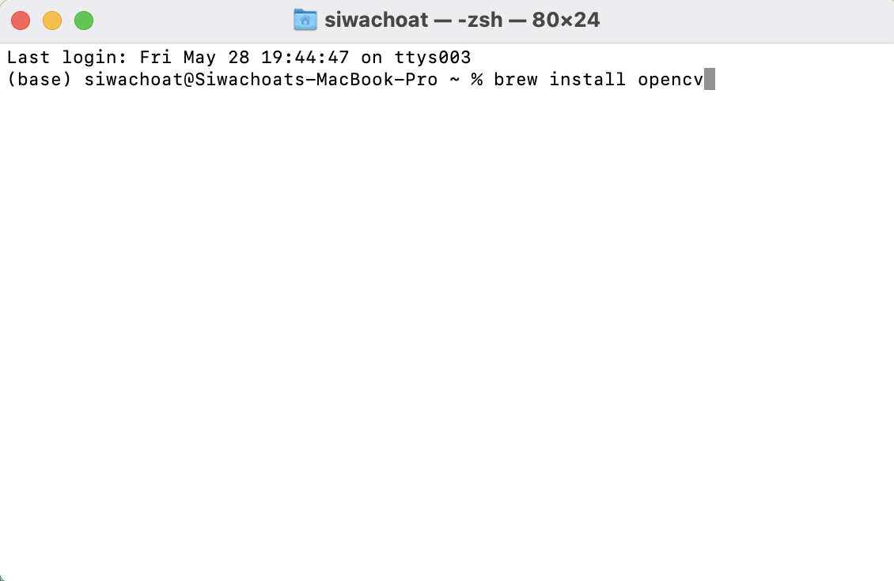

```{r setup, include=FALSE}
library(knitr)
library(rmdformats)
library(reticulate)

## Global options
options(max.print="150")
opts_chunk$set(echo=TRUE,
	             cache=TRUE,
               prompt=FALSE,
               tidy=TRUE,
               comment=NA,
               message=FALSE,
               warning=FALSE)
opts_knit$set(width=100)
```


<p style="line-height:1.3; font-size:16px; color: #353b48; text-align:right;">
สิวะโชติ ศรีสุทธิยากร
</br>
</br>
ภาควิชาวิจัยและจิตวิทยาการศึกษา คณะครุศาสตร์
</br>
จุฬาลงกรณ์มหาวิทยาลัย
</br>
</font> 13 May 2021 </font>
</p>


1. เปิด terminal

2. พิมพ์คำสั่ง `brew install opencv` เพื่อติดตั้ง openCV package



